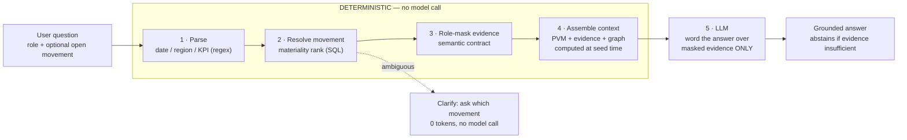
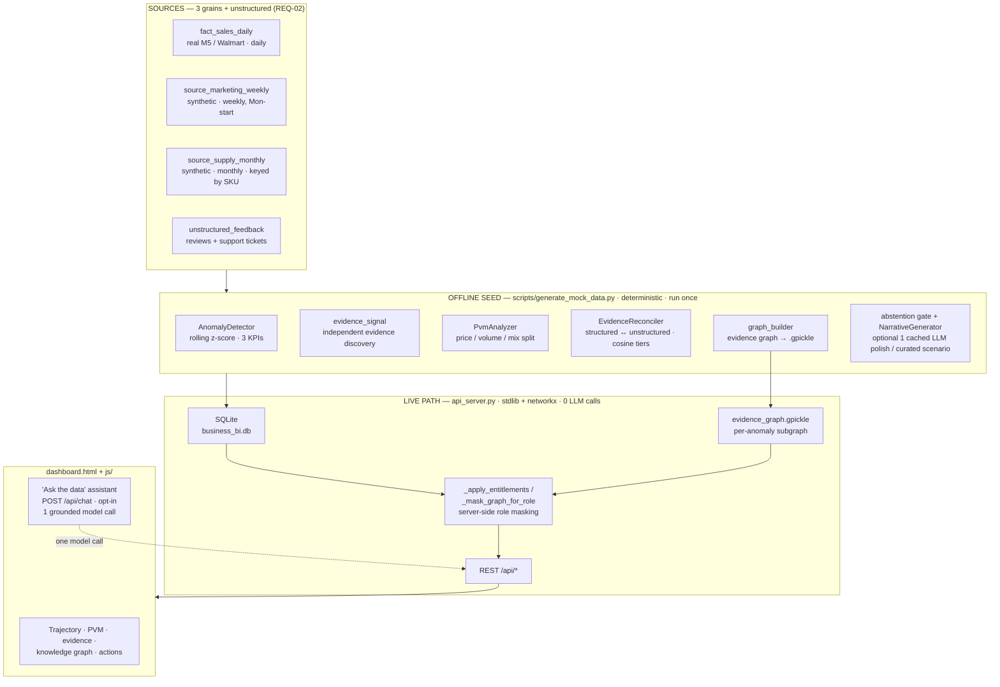
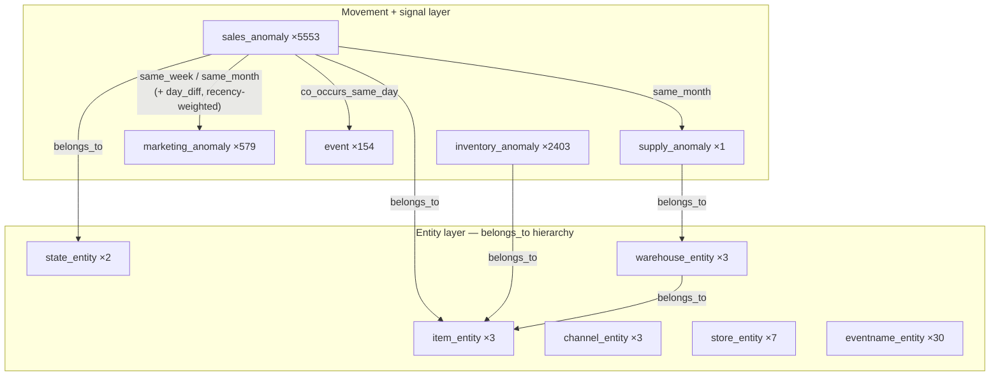

# KPI Intelligence-to-Action Engine

**Accenture Innovation Challenge 2026 · Round 2 · Track 3 — BusinessIntelligence.ai**
Team **Stack Overflowed** — IIT Madras

<p>


</p>

> An engine that turns a **KPI movement** into a **persona-specific, evidence-cited action** — it detects
> material movements, ranks their drivers, explains them in plain language, communicates uncertainty
> (or abstains), and recommends the next step. **Every quantitative claim is produced by deterministic
> analytics; the LLM only words the narrative**, and every response shows which parts were which.

---

## 1. Demo video

▶️ **Prototype walkthrough:** `<add public link — YouTube / Drive — before submission>`

Covered in the video: scenario load → trajectory chart with all series anomalies → evidence trail +
anomaly-centric knowledge graph → live role switch (masking visibly changes) → conversational assistant
(grounded answer, clarification, abstention) → approve / assign an action → runtime telemetry.

---

## 2. Implementation approach

The Round 2 brief is explicit: *"The LLM should not be treated as the source of quantitative truth.
Teams should explicitly demonstrate when they use deterministic logic, SQL, business rules, statistics,
traditional ML, retrieval or LLMs — and why."* This engine is built around that sentence.

| Principle | How it is realised |
|---|---|
| **LLM is never the source of quantitative truth** | Anomaly detection, price/volume/mix contribution, confidence scoring, abstention, and data-access masking are all deterministic (SQL, statistics, business rules). The LLM only phrases an answer over evidence that was already computed. |
| **Zero-cost, zero-dependency live path** | `api_server.py` is Python standard library plus `networkx` (only to load the pre-built evidence graph). Serving the dashboard and every analytics endpoint makes **no LLM calls** and costs **$0**. |
| **Grounded conversation** | The optional *"Ask the data"* assistant (`POST /api/chat`) resolves the question to one KPI movement deterministically, role-masks its evidence, and passes only that to the model — with instructions to abstain when the evidence is insufficient. |
| **Governed by a semantic contract** | [`schemas/semantic_contract.json`](Accenture/Accenture/schemas/semantic_contract.json) holds KPI definitions, calculations, drivers, thresholds, lineage and entitlements. Role masking is enforced **server-side** — restricted fields are removed from the JSON before it leaves the API and before the model sees it. |
| **Multi-signal detection** | A statistical z-score signal and an independent evidence-driven signal run separately and are merged; a period flagged by neither is never admitted as an anomaly. |
| **Honest uncertainty** | Sparse-history / no-isolable-driver movements return figures **plus a confidence flag** and abstain on root cause; ambiguous questions trigger a clarification with **no model call**. |

### Deterministic vs LLM — per stage

| Stage | Engine |
|---|---|
| Detect movements, rank drivers (PVM), score confidence, decide abstention | **Deterministic** — `src/analytics/*`, `src/llm/abstention.py` |
| Reconcile structured ↔ unstructured evidence, build & query the evidence graph | **Deterministic** — `src/retrieval/evidence_reconciler.py`, `src/analytics/graph_*` |
| Enforce row/column data access | **Deterministic** — `_apply_entitlements` / `_mask_graph_for_role` in `api_server.py`, driven by the semantic contract |
| Seed-time narrative pre-generation | **Deterministic templates**, optionally polished by **one cached `OPENAI_API_KEY` call per curated scenario** (`src/llm/llm_client.py`) — fully works with no key |
| Live conversational answer wording | **LLM** — Groq `openai/gpt-oss-120b` by default, Anthropic `claude-haiku-4-5` as fallback, **one call per question** |
| *"What is the evidence graph / PVM / abstention?"* meta questions | **Deterministic** — fixed descriptions, no model call |

Of the five stages in a conversational turn, **four are deterministic and one — phrasing — is the model**:



---

## 3. Solution architecture

Everything quantitative happens **before** any model call. The model only ever receives already-masked
evidence and returns wording.



### KPIs, sources, personas

| | Detail |
|---|---|
| **KPIs (3, all wired end-to-end)** | `Revenue` (additive, PVM-decomposed), `GrossMarginPercent` (non-additive), `InventoryTurnover` (non-additive, from inventory logs). All three are detected, charted, and independently anomaly-flagged — not one real KPI plus two decorative tabs. |
| **Structured sources (3 grains)** | `fact_sales_daily` (real M5/Walmart, **daily**), `source_marketing_weekly` (**weekly**, Monday-start, region names not state codes), `source_supply_monthly` (**monthly**, keyed by internal `warehouse_sku` — forces a real lookup join). |
| **Unstructured** | `unstructured_feedback` — customer reviews + support tickets, plus `inventory_logs` for turnover. |
| **Personas (3)** | `vp_sales` — financial/executive view, blocked from SKU & warehouse detail. `supply_planner` — operational view, blocked from revenue / margin / COGS / marketing spend. `admin` — full-access governance role, used to verify masking against unredacted ground truth. |
| **Curated demo scenarios** | `supply` (supply constraint), `pricecut` (promotional elasticity), `billing` (pricing/billing bug — contradictory evidence), `sparse` (newly launched, low confidence) — **plus 53 statistically / evidence-detected movements**. Curated keys are cosmetic labels applied *after* organic discovery, not an admission list. |

### Multi-signal detection & the abstention gate


### Anomaly-centric evidence graph

The knowledge graph is a `networkx` **DiGraph** built once at seed time and persisted to
`evidence_graph.gpickle`. `api_server.py` loads it at startup and serves a small **per-anomaly
subgraph** live (`graph_subgraph.anomaly_subgraph`), role-masked like every other surface.



**8,738 nodes / 40,380 edges · 0 PVM sign mismatches.** Corroborating neighbours are trimmed to the
focal anomaly's own item/state (`graph_query.entity_relevant`) and weighted by recency — influence
halves every 30 days of temporal distance, and movements *before* the focal one are discounted further.

---

## 4. Results at a glance

All numbers below are **real and reproducible** — they come from `telemetry_summary` and the `anomalies`
table in the committed `business_bi.db` (seed run of **2026-08-29**), and are served live at
`GET /api/telemetry`.

### Seed pipeline telemetry (measured, not fabricated)

| Metric | Value |
|---|---|
| Movements processed | **57** |
| LLM calls during seed | **0** *(no `OPENAI_API_KEY` set — fully deterministic mode)* |
| LLM cost during seed | **$0.0000** |
| Narratives generated deterministically | **57 / 57** |
| Pipeline wall time | **7.44 s** |
| Avg analytics SQL time / step | **32.7 ms** |
| **LLM calls on the live analytics path** | **0** |
| **Cost per dashboard load** | **$0.00** |

### Detection signal mix — 57 admitted movements

```
STATISTICAL      41  ████████████████████████████████████████████████  72%
EVIDENCE_DRIVEN   8  █████████                                         14%
HYBRID            7  ████████                                          12%
SPARSE_HISTORY    1  █                                                  2%
```

### What the engine does with a movement — deliberate escalation bias

```
Abstained  (figures + confidence flag, no cause asserted)  44  ██████████████████████████████████████  77%
Explained  (PVM / evidence / recommended action)           13  ███████████                             23%
```

Of 57 admitted movements, **44 are held at `abstained`** — the engine returns figures and a confidence
flag but declines to assert a cause it cannot support. That is the intended behaviour, not a gap.

### Movements by KPI / by severity

```
InventoryTurnover  21  ██████████████████████████████████████████        |z| ≥ 3  CRITICAL   20
Revenue            20  ████████████████████████████████████████          |z| ≥ 2  WARNING    29
GrossMarginPercent 16  ████████████████████████████████                  other    ACTIVE      8
```

15 of the 57 carry a **`strong`** evidence classification from the independent evidence signal.

### Deterministic test suite

`Accenture/Accenture/tests/` — 8 modules covering the deterministic layer: `test_analytics`,
`test_abstention`, `test_hybrid_detection`, `test_graph`, `test_personas`, `test_schemas`,
`test_schema_parser`, `test_mock_data`.

```bash
pip install pytest && python -m pytest Accenture/Accenture/tests -q
```

---

## 5. Repository layout

```
api_server.py                    Live API + static file server (Python stdlib + networkx to load the graph)
dashboard.html                   Single-page dashboard
js/                              Frontend modules — api, state, charts, drawer, evidence, actions, app, chat
css/                             Styles — tokens, layout, hero, charts, evidence, drawer, chat
.env.example                     Template for optional API keys (copy to .env)
requirements.txt                 Deps for the OFFLINE seed / analytics pipeline only
persona_profiles.md              Persona goals, decision rights, entitlement & narrative spec

KPI-data/
  01_get_and_build_dataset.py    Downloads M5 / Walmart, builds fact_sales_daily.parquet (real, reconciled)
  02_gen_marketing_source.py     Builds the synthetic weekly marketing source
  03_gen_supply_source.py        Builds the synthetic monthly supply source + SKU lookup
  *.parquet                      Generated source extracts
  README.md                      Dataset provenance, deliberate mismatches, 6 integrity checks

Accenture/Accenture/
  schemas/
    semantic_contract.json       KPI definitions, drivers, thresholds, lineage, entitlements
    db_init.sql                  Table DDL
  scripts/
    generate_mock_data.py        Seed pipeline: SQLite -> detect -> evidence graph -> narratives -> telemetry
    build_graph.py               Standalone evidence-graph (re)builder
  src/
    analytics/                   anomaly_detector, pvm_analyzer, evidence_signal, series_anomaly,
                                   sentiment, aggregation,
                                   graph_builder / graph_entities / graph_subgraph /
                                   graph_query / graph_store / graph_narrative_adapter
    llm/                         llm_client (optional polish), narrative_generator, abstention, schema_parser
    retrieval/                   evidence_reconciler
  data/                          Committed SQLite DB + parquet source extracts (evidence_graph.gpickle
                                   is rebuilt at seed/startup and git-ignored)
  tests/                         pytest suite for the deterministic layer
  docs/persona_profiles.md
```

---

## 6. Dependencies

### Runtime — live demo (`api_server.py` + `dashboard.html`)

Python **3.10+**. The server is standard library (`http.server`, `sqlite3`, `json`, `urllib`) plus
**`networkx`** — used only to load and traverse the pre-built evidence graph.

```bash
pip install networkx        # the only runtime dependency
```

If the database has already been seeded (it is committed at
`Accenture/Accenture/data/business_bi.db`) and the `.gpickle` is missing, `api_server.py` rebuilds the
graph from the DB automatically at startup — no full reseed required.

### Offline seed / analytics pipeline (`requirements.txt`)

Needed only to regenerate the database and evidence graph from scratch:

```
pandas>=2.0
numpy>=1.24
pydantic>=2.0
networkx>=3.0
openai>=1.0        # only used if OPENAI_API_KEY is set, for optional narrative polish
```

```bash
pip install -r requirements.txt
```

### Optional API keys (`.env` beside `api_server.py`)

The prototype runs **fully without any key**. Keys unlock the live conversational assistant only.

| Variable | Purpose |
|---|---|
| `GROQ_API_KEY` | Live *"Ask the data"* assistant (free tier). Preferred if set. Get one at <https://console.groq.com/keys>. |
| `GROQ_MODEL` | Optional model override (default `openai/gpt-oss-120b`). |
| `ANTHROPIC_API_KEY` | Fallback provider for the assistant if `GROQ_API_KEY` is unset (model `claude-haiku-4-5`). |
| `OPENAI_API_KEY` | **Offline seed only** — one cached call per curated scenario to polish narrative prose. |

Copy `.env.example` → `.env` and fill in what you need.

---

## 7. Execution instructions

### Quick start (prototype demo)

```bash
# 1. clone
git clone https://github.com/kailash-git/Accenture_AI_Hackathon.git
cd Accenture_AI_Hackathon

# 2. minimal runtime dep
pip install networkx

# 3. (optional) enable the conversational assistant
cp .env.example .env          # then add GROQ_API_KEY=...

# 4. run — DB is already seeded, no full pipeline needed
python api_server.py
```

Open **<http://127.0.0.1:8000/dashboard.html>**. The server prints:

```
============================================================
  KPI Intelligence API Server Running on http://127.0.0.1:8000
  Serving dashboard at: http://127.0.0.1:8000/dashboard.html
  Database target: .../Accenture/Accenture/data/business_bi.db
============================================================
  evidence graph loaded: 8738 nodes / 40380 edges
```

If the database is missing, `api_server.py` runs the seed pipeline once automatically (needs
`requirements.txt` installed).

### Rebuild the database from scratch (optional)

```bash
pip install -r requirements.txt
cd Accenture/Accenture
python scripts/generate_mock_data.py   # SQLite + anomaly detection + evidence graph + persona narratives
cd ../..
python api_server.py
```

Rebuild only the evidence graph against an already-seeded DB:

```bash
python Accenture/Accenture/scripts/build_graph.py
```

### Try the assistant

In the *"Ask the data"* panel (needs `GROQ_API_KEY` or `ANTHROPIC_API_KEY`):

| Ask | What it demonstrates |
|---|---|
| `Why did revenue fall in CA in Nov 2012?` | grounded answer with PVM split + confidence |
| `why did revenue change?` | ambiguous → asks *which movement* (**no model call**) |
| `what happened to margin in March 2020?` | no anomaly there → says so, then gives the most material one |
| `How confident are we?` on the `sparse` scenario | **abstains** — figures returned, root cause declined |
| Switch role to **Supply Planner** and re-ask a revenue question | revenue / margin figures are **masked server-side** |

### Run the deterministic tests

```bash
pip install pytest
python -m pytest Accenture/Accenture/tests -q
```

### Key API endpoints

| Method | Path | Purpose |
|---|---|---|
| `GET` | `/api/health` | Liveness + DB status |
| `GET` | `/api/anomalies` | Ranked, role-masked list of KPI movements (materiality order, not recency) |
| `GET` | `/api/anomalies/<key>` | One movement: PVM, evidence, graph subgraph, narrative, action |
| `GET` | `/api/anomalies/<key>/timeline?metric=revenue\|margin\|turnover` | Trajectory series + every anomaly dot on it |
| `GET` | `/api/anomalies/<key>/graph` | Evidence knowledge subgraph (role-masked) |
| `GET` | `/api/telemetry` | SQL latency, detection counts, feedback stats, seed + live-chat LLM telemetry |
| `GET` | `/api/entitlements` | The caller role's contract entitlements |
| `POST` | `/api/chat` | Grounded conversational answer — `{message, role, anomaly_key?, focus?}` |
| `POST` | `/api/feedback` | 👍/👎 on a narrative — `{anomaly_id, rating, user_comments}` |
| `POST` | `/api/actions/<key>/approve` · `/assign` | Record an action decision + audit id (both persist to `user_feedback`) |

Role is taken from the `X-User-Role` header or `?role=` query param
(`vp_sales` | `supply_planner` | `admin`; default `vp_sales`).

### Role-based masking — enforced, not cosmetic

| Field / column | `vp_sales` | `supply_planner` | `admin` |
|---|---|---|---|
| Revenue, Gross Margin %, COGS, PVM $ effects, product revenue impact | ✅ visible | ❌ `MASK_NULL` / `RESTRICTED` | ✅ |
| Marketing spend & marketing-sourced evidence | ✅ | ❌ `RESTRICTED` | ✅ |
| `item_id` / SKU, warehouse identity, logistics card | ❌ `RESTRICTED` | ✅ visible | ✅ |
| Supply fill rate / stockout days | ❌ | ✅ | ✅ |
| Free-text evidence that *narrates* a dollar figure | ✅ | ❌ disclosing clause redacted | ✅ |
| Evidence-graph nodes/edges carrying the above | masked | masked | full |

Enforced in `_apply_entitlements`, `_mask_graph_for_role`, and `_redact_financial_disclosure` in
`api_server.py` — restricted fields are **removed from the JSON server-side** before the response
leaves the API *and* before the chat model ever sees them.

---

## 8. Design decisions & assumptions

- **Jurisdiction / data:** illustrative FMCG data — real M5 / Walmart daily sales for 3 items × 2 states
  (CA, TX), Jan 2011 – Apr 2016, reconciled with two synthetic companion sources (marketing, supply)
  sized against the real backbone's measured volatility. No real proprietary data. Elasticity figures
  (e.g. the −1.68 unit price elasticity in the `pricecut` scenario) are **stated assumptions, not fitted
  values**. See [`KPI-data/README.md`](KPI-data/README.md) for provenance and the 6 integrity checks.
- **Scenario impacts are a stated simulation assumption.** `generate_mock_data.py` projects three
  synthetic source-system anomalies (supply constraint, billing bug, price cut) back onto
  `fact_sales_daily` so every layer reasons about one internally consistent event. Narratives and
  recommended actions are still computed live from whatever numbers land there.
- **Margin / turnover explanation is retrieval-based, by design.** PVM decomposition applies to
  *revenue* variance. `GrossMarginPercent` and `InventoryTurnover` anomalies are detected by the same
  z-score engine but explained through evidence retrieval, not a fabricated PVM-style split — a stated
  scope limitation recorded in the semantic contract.
- **Live path is deliberately LLM-free** so the demo has no external dependency, no latency-budget
  risk, and $0 cost. The one live model call (chat) is opt-in and degrades to a *"not configured"*
  notice without a key.
- **Provider-swappable assistant:** Groq (free) by default, Anthropic as fallback, via a
  zero-dependency stdlib client — no vendor lock-in.
- **Feedback capture is built; the closing loop is roadmap.** `user_feedback` records every rating /
  approval / assignment with an audit id and surfaces counts in `/api/telemetry`. Consuming that
  feedback to revise narratives at the next seed run is the documented next step.
- **Reproducibility:** all hashing/jitter in the seed uses `crc32`, not Python's per-process-randomised
  `hash()`, so a reseed reproduces byte-identical anomalies on any machine.

### Round 2 minimum expectations — coverage

| Brief expectation | Where |
|---|---|
| 3–5 connected KPIs across 2–3 sources, different grains | 3 KPIs · daily + weekly + monthly + unstructured |
| Lightweight KPI / semantic contract (definitions, calcs, drivers, thresholds, lineage, access) | `schemas/semantic_contract.json` |
| ≥ 2 personas with different narratives / actions | `vp_sales`, `supply_planner` (+ `admin` governance) |
| One multi-factor movement with known drivers | `supply` — stockout + demand + price, Nov 2012 |
| One low-confidence scenario — clarify or abstain | `sparse`; ambiguous chat → clarification, 0 tokens |
| One sparse-history / newly launched KPI | `sparse` — HOUSEHOLD_1_020, TX, Oct 2015 launch |
| One role-based security / entitlement scenario | live role switch; server-side masking table above |
| Evidence: freshness, method, contribution, confidence, lineage | evidence trail + graph + `/api/telemetry` + contract `lineage` |
| Clear LLM-vs-non-LLM breakdown | §2 tables + `processing` block on every `/api/chat` response |
| Runtime telemetry: latency, model calls, tokens, cost | `/api/telemetry` (`seed_*` + `live_chat`) |

---

## 9. Team

**Stack Overflowed — IIT Madras.** Track 3, BusinessIntelligence.ai.
Persona & entitlement design mapped by Sivasubramanian S. See
[`persona_profiles.md`](persona_profiles.md) for the full persona spec and
[`KPI-data/README.md`](KPI-data/README.md) for dataset provenance.

**License:** MIT.
