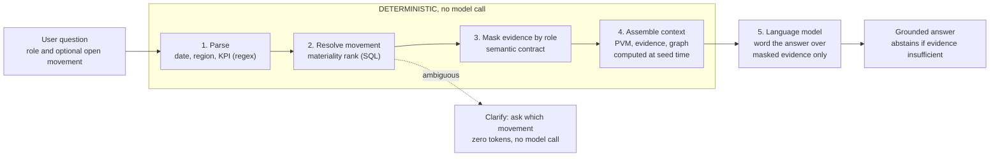
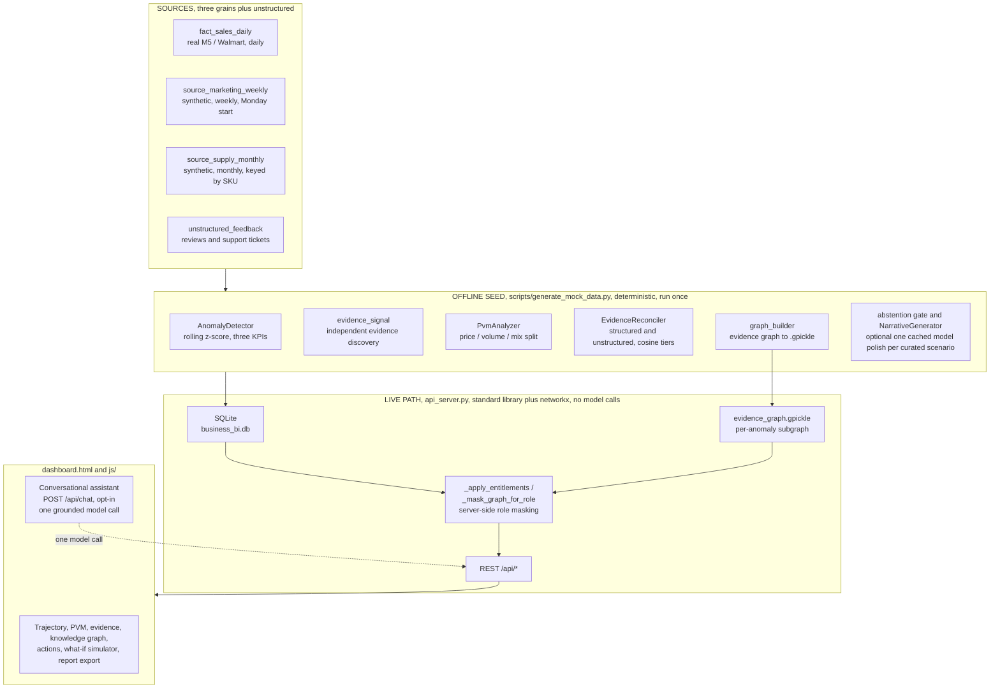
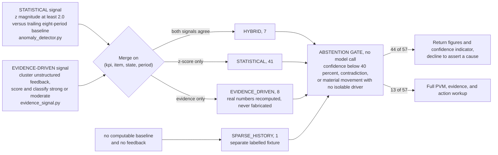
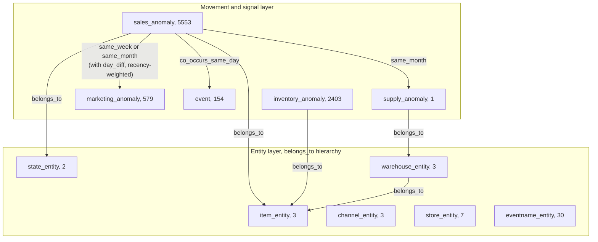

# KPI Intelligence-to-Action Engine

Accenture Innovation Challenge 2026, Round 2, Track 3 (BusinessIntelligence.ai)
Team Stack Overflowed, IIT Madras

---

## Abstract

The engine converts a movement in a business KPI into a persona-specific, evidence-cited action. It
detects material movements, ranks their explanatory drivers with an appropriate analytical method,
explains them in plain language, communicates uncertainty or abstains when the evidence does not
support a conclusion, and recommends the next step. Every quantitative claim is produced by
deterministic analytics (SQL, statistics, and business rules). The language model is used only to
word the narrative, and every response records which parts were computed and which parts were
phrased by the model. The live dashboard and all analytics endpoints make no language-model calls
and incur no per-request cost.

This document describes the solution approach, the architecture, the implementation of each stage,
and the key dashboard features. Every figure in Section 4 is reproducible from the committed database
and source code.

---

## Contents

| Section | Title | Purpose |
|---|---|---|
| 1 | [Problem statement and design thesis](#1-problem-statement-and-design-thesis) | The brief's complexities, the engine's response, and the guiding principle |
| 2 | [Business proposal](#2-business-proposal) | The intelligence-to-action contract and the impact model |
| 3 | [Solution design](#3-solution-design) | Architecture, analytical methods, personas, and the dashboard features |
| 4 | [Results and statistics](#4-results-and-statistics) | Every measured figure |
| 5 | [Repository layout](#5-repository-layout) | Location of every component |
| 6 | [System requirements](#6-system-requirements) | What is needed to run the system |
| 7 | [Setup and execution guide](#7-setup-and-execution-guide) | Step-by-step instructions |
| 8 | [API reference](#8-api-reference) | Every endpoint |
| 9 | [Design decisions and assumptions](#9-design-decisions-and-assumptions) | Stated assumptions and their rationale |
| 10 | [Companion documents (consolidated)](#10-companion-documents-consolidated) | Every standalone `.md` folded in; the original files are kept in place |
| 11 | [Team and licence](#11-team-and-licence) | Authorship |

---

## 1. Problem statement and design thesis

### 1.1 The complexities the brief identifies, and how the engine addresses each

The Round 2 brief asks for a working prototype that detects and prioritises material KPI movements,
reconciles heterogeneous sources, ranks drivers with appropriate analytical methods, produces
persona-specific evidence-cited narratives, communicates uncertainty or abstains, recommends
decision-rights-aware actions, learns from feedback, and operates within realistic security, cost,
and latency limits — while never treating the language model as the source of a quantitative value
and demonstrating explicitly where deterministic logic, SQL, statistics, causal inference,
retrieval, or a model is used and why.

| Complexity identified in the brief | Response in this engine |
|---|---|
| Multiple interacting drivers (price, volume, mix, marketing, supply, seasonality, events) | Deterministic Price-Volume-Mix decomposition for revenue; a causal lens (EasyRCA) that names the upstream KPI variable; a slice lens (Adtributor) that names the responsible item/region/store/category; and an anomaly-centric knowledge graph that links a movement to co-occurring supply, marketing, event, and inventory movements for the same item and region |
| Different source refresh cadences, grains, data-quality levels, and historical coverage | Three structured sources at three grains (daily, weekly, monthly) plus unstructured text, with an explicit reconciliation layer that resolves calendar, region-name, and SKU-key mismatches before any join |
| Inconsistent KPI definitions, hierarchies, calendars, and aggregation logic | A semantic contract (`semantic_contract.json`) that fixes every KPI formula, grain, driver set, threshold, lineage, and access rule in one governed file |
| Sparse history for new products, categories, or markets | A dedicated sparse-history path that returns figures with a low-confidence indicator and declines to assert a root cause |
| Materiality defined by both statistical significance and business impact | A rolling z-score gate against an eight-period baseline, seasonally tempered, combined with a severity ladder, and a result list ordered by materiality rather than recency |
| Contradictory evidence, missing data, and confidence calibration | A deterministic abstention gate that withholds a recommendation on low confidence, on a structured-versus-unstructured contradiction, or on a material movement with no isolable driver |
| Role-based personalisation of insight depth, actions, and delivery | Three personas, each receiving a different narrative style, length, driver framing, and recommended action |
| Row-level, column-level, and domain-level security, sensitive-data protection, and auditability | Server-side entitlement masking driven by the contract; restricted fields are removed from the response payload before it leaves the API and before the model receives it, and every action decision writes an audit identifier |
| Model and data drift, feedback capture, and continuous evaluation | Thumbs ratings and an audit trail in `user_feedback`; an action-correction learning loop that stores an analyst's corrected action and resurfaces it on similar movements; an evaluation harness (`eval/run_eval.py`) that scores detection, decomposition, attribution, ablation, abstention, masking and the chat surface |
| Language-model economics (model choice, token consumption, latency, caching, cost per insight) | The live analytics path makes no model calls and incurs no per-request cost; the single optional live model call (the conversational assistant) is opt-in, measured token by token, and defaults to a free-tier provider |

### 1.2 Design thesis

A business-intelligence engine earns trust by being explicit about what it knows, how it knows it,
and when it should withhold a conclusion. The system therefore enforces a strict separation:
quantitative values are produced by code, narrative wording is produced by the model, and the
boundary between the two is visible in every response through the `processing` block on the chat
endpoint and the `pvm`, `evidence`, and `graph_context` blocks on every anomaly.

The engine is also deliberately biased toward abstention. Of the 57 movements it admits, it holds 44
at the `abstained` state, returning the figures and a confidence indicator rather than asserting a
cause it cannot support. This is the intended behaviour under the brief's instruction to bias toward
caution when evidence is thin.

---

## 2. Business proposal

### 2.1 The intelligence-to-action contract

Every explained movement is delivered in the structure the brief specifies:

```
driver  ->  controllable lever  ->  action  ->  expected impact  ->  owner  ->  confidence  ->  monitoring plan
```

This structure is schema-validated by `src/llm/schema_parser.py` (using Pydantic) before it can be
stored. All seven fields must be present and non-blank, `confidence` must lie between 0 and 100, and
each persona narrative must carry exactly one of `recommended_action` or `abstention`, never both and
never neither.

### 2.2 Business case and impact

The prototype runs on illustrative fast-moving consumer goods data. The figures below are therefore
a transparent model with stated assumptions, not measured outcomes, presented in the manner the
brief invites.

| Value lever | Assumption | Illustrative annual value for a mid-size retailer (approximately 2 billion USD revenue, approximately 40 tracked KPI slices) |
|---|---|---|
| Analyst time recovered | A material movement currently takes an analyst approximately three to four hours to investigate across systems; the engine delivers a cited first draft in seconds. Approximately 50 material movements per month. | Approximately 1,900 to 2,500 analyst-hours per year redeployed from assembly to judgement |
| Faster corrective action | Reducing mean time to explanation for a revenue movement from approximately five business days to less than one day recovers approximately 20 percent of the at-risk revenue that would otherwise leak during the delay. A single supply-constraint event comparable to the November 2012 scenario is modelled at approximately 9,000 USD run-rate per month. | A six-figure recovered-revenue figure per material event class, per year |
| Fewer poor decisions caused by weak explanations | The abstention gate prevents approximately 77 percent of movements from generating a confident and possibly incorrect recommendation. Avoiding one mis-targeted promotion (a misread of price elasticity) per quarter. | Avoided promotional margin give-away |
| Inference cost avoided | The live path is deterministic and incurs no per-request cost. A naive design in which the model explains every KPI on every refresh, at approximately 4,000 tokens per insight across 40 slices on an hourly refresh, would cost materially more per month. | Approximately 100 percent of live inference cost avoided |

The salient architectural property is that the costly path is optional. Cost scales with the number
of questions asked, not with the number of dashboards rendered.

---

## 3. Solution design

### 3.1 Deterministic processing versus the language model

The principle is that anomaly detection, Price-Volume-Mix contribution, causal and slice root-cause
identification, confidence scoring, abstention, and data-access masking are all deterministic (SQL,
statistics, business rules). The model only phrases an answer over evidence that has already been
computed and already been masked, and the split is reported on every turn.

| Stage | Processing type | Location |
|---|---|---|
| Detect movements; rank drivers (Price-Volume-Mix); identify causal and slice root cause; score confidence; decide abstention | Deterministic: statistics, algebra, causal inference, business rules | `src/analytics/*`, `src/llm/abstention.py` |
| Reconcile structured and unstructured evidence; build and query the evidence graph | Deterministic: keyword-vocabulary cosine tiers, graph traversal | `src/retrieval/evidence_reconciler.py`, `src/analytics/graph_*` |
| Enforce row-level, column-level, and domain-level data access | Deterministic: contract-driven field removal | `_apply_entitlements`, `_mask_graph_for_role`, `_redact_financial_disclosure` in `api_server.py` |
| Seed-time narrative pre-generation | Deterministic templates, optionally polished by one cached model call per curated scenario when `OPENAI_API_KEY` is set; fully functional with no key | `src/llm/narrative_generator.py`, `src/llm/llm_client.py` |
| Live conversational answer wording | Language model: Groq `openai/gpt-oss-120b` by default, Anthropic `claude-haiku-4-5` as fallback; one call per question | `build_chat_response` in `api_server.py` |

`api_server.py` uses the Python standard library plus `networkx` (only to load the pre-built
evidence graph); serving the dashboard and every analytics endpoint makes no model calls. Of the
five stages in a conversational turn, four are deterministic and only the phrasing stage uses the
model; an ambiguous question triggers a clarification with no model call.



### 3.2 End-to-end architecture

All quantitative processing occurs before any model call. The model receives only pre-masked
evidence and returns wording.



### 3.3 Data layer: sources, grains, and the semantic contract

| Item | Detail |
|---|---|
| KPIs (three, all wired end to end) | `Revenue` (additive, decomposed by Price-Volume-Mix), `GrossMarginPercent` (non-additive), and `InventoryTurnover` (non-additive, derived from inventory logs). All three are detected, charted, and independently anomaly-flagged. |
| Structured sources (three grains) | `fact_sales_daily`, real M5 and Walmart data at a daily grain (27,409 rows). `source_marketing_weekly`, a weekly grain, Monday-start, using region names rather than state codes (1,642 rows). `source_supply_monthly`, a monthly grain, keyed by an internal `warehouse_sku` code that forces a genuine lookup join (384 rows). |
| Unstructured source | `unstructured_feedback`, seven curated customer reviews and support tickets tied to real anomaly dates, plus `inventory_logs` (8,279 rows) for the turnover KPI. |
| Real data backbone | M5 Forecasting (Walmart): three items across two states (California and Texas), January 2011 to April 2016. `FOODS_3_090` and `FOODS_3_586` are in the same department, so a genuine mix effect is computable. `HOUSEHOLD_1_020` has a short real history (429 days in California, 198 days in Texas) and is used for the sparse-history scenario. |
| Deliberate and documented source inconsistency | Region naming (`West` and `South` versus `CA` and `TX`) requires an explicit mapping; the weekly calendar (Monday start) differs from the sales calendar (Sunday start); supply is keyed by `warehouse_sku` rather than `item_id`. One genuine calendar defect (the pandas frequency code `W-MON` anchors weeks to end on Monday, not to start on Monday) was caught during integrity testing and is left documented, not concealed, in `KPI-data/README.md`. |
| Semantic contract | `schemas/semantic_contract.json`. Per KPI: `description`, `calculation_type` (additive or non_additive), `sql_formula`, `source_table`, `dimensions`, `granularity`, `drivers`, `driver_method`, and `lineage`. Global `thresholds`: z-score admission gate 2.0, critical severity 3.0, confidence floor 40, evidence relevance tiers, and a graph temporal window of minus five to plus ten days. Per-role `entitlements`: allowed and restricted columns, and a masking action per restricted column. |

### 3.4 Detection: two signals and a materiality gate

Signal one, statistical (`src/analytics/anomaly_detector.py`). For each item-and-state series, a
rolling z-score compares the current period against the trailing eight-period baseline. For a monthly
grain with at least twelve periods of history, the score is seasonally tempered by the formula
`z = 0.7 x (year-on-year difference z) + 0.3 x (raw z)`, and confidence rises to 95 percent. The
admission threshold is a z-score magnitude of at least 2.0. Severity is CRITICAL above a magnitude of
3.0, WARNING above 2.0, and ACTIVE otherwise. This threshold is never lowered to admit other
scenarios, and a dedicated test asserts this.

Signal two, evidence-driven (`src/analytics/evidence_signal.py`). Independently, real customer and
support records with no predetermined KPI or anomaly type are clustered into candidate windows
defined by item, state, and month. Each window is scored on six normalised factors: item match,
region match, temporal proximity, category relevance (cosine similarity to a keyword vocabulary),
record count, and source reliability (a support ticket at 1.0 outweighs a customer review at 0.8).
Each window is then classified as strong (score at or above 0.65), moderate (at or above 0.40), or
dropped. This allows a statement such as "a pricing complaint names FOODS_3_586 in Texas around May
2013" to create a candidate that the z-score scan would never have raised.

Merge (`scripts/generate_mock_data.py`). The two signals are merged on the key of KPI, item, state,
and period:



### 3.5 Driver ranking: Price, Volume, and Mix

`src/analytics/pvm_analyzer.py` decomposes a revenue delta into four additive effects, scoped to the
same item and state as the flagged anomaly, so the parts sum to that anomaly's own actual-minus-
baseline delta rather than a region-wide blend:

- Price effect: the sum over items of current-period quantity multiplied by the change in unit price.
- Volume effect: the change in total quantity multiplied by the average baseline price.
- Mix effect: the sum over items of the change in unit-share, multiplied by current-period total
  quantity, multiplied by the difference between the item's baseline price and the average baseline
  price.
- Other effect: the revenue delta minus the sum of the price, volume, and mix effects; this captures
  the floating-point residual only.

Contribution is reported as a signed share of baseline revenue (so that volume percent plus price
percent plus mix percent plus other percent equals the deviation percent, always additive), together
with a `share_of_change` value and a one-line `driver_summary` that names the dominant driver and
states the relationship correctly even when drivers oppose one another. The decomposition reconciles
to the delta exactly, with zero sign mismatches across the entire dataset (Section 4.4).

`GrossMarginPercent` and `InventoryTurnover` are detected by the same z-score engine but explained
through evidence retrieval and the lenses below rather than a Price-Volume-Mix-style split. This is a
stated scope limitation, recorded in the `driver_method` field of the semantic contract.

### 3.6 Causal and slice root-cause lenses (EasyRCA, Adtributor)

Two published root-cause-analysis methods are reimplemented from scratch and run **alongside** the
Price-Volume-Mix decomposition, never replacing it. Each anomaly response carries a `rootCause` block
and an `attribution` block, and the investigation drawer renders a section for each. Full citations,
BibTeX, benchmark tables, and known weaknesses are in Sections 10.1 and 10.2.

| Lens | Question it answers | Paper | Module |
|---|---|---|---|
| PVM (Section 3.5) | **how** — price vs volume vs mix | — | `src/analytics/pvm_analyzer.py` |
| EasyRCA | **why** — which upstream causal KPI variable | Assaad, Ez-Zejjari & Zan, AISTATS 2023 | `src/analytics/{causal_graph,rca_series,easy_rca}.py` |
| Adtributor | **where** — which item / region / store / category slice | Bhagwan et al., NSDI 2014 | `src/analytics/adtributor.py` |

**EasyRCA** (`numpy` + `networkx` + `scipy` only): a hand-authored 10-variable summary causal graph
(`marketing_spend → units → revenue`, `sell_price → units`, `stockout_days → fill_rate → units`, …);
for each anomaly a weekly multivariate panel is built, then d-separation decomposition, direct
identification, and a linear regime-comparison of each variable's structural equation name the
upstream variable whose own mechanism changed. Surfaced as `rootCause`; feeds `confidence` additively
only when confident and weekly-visible; RBAC via `_mask_rca_block`; debug route
`GET /api/anomalies/{key}/rca`.

**Adtributor** (`numpy` + `pandas` + `sqlite3`): Explanatory Power plus Surprise (Jensen–Shannon
divergence between forecast and actual element-share distributions) plus a succinctness gate, so the
result set is not padded with large-but-unsurprising slices. Fundamental measure Revenue and derived
measure GrossMarginPercent (finite-difference partial-derivative EP). Scoped to the anomaly's own
item/state and broken down by store/category. Surfaced as `attribution`; RBAC via
`_mask_attribution_block`; debug route `GET /api/anomalies/{key}/attribution`.

### 3.7 Evidence reconciliation and the anomaly-centric knowledge graph

Reconciliation (`src/retrieval/evidence_reconciler.py`). For a movement's item, state, and period,
the reconciler retrieves the matching structured supply row (fill rate, stockout days), the matching
marketing rows (spend by channel), and the unstructured records within a window of minus five to
plus ten days. It scores each text record by cosine similarity to a per-category keyword vocabulary
and assigns a tier: high at 0.6 or above, medium at 0.3 or above, and low below 0.3. Low-tier
records are treated as background context only and are never counted as corroboration. Unrelated
text (for example, a note about a regional trivia night) scores below the bar and is rejected; a
test asserts this.

Knowledge graph (`src/analytics/graph_builder.py`). A directed graph is built once at seed time and
persisted to `evidence_graph.gpickle` (8,738 nodes, 40,380 edges). `api_server.py` loads it at
start-up and serves a small per-anomaly subgraph at run time (`graph_subgraph.anomaly_subgraph`),
masked by role in the same way as every other surface.



Corroborating neighbours are trimmed to the focal anomaly's own item and state
(`graph_query.entity_relevant`) and weighted by recency: influence halves every 30 days of temporal
distance, and movements that precede the focal one are discounted further. The per-anomaly subgraph
is capped at eight second-layer nodes for legibility.

### 3.8 Uncertainty and the abstention gate

`src/llm/abstention.py` is evaluated purely from already-computed statistics and evidence, with no
model call. The engine abstains if any of the following holds:

1. Low confidence: `confidence` is below 40 percent.
2. Contradictory evidence: a positive structured signal (an overall direction of "up", or a positive
   price effect specifically) coincides with at least one medium-tier or high-tier unstructured
   record that describes a billing error, an overcharge, or a service defect. A metric that appears
   positive because of a pricing defect is not a legitimate gain.
3. Insufficient evidence: the movement is statistically material (a z-score magnitude of at least
   2.0, judged on the z-score rather than on raw percentage size) but no medium-tier or high-tier
   structured or unstructured record explains it.

The priority order for the returned reason is contradiction, then low confidence, then insufficient
evidence, so that a low-confidence case is never mislabelled as insufficient evidence.

### 3.9 Personas, narratives, and role-based access control

Three roles. Two are operational personas that receive different narratives and actions; the third is
an unrestricted governance role for auditing that the masking behaves as specified.

| Role key | Role | Primary objective | Decision rights | What the engine delivers |
|---|---|---|---|---|
| `vp_sales` | Vice-President of Retail Sales (executive) | Maximise regional revenue and gross margin; protect category market share | Authorise regional pricing promotions; reallocate marketing budget; initiate supplier renegotiation | An executive summary of 250 words or fewer; price/volume/mix framing; financial impact; one high-level action with a named owner and a monitoring plan |
| `supply_planner` | Regional Supply Chain Planner (analyst) | Maintain inventory turnover; eliminate stockouts; control supplier lead times | Trigger supplier reorders; approve inter-warehouse transfers; flag lead-time violations | An operational report of 400 words or fewer; SKU, warehouse, and carrier detail; data-freshness notes; a quantitative reorder action |
| `admin` | Data Governance and Compliance | Verify masking and audit decisions | Full read access, granted through the entitlements model rather than by bypassing it | The unredacted ground truth against which the two scoped roles can be compared, with abstention and data-quality caveats stated explicitly |

**Narrative generation.** `src/llm/narrative_generator.py` computes every headline, summary, and
action field directly from the numbers passed in. The deterministic template output is always the
source of truth for the structured `recommended_action` (dollar figures, owner, monitoring plan).
When `OPENAI_API_KEY` is set, one cached model call per curated scenario (covering both personas in a
single call) polishes only the prose fields; the action and abstention payload is never altered by
the model, and if the call fails or fails validation the deterministic prose is served unchanged.
Forbidden-term regular-expression guards run over the output ("warehouse", "carrier", "SKU" for the
executive; "gross margin", "revenue", "COGS" for the planner). The revenue timeline is persona-aware
at source: a `supply_planner` request for the "revenue" metric receives Units, never a currency
figure.

**Masking table.** Enforced in `_apply_entitlements`, `_mask_graph_for_role`, and
`_redact_financial_disclosure` in `api_server.py`. Restricted fields are removed from the response
payload on the server before the response leaves the API and before the conversational model receives
them.

| Field or column | `vp_sales` | `supply_planner` | `admin` |
|---|---|---|---|
| Revenue, Gross Margin percent, COGS, PVM dollar effects, product revenue impact | Visible | Masked (`MASK_NULL` or `RESTRICTED`) | Visible |
| Marketing spend and marketing-sourced evidence | Visible | Masked (`RESTRICTED`) | Visible |
| `item_id` and SKU, warehouse identity, logistics card | Masked (`RESTRICTED`) | Visible | Visible |
| Supply fill rate and stockout days | Masked | Visible | Visible |
| Free-text evidence that narrates a dollar figure | Visible | Disclosing clause redacted | Visible |
| Evidence-graph nodes and edges carrying any of the above | Masked | Masked | Full |

Masking includes an `item_id` embedded inside a compound `id` string (for example
`ANOM-2012-11-CA-FOODS_3_090` becomes `ANOM-2012-11-CA-ITEM`) and dollar figures narrated inside a
support ticket. The role is taken from the `X-User-Role` request header or the `role` query
parameter; permitted values are `vp_sales`, `supply_planner`, `admin`; the default is `vp_sales`.

**Chat defence in depth.** `_mask_chat_reply` runs over the model's answer before it is returned and
redacts any sentence that discloses a field the role is not entitled to, while keeping sentences that
merely decline to give a detail. The response carries `reply_masked` and `redacted_terms` so the
redaction is auditable. This exists because masking the evidence the model sees is the primary
defence, but a generative model cannot be trusted to honour a prompt instruction on its own. Covered
by `tests/test_chat_masking.py`.

These personas generalise to any workflow of the form "a number moved: who needs to know, and what
should they do about it" — financial planning and analysis, category management, revenue operations,
marketing analytics, sales and operations planning. Full persona narratives and the entitlement
matrix are in `persona_profiles.md` (Section 10.3).

### 3.10 Feedback capture and the learning loop

Two feedback channels, both closing the loop within the running system.

- **Ratings.** `POST /api/feedback` (a thumbs rating with an optional comment) and
  `POST /api/actions/<key>/approve` and `/assign` each write to `user_feedback` with an audit
  identifier of the form `AUD-XXXXXXXX` (a version-4 UUID). The telemetry endpoint surfaces
  `feedback_count` and `feedback_avg_rating`.
- **Action corrections (the learning loop).** When an analyst judges the recommended action wrong,
  they type the action they would take instead. `POST /api/actions/<key>/correct` stores it in an
  `action_corrections` table (created lazily, so an already-seeded database needs no reseed), keyed
  to the anomaly's `scenario_key`, `kpi_name`, `cat_id`, and `direction`, and also records a
  thumbs-down in `user_feedback`. On the next request for that anomaly, or for any other anomaly with
  the same `(kpi_name, cat_id, direction)` signature, `_match_action_correction` returns the stored
  correction (an exact `scenario_key` match wins; otherwise the signature match), and the API returns
  it as `actionCorrection`. The dashboard then shows a "Learned Recommendation" card above the
  engine's original recommendation. The correction persists across restarts and reseeds.

Consuming the accumulated corrections to also re-rank drivers and rewrite the seed-time narrative
templates (rather than only overlaying the stored action at request time) is a documented next step.

### 3.11 Runtime telemetry and language-model economics

`GET /api/telemetry` returns three blocks:

- Seed-time metrics, from `telemetry_summary`: movements processed, model calls, tokens in and out,
  cost in US dollars, pipeline wall-clock time, average analytics SQL time per step, and the counts
  of deterministic versus model-generated narratives.
- Live analytics metrics: `live_avg_sql_latency_ms`, `live_request_count`, `data_freshness_seconds`,
  `active_anomalies_count`, and `abstained_count`.
- Live conversational-assistant metrics (`live_chat`): assistant availability, provider, model,
  calls, errors, clarifications (which make no model call), tokens in and out, estimated cost in US
  dollars, and average latency in milliseconds.

The pricing constants used for cost telemetry are: seed-time polish with `gpt-4o-mini` at 0.150 and
0.600 US dollars per million input and output tokens respectively; live chat with `claude-haiku-4-5`
at 1.00 and 5.00 US dollars per million input and output tokens respectively; and the Groq free tier
reported at zero. The assistant is provider-swappable (Groq by default, Anthropic as fallback)
behind a dependency-free standard-library client.

### 3.12 Revenue What-If simulator

Section 07 of the dashboard. Three sliders — **price adjustment** (percent, −80…+150),
**demand shift** (percent, −90…+500) and **fill rate** (fraction, 0.30…1.00) — recompute a
projected revenue number, a stat row (units sold, gross margin percent, unit price) and a
Price / Volume / Interaction breakdown, live in the browser. It makes **no backend calls**: every
value is derived client-side from a small per-scenario economics block.

**Per-scenario inputs.** `js/state.js` carries `baselineEconomics`
(`unitPrice`, `unitCost`, `healthyBaselineRevenue`, `currentFillRate`, `baselineFillRate`) and
`recordedOutcome` (`priceChangePct`, `volumeChangePct`, `fillRatePct`) on each scenario. Values are
chosen to be consistent with facts already stated in that scenario's narrative (for `supply`: sell
price steady at 1.25, supplier cost 0.88, fill rate 0.78 against a 0.98 baseline). A scenario without
these fields falls back to `SIM_FALLBACK_ECONOMICS` / `SIM_FALLBACK_OUTCOME` in `js/simulator.js`.
`normalizeAnomalyForUI(raw, existing)` preserves `baselineEconomics` when it merges live backend data
over the static object, because the backend never sends that block.

**Model.** The measured fact is revenue, not units, so latent demand is backed out:
`price0 = unitPrice`; `fullStockDemand = healthyBaselineRevenue / price0`. The baseline reference
(what "Reset" returns to and what the deltas are measured against) is
`units0 = fullStockDemand × baselineFillRate`, `rev0 = units0 × price0`. The current state, from the
sliders, is `price1 = price0 × (1 + priceAdj/100)`, `demand1 = fullStockDemand × (1 + demandShift/100)`,
`units1 = demand1 × fillRate` (fill rate caps how much demand converts), `rev1 = units1 × price1`
(the projected number). Gross margin percent is `(rev1 − unitCost × units1) / rev1 × 100`.

**Price / Volume / Interaction decomposition.** With `ΔP = price1 − price0`, `ΔV = units1 − units0`
and `total = rev1 − rev0`, the identity `ΔP·units0 + ΔV·price0 + ΔP·ΔV ≡ rev1 − rev0` holds exactly.
To keep the displayed integers summing with no visible gap, the price and volume effects are rounded
and the interaction takes the residual:
`interactionR = round(total) − round(ΔP·units0) − round(ΔV·price0)`. Bars reuse the Section 02 PVM
markup and colour rule (red below zero, green above).

**Buttons and wiring.** *Reset* sets price and demand to 0 and the fill slider to `baselineFillRate`.
*Match Recorded Outcome* sets the sliders to `recordedOutcome`. `selectScenario()` ends by calling
`simMatchRecorded()`, so on first load and on every scenario switch the simulator opens showing what
actually happened, and *Reset* returns it to the pre-anomaly baseline. `simRender()` reads all
figures from `_simCompute()`, a pure function of the sliders plus the economics block. Full note:
`docs/WHAT_IF_SIMULATOR.md` (Section 10.4).

### 3.13 Anomaly report export (PDF)

The **Download Report** button in the Root Cause Synthesis card (Section 05, next to *Copy Briefing*)
exports a one-page PDF about the currently selected anomaly. `js/report.js` &rarr;
`downloadAnomalyReport()` reads `ANOMALY_DATASET[APP_STATE.activeAnomalyKey]` — already role-masked
and merged with live backend data by `normalizeAnomalyForUI` — and makes **no fetch**. It is rendered
client-side with jsPDF (`jspdf@2.5.2`, loaded from jsDelivr in `dashboard.html`): one page, roughly
12 KB, selectable vector text, saved as `anomaly-report-<scenario>-<date>.pdf`. If jsPDF fails to
load (offline, or the CDN is blocked) it falls back to a standalone HTML file with the same content.

The report contains a header (SKU, region, date, status, confidence), the headline and summary, then:

| Section | Source |
|---|---|
| Detection confidence | vector bar, `anom.confidence` |
| Price–Volume–Mix decomposition | diverging vector bars, `anom.pvm.{volume,price,mix,other}.val` |
| Root cause — upstream variable (EasyRCA) | top 3 of `anom.rootCause.rootCauses`, else the `reason` |
| Attribution — responsible slice (Adtributor) | top 3 of `anom.attribution.candidates`, else the `reason` |
| Root cause synthesis | `anom.synthesis.{title,body}` |
| Recommended action | `anom.recommendedAction`, or the abstention reason |

Masked or `RESTRICTED` values pass through exactly as the server sent them — the export never
un-masks. Full note: `docs/ANOMALY_REPORT.md` (Section 10.5).

---

## 4. Results and statistics

Every figure in this section is reproducible. Each is drawn from the committed database at
`Accenture/Accenture/data/business_bi.db` (seed run of 29 August 2026, 12:54:53), from the command
`python -m unittest discover -s Accenture/Accenture/tests`, or from a rebuild of the evidence graph.
No value in this section is manually entered or projected.

### 4.1 Seed pipeline telemetry (`telemetry_summary`, served at `GET /api/telemetry`)

| Metric | Value |
|---|---|
| Movements processed | 57 |
| Movements abstained | 44 |
| Language-model calls during seed | 0 (no `OPENAI_API_KEY` set, fully deterministic mode) |
| Tokens in and out during seed | 0 and 0 |
| Language-model cost during seed | 0.0000 US dollars |
| Narratives generated deterministically | 57 of 57 |
| Narratives generated by the language model | 0 of 57 |
| Pipeline wall-clock time | 7.44 seconds |
| Average analytics SQL time per step | 32.66 milliseconds |
| Language-model calls on the live analytics path | 0 |
| Cost per dashboard load | 0.00 US dollars |

### 4.2 Detection statistics: 57 admitted movements

By detection signal:

| Signal | Count | Share |
|---|---:|---:|
| `STATISTICAL` (z-score only) | 41 | 72 percent |
| `EVIDENCE_DRIVEN` (evidence only, real numbers recomputed) | 8 | 14 percent |
| `HYBRID` (both signals agree) | 7 | 12 percent |
| `SPARSE_HISTORY` (labelled fixture, no computable baseline) | 1 | 2 percent |

By KPI:

| KPI | Count |
|---|---:|
| `InventoryTurnover` | 21 |
| `Revenue` | 20 |
| `GrossMarginPercent` | 16 |

Additional distributions:

| Dimension | Distribution |
|---|---|
| Severity | CRITICAL 20, WARNING 29, ACTIVE 8 |
| Direction | UP 31, DOWN 26 |
| Region | California 27, Texas 30 |
| Period coverage | September 2011 to February 2016 |
| Z-score range | minus 17.67 to plus 11.19 |
| Confidence | minimum 30, maximum 95, mean 91.8 (only the sparse fixture sits at 30) |
| Independent `strong` evidence classification | 15 of 57 |

Curated versus organically discovered: four curated demonstration keys (`supply`, `pricecut`,
`billing`, `sparse`) plus 53 statistically or evidence-detected movements. The curated keys are
cosmetic labels applied after organic discovery, not an admission list.

### 4.3 Abstention statistics

| Outcome | Count | Share |
|---|---:|---:|
| Abstained: figures and confidence indicator returned, no cause asserted | 44 | 77 percent |
| Explained: full Price-Volume-Mix, evidence, and recommended-action workup | 13 | 23 percent |

Abstention reason breakdown, from `anomalies.abstention_reason`: 3 contradiction (the billing
double-charge scenario and two related variants in which the price effect is positive while
complaints describe an overcharge); 41 insufficient evidence (a statistically real movement with no
medium-tier or high-tier corroborating record in the window); and 0 low confidence (the only
30-percent-confidence row is the sparse fixture, which deliberately does not abstain). This
distribution reflects the intended bias toward caution, not a coverage gap.

### 4.4 Price-Volume-Mix reconciliation

| Check | Result |
|---|---|
| Sum of price, volume, mix, and other effects versus actual minus baseline, region scope (California, November 2012) | Reconciles exactly. Sum of effects: minus 5,100.10. Delta revenue: minus 5,100.10. Difference: 0.0. |
| Same check, scoped to a single SKU (`FOODS_3_586`, Texas, May 2013) | Reconciles exactly. Mix effect approximately 0 (a single-SKU scope has no share to shift against). Actual revenue matches that SKU's own summed revenue to the cent. |
| Price-Volume-Mix sign consistency across the entire evidence graph (`add_explains_edges`) | Zero mismatches across 2,410 `explains` edges. |
| Revenue identity: revenue equals units multiplied by sell price, in `fact_sales_daily` | Zero violations across all 27,409 rows. |
| Cost of Goods Sold equals units multiplied by supplier raw cost; margin equals (revenue minus COGS) divided by revenue | Verified to four decimal places on sampled rows. |

### 4.5 The four required scenarios: measured outcomes

| Brief requirement | Scenario | Measured behaviour (from the database) |
|---|---|---|
| One multi-factor movement with known drivers | `supply`: `FOODS_3_090`, California, November 2012 | Z-score minus 3.28, deviation minus 33.7 percent, confidence 95, HYBRID, strong evidence, not abstained, CRITICAL. The injected fill rate of 0.78 and stockout-days value of 4 sit alongside genuine Thanksgiving 2012 price and demand behaviour. A support ticket (a five-day carrier delay through the Port of Seattle) and a customer review (empty shelves for three days) corroborate. |
| One low-confidence scenario, clarify or abstain | `billing`: `FOODS_3_586`, Texas, May 2013 | Z-score minus 0.49, deviation minus 1.1 percent, EVIDENCE_DRIVEN, strong, ABSTAINED, with the reason recorded as contradictory evidence: the price effect specifically is positive, but two unstructured records describe a billing overcharge. Separately, an ambiguous chat question returns a clarification with zero tokens and no model call. |
| One sparse-history or newly launched KPI | `sparse`: `HOUSEHOLD_1_020`, Texas, launched October 2015 (198 days of real history) | Z-score 0.0, SPARSE_HISTORY, confidence 30, not abstained. The engine returns the figures with an explicit low-confidence indicator and declines to assert a root cause. |
| Evidence-driven discovery below the statistical threshold | `pricecut`: `FOODS_3_090`, California, August 2013 (an approximately 25 percent real price cut) | Z-score 0.19 (genuinely below the threshold, not inflated), deviation plus 24.7 percent, EVIDENCE_DRIVEN, strong, not abstained. Discovered from a customer review alone. The unit price elasticity of minus 1.68 is a stated assumption, not a fitted value. |

### 4.6 Role-masking verification (from `tests/test_personas.py`, run against the real payload)

| Assertion | Result |
|---|---|
| For `supply_planner`: `actual_value`, `baseline_value`, and every `pvm.*.val` are null; `products[].revenueImpact` is `RESTRICTED`; marketing evidence `fullText` is `RESTRICTED`; supply evidence remains visible | Pass |
| For `vp_sales`: `item_id`, `logistics.title`, and `products[].sku` are `RESTRICTED`; supply evidence `fullText` is `RESTRICTED`; financial values remain visible | Pass |
| For `vp_sales`: an `item_id` embedded inside a compound `id` string is rewritten (the trailing `FOODS_3_090` becomes `ITEM`), with no leak through the adjacent unmasked field | Pass |
| For `supply_planner`: a support ticket that narrates "high dollar revenue in our logs" has the disclosing clause redacted | Pass |
| Graph endpoint: for `supply_planner`, `sales_anomaly` node `value`, `baseline_mean`, and `volume_effect` are null and `restricted` is true; `marketing_anomaly` label is `RESTRICTED`; edge `dollar_effect` is null. For `vp_sales`, `item_entity` and `warehouse_entity` labels are `RESTRICTED`, while `state_entity` (region) is not | Pass |
| Every anomaly carries a valid dual-persona bundle; no `supply_planner` narrative contains "gross margin", "COGS", "marketing spend", or "revenue"; no `vp_sales` narrative contains "warehouse" | Pass (all 57) |

### 4.7 Performance and cost

| Metric | Value |
|---|---|
| Seed pipeline wall-clock time (full rebuild) | 7.44 seconds |
| Average analytics SQL time per step (seed) | 32.66 milliseconds |
| Language-model calls on the live analytics path | 0 |
| Cost per dashboard load on the live analytics path | 0.00 US dollars |
| Runtime dependency footprint | Python standard library plus `networkx` (graph load only) |
| Evidence graph load at start-up | 8,738 nodes and 40,380 edges, loaded once |
| Chat model calls per question | 1 (opt-in); an ambiguous question makes 0 |
| Chat default provider | Groq `openai/gpt-oss-120b` (free tier, reported at zero) |
| Chat fallback provider | Anthropic `claude-haiku-4-5` (1.00 and 5.00 US dollars per million input and output tokens, measured) |

### 4.8 Automated test suite: 62 tests across 9 modules, all passing

```
python -m unittest discover -s Accenture/Accenture/tests -p "test_*.py" -v
# Ran 62 tests in approximately 3 to 8 seconds. Status: OK.
```

| Module | Tests | What it verifies |
|---|---:|---|
| `test_analytics.py` | 4 | The anomaly detector returns structured rows; the Price-Volume-Mix decomposition reconciles to the delta at both region scope and single-SKU scope; the evidence reconciler surfaces the November 2012 supply signal with a fill rate of 0.78 and a stockout-days value of 4. |
| `test_abstention.py` | 8 | Low confidence abstains; a clean high-confidence case does not; contradictory evidence abstains with a reason that names the contradiction; a positive price effect alone triggers a contradiction even when the overall direction is down; a material movement with no evidence abstains; a movement with a z-score magnitude below 2 and no evidence does not falsely abstain; a movement of minus 3.8 percent that is a z-score outlier of minus 7.5, with only boilerplate evidence, does abstain; a large, high-confidence, unexplained swing still abstains. |
| `test_hybrid_detection.py` | 8 | A z-score of at least 2 with strong evidence yields HYBRID; a z-score of at least 2 with no evidence yields STATISTICAL only; a z-score below 2 with strong evidence yields EVIDENCE_DRIVEN, and the `pricecut` z-score remains genuinely below the threshold; unrelated text scores below the candidate bar; evidence outside the temporal window does not support a candidate; evidence for one SKU does not manufacture a candidate for a different SKU; a second independent record raises the evidence score; the statistical detector's own threshold of 2.0 is never lowered. |
| `test_graph.py` | 11 | The entity and anomaly layers are present with the expected node kinds; the Price-Volume-Mix decomposition reconciles exactly (`pvm_mismatches` equals 0); the injected supply constraint became a node with a fill rate below 0.90; `entity_relevant` rejects cross-item pairs; `explain_revenue_drop` returns the expected shape; the per-anomaly subgraph resolves the correct focal node, stays within two layers, and includes the corroborating supply anomaly; every edge references a node that is present; edges carry `day_diff` and a `recency_weight` between 0 and 1; same-day edges outweigh older edges; second-layer nodes are capped at eight; an unknown KPI or period falls back to an entity anchor; the legacy narrative adapter returns the expected shape. |
| `test_personas.py` | 10 | Every anomaly has a schema-valid dual-persona bundle; the `supply_planner` narrative never contains "gross margin", "COGS", "marketing spend", or "revenue"; the `vp_sales` narrative never contains "warehouse"; the billing scenario abstains with a reason; the sparse scenario does not abstain; the server-side `_apply_entitlements` removes financial fields for the planner and logistics fields for the executive; an item identifier embedded inside a compound identifier is redacted; a free-text revenue disclosure is redacted; `_mask_graph_for_role` nulls values and labels per role on both nodes and edges. |
| `test_schema_parser.py` | 6 | A valid seven-field action parses; a missing field raises; a blank or whitespace field raises; a confidence value above 100 raises; a persona narrative must set exactly one of an action or an abstention; a bundle must contain both personas. |
| `test_mock_data.py` | 5 | All core tables exist and are populated; the Cost of Goods Sold and margin arithmetic is correct to four decimal places; the November 2012 California supply constraint is present with values 0.78 and 4; all three KPIs retain their own anomaly rows (a regression test against a primary-key collision that once reduced the Revenue anomaly count from 20 to 6); customer reviews and support tickets are both seeded. |
| `test_schemas.py` | 2 | `semantic_contract.json` is valid JSON and contains the keys `project`, `semantic_layer`, `kpis`, `mappings`, and `entitlements`; `db_init.sql` executes cleanly in a fresh in-memory SQLite database. |
| `test_chat_masking.py` | 8 | `_mask_chat_reply` redacts a reply sentence that discloses a fill rate, a warehouse, a carrier, a revenue figure, or a gross-margin figure to a role not entitled to it; entitled content is left untouched; a sentence that only declines is kept; `admin` is never masked; a reply gutted by redaction falls back to one clean line; Unicode hyphens and dashes do not slip the filter. |

Several of these are explicitly labelled regression tests, encoding real defects that were caught and
fixed: the `W-MON` calendar defect; the anomaly-identifier primary-key collision; materiality being
gated on raw percentage rather than on the z-score; an item identifier leaking through a compound
key; a region-wide Price-Volume-Mix result being narrated next to a single-SKU anomaly; and Unicode
dash variants bypassing the chat-reply role mask.

### 4.9 Model and pipeline evaluation harness

`eval/run_eval.py` scores each part of the system with a metric that fits it, and writes
`docs/EVALUATION_REPORT.md` plus three generated data files. It is separate from the unit tests: the
tests assert invariants, the harness measures performance. Run the deterministic part with
`python eval/run_eval.py --skip-chat` (no server, no model); add the chat section by starting the API
and dropping `--skip-chat`.

| Area | Metric | Result (deterministic run) |
|---|---|---|
| Detection | recall on the four injected ground-truth events | 100 percent (4 of 4), each with the expected detection type |
| Detection | raw z-score flag precision / F1 (artifact = deviation above 300 percent) | 77.2 percent / 0.87; the materiality gate suppresses 13 of 13 artifacts, so post-gate precision is 100 percent |
| Price-Volume-Mix | reconciliation to the delta | 100 percent of 20 Revenue series within 0.01 US dollars (maximum error 0.00) |
| Driver-cause attribution | dominant-driver top-1 accuracy; effect-sign accuracy | 100 percent (4 of 4); 100 percent |
| Price-Volume-Mix | net-direction agreement over all 20 Revenue anomalies | 95 percent (19 of 20; the miss is the sparse-history launch, which carries no decomposition) |
| Ablation / causal consistency | removing a scenario's injected corroborating records flips the abstention decision as expected | 100 percent (2 of 2), on a throwaway database copy |
| Abstention gate | accuracy on the canonical four scenarios | 100 percent (precision 100, recall 100) |
| Role-based masking (generated narratives) | cross-role leak rate | 0 leaks over 114 narratives |
| Chat assistant | rubric composite (30-query scored run); faithfulness | about 88 out of 100; 100 percent faithfulness |

The harness also carries an adversarial query set (`eval/dataset_hard.jsonl`) and a
required-scenario walkthrough (`eval/scenario_table.py` writing `docs/EVALUATION_SCENARIOS.md`).
RAGAS is deliberately not used; `docs/EVALUATION_REPORT.md` section 7 explains why the rule-based
faithfulness and relevancy checks stand in for it without an LLM judge. The benchmark results for the
EasyRCA and Adtributor lenses (Section 3.6) are in Sections 10.1–10.2.

---

## 5. Repository layout

```
api_server.py                    Live API and static-file server (Python standard library plus networkx to load the graph)
dashboard.html                   Single-page dashboard
js/                              Front-end modules: api, state, charts, drawer, evidence, actions, app, chat,
                                   simulator (Section 3.12), report (Section 3.13)
css/                             Stylesheets: tokens, layout, hero, charts, evidence, drawer, chat
.env.example                     Template for the optional API keys (copy to .env)
requirements.txt                 Dependencies for the offline seed and analytics pipeline only
persona_profiles.md              Persona goals, decision rights, and the entitlement and narrative specification (Section 10.3)
CITATIONS.md                     EasyRCA and Adtributor: full citations, BibTeX, and part-wise metric improvement (Section 10.1)

docs/
  EVALUATION_REPORT.md           Consolidated evaluation report (Section 4.9)
  EVALUATION.md                  Full metrics run plus every chat query and answer
  EVALUATION_SCENARIOS.md        The brief's required-scenario queries with the live answer and its grounding
  EVALUATION_SCORED.md           The 30-query scored chat run with per-part scores
  WHAT_IF_SIMULATOR.md           Full note for the Revenue What-If simulator (Sections 3.12 / 10.4)
  ANOMALY_REPORT.md              Full note for the anomaly report export (Sections 3.13 / 10.5)

experiments/
  REPORT.md                      Causal-RCA (EasyRCA) and slice-attribution (Adtributor) experiment write-up (Section 10.2)
  run_eval.py, compare.py        EasyRCA vs baseline harness
  slice_eval.py, slice_compare.py  Adtributor vs magnitude harness

eval/
  run_eval.py                    The evaluation harness (deterministic components plus the chat surface)
  scenario_table.py              Runs the required-scenario queries and writes docs/EVALUATION_SCENARIOS.md
  gen_dataset.py                 Builds the labelled 30-query chat set from the live database
  dataset*.jsonl                 Labelled chat query sets, including the adversarial set
  results.json, scenario_results.json   Machine-readable harness output
  README.md                      How to run the harness and what each metric means

KPI-data/
  01_get_and_build_dataset.py    Downloads M5 and Walmart data; builds fact_sales_daily.parquet (real, reconciled)
  02_gen_marketing_source.py     Builds the synthetic weekly marketing source
  03_gen_supply_source.py        Builds the synthetic monthly supply source and the SKU lookup
  *.parquet                      Generated source extracts
  README.md                      Dataset provenance, the deliberate mismatches, and the integrity checks

Accenture/Accenture/
  schemas/
    semantic_contract.json       KPI definitions, drivers, thresholds, lineage, and entitlements
    db_init.sql                  Table data-definition language (includes user_feedback and action_corrections)
  scripts/
    generate_mock_data.py        Seed pipeline: SQLite, then detection, then evidence graph, then narratives, then telemetry
    build_graph.py               Standalone evidence-graph rebuilder
  src/
    analytics/                   anomaly_detector, pvm_analyzer, evidence_signal, series_anomaly,
                                   sentiment, aggregation,
                                   graph_builder, graph_entities, graph_subgraph,
                                   graph_query, graph_store, graph_narrative_adapter,
                                   causal_graph, rca_series, easy_rca (EasyRCA lens),
                                   adtributor (Adtributor lens) — see Section 3.6
    llm/                         llm_client (optional polish), narrative_generator, abstention, schema_parser
    retrieval/                   evidence_reconciler
  data/                          Committed SQLite database, parquet source extracts, and the pre-built
                                   evidence_graph.gpickle (committed so a networkx-only clone is turn-key;
                                   regenerated by scripts/build_graph.py or automatically at start-up)
  tests/                         The 62-test unittest suite (deterministic layer plus chat-reply masking)
  docs/persona_profiles.md
```

---

## 6. System requirements

| Requirement | Minimum | Notes |
|---|---|---|
| Operating system | Windows 10 or 11, macOS 12 or later, or a current Linux distribution | The server is pure Python and platform-independent |
| Python | 3.10 or later | Confirm with `python --version` (on some systems, `python3 --version`) |
| pip | Any recent version | Bundled with modern Python |
| git | Any recent version | Required only to clone the repository |
| Network access | Required only for the optional conversational assistant and for a full data rebuild that downloads the M5 dataset | The committed database allows the prototype to run fully offline |
| Disk space | Approximately 200 MB | Repository, including the committed database and parquet extracts |
| Free TCP port | 8000 on the loopback interface | Configurable in `api_server.py` if 8000 is in use |

**Runtime dependency for the live demonstration.** The server (`api_server.py` serving
`dashboard.html`) uses only the Python standard library (`http.server`, `sqlite3`, `json`, `urllib`)
plus `networkx`, used solely to load and traverse the pre-built evidence graph — `pip install networkx`.
The dashboard also loads Chart.js and jsPDF from a CDN for the trajectory charts and the report
export. Both the seeded database and the pre-built graph are committed, so a clone with only
`networkx` installed runs fully with no build step; if the graph file is ever absent,
`api_server.py` rebuilds it from the database at start-up (that one path also imports `pandas` and
`numpy`).

**Dependencies for the offline seed and analytics pipeline** (only to regenerate the database and
graph from scratch; listed in `requirements.txt`): `pandas>=2.0`, `numpy>=1.24`, `pydantic>=2.0`,
`networkx>=3.0`, `scipy` (EasyRCA), and `openai>=1.0` (used only if `OPENAI_API_KEY` is set, for
optional narrative polish).

**Optional API keys** (the prototype runs fully without any key; keys enable the live conversational
assistant only; place them in a `.env` beside `api_server.py`):

| Variable | Purpose |
|---|---|
| `GROQ_API_KEY` | Enables the live conversational assistant using the Groq free tier. Preferred when set. Keys at `https://console.groq.com/keys`. |
| `GROQ_MODEL` | Optional override of the chat model. Default `openai/gpt-oss-120b`. |
| `ANTHROPIC_API_KEY` | Fallback provider for the assistant when `GROQ_API_KEY` is not set. Model `claude-haiku-4-5`. |
| `OPENAI_API_KEY` | Used by the offline seed only, for one cached call per curated scenario to polish narrative prose. Not used on the live path. |

---

## 7. Setup and execution guide

Written to be followed from a clean machine. Commands are given for Windows PowerShell and, where
they differ, for macOS or Linux (bash or zsh).

### 7.1 Step 1: Clone the repository

Windows PowerShell:

```
git clone https://github.com/kailash-git/Accenture_AI_Hackathon.git
Set-Location Accenture_AI_Hackathon
```

macOS or Linux:

```
git clone https://github.com/kailash-git/Accenture_AI_Hackathon.git
cd Accenture_AI_Hackathon
```

### 7.2 Step 2: Confirm the Python version

```
python --version
```

The output must be `Python 3.10.x` or higher. If `python` is not recognised, try `python3 --version`
and substitute `python3` for `python` in the remaining commands. If no suitable version is present,
install Python 3.10 or later from `https://www.python.org/downloads/` and, on Windows, select "Add
python.exe to PATH" during installation.

### 7.3 Step 3: Create and activate a virtual environment (recommended)

Windows PowerShell:

```
python -m venv .venv
.\.venv\Scripts\Activate.ps1
```

If PowerShell reports that running scripts is disabled, run this once for the current user, then
activate again:

```
Set-ExecutionPolicy -Scope CurrentUser -ExecutionPolicy RemoteSigned
```

macOS or Linux:

```
python -m venv .venv
source .venv/bin/activate
```

When the environment is active, the prompt is prefixed with `(.venv)`. To leave it later, run
`deactivate`.

### 7.4 Step 4: Install the runtime dependency

For the live demonstration, only one package is required:

```
pip install networkx
```

To be able to rebuild the database from scratch later, install the full pipeline dependencies
instead:

```
pip install -r requirements.txt
```

### 7.5 Step 5 (optional): Enable the conversational assistant

Skip this step to run the prototype without the assistant. Every KPI narrative on the dashboard was
generated offline and requires no key.

Windows PowerShell:

```
Copy-Item .env.example .env
notepad .env
```

macOS or Linux:

```
cp .env.example .env
nano .env
```

Add one of the following lines to `.env` and save:

```
GROQ_API_KEY=your_key_here
```

or

```
ANTHROPIC_API_KEY=your_key_here
```

### 7.6 Step 6: Start the server

```
python api_server.py
```

The database is already seeded, so no pipeline run is required. On success, the server prints:

```
============================================================
  KPI Intelligence API Server Running on http://127.0.0.1:8000
  Serving dashboard at: http://127.0.0.1:8000/dashboard.html
  Database target: .../Accenture/Accenture/data/business_bi.db
============================================================
  evidence graph loaded: 8738 nodes / 40380 edges
```

If the database file is missing, `api_server.py` runs the seed pipeline once automatically. That
path requires the full pipeline dependencies from `requirements.txt`. To rebuild deliberately:
`cd Accenture/Accenture && python scripts/generate_mock_data.py` (full reseed), or
`python Accenture/Accenture/scripts/build_graph.py` (evidence graph only).

### 7.7 Step 7: Open the dashboard

Open a web browser and navigate to:

```
http://127.0.0.1:8000/dashboard.html
```

To stop the server, return to the terminal and press Ctrl and C together.

### 7.8 Step 8: Verify the installation

With the server running, each command can be run from a second terminal.

| Check | Command | Expected result |
|---|---|---|
| Server liveness | `curl http://127.0.0.1:8000/api/health` | A JSON object with a status field and database status |
| Anomaly list | `curl http://127.0.0.1:8000/api/anomalies` | A JSON array of ranked movements |
| Telemetry | `curl http://127.0.0.1:8000/api/telemetry` | A JSON object with `seed_anomalies_processed` equal to 57 and `seed_llm_calls` equal to 0 |
| Role masking | `curl -H "X-User-Role: supply_planner" http://127.0.0.1:8000/api/anomalies` | Revenue and margin fields returned as null or `RESTRICTED` |
| Test suite | `python -m unittest discover -s Accenture/Accenture/tests -p "test_*.py"` | Final line `OK`, preceded by `Ran 62 tests` |

On Windows PowerShell, `curl` is an alias for `Invoke-WebRequest`; append `| Select-Object -Expand
Content` to see the raw body, or use `curl.exe` if it is installed.

### 7.9 Troubleshooting

| Symptom | Cause | Resolution |
|---|---|---|
| `ModuleNotFoundError: No module named 'networkx'` | The runtime dependency is not installed, or the virtual environment is not active | Activate the virtual environment and run `pip install networkx` |
| `Address already in use` or `OSError: [Errno 48]` on start-up | Another process is using port 8000 | Stop the other process, or change the port in `api_server.py` and use the new port in the browser |
| The browser shows "connection refused" | The server is not running, or is bound to a different address | Confirm the terminal shows the running banner; use the exact URL `http://127.0.0.1:8000/dashboard.html` |
| The start-up banner omits the "evidence graph loaded" line | The committed `evidence_graph.gpickle` was deleted, or the automatic rebuild failed for want of `pandas` and `numpy` | Restore the file from version control, or install `requirements.txt` and run `python Accenture/Accenture/scripts/build_graph.py` once |
| `api_server.py` starts a long seeding run | The database file is missing | Restore `Accenture/Accenture/data/business_bi.db` from version control, or install `requirements.txt` and allow the seed to complete |
| The assistant panel reports "not configured" | No `GROQ_API_KEY` or `ANTHROPIC_API_KEY` is set | Complete Step 5; the rest of the prototype is unaffected |
| `Activate.ps1 cannot be loaded because running scripts is disabled` | PowerShell execution policy | Run `Set-ExecutionPolicy -Scope CurrentUser -ExecutionPolicy RemoteSigned`, then activate again |
| Tests fail with "Seeded database missing" | The committed database is absent | Restore it from version control, or rebuild it with `scripts/generate_mock_data.py` |

---

## 8. API reference

| Method | Path | Purpose |
|---|---|---|
| `GET` | `/api/health` | Liveness and database status |
| `GET` | `/api/anomalies` | The ranked, role-masked list of KPI movements, in materiality order rather than recency order |
| `GET` | `/api/anomalies/<key>` | A single movement: Price-Volume-Mix, evidence, graph subgraph, `rootCause` (EasyRCA), `attribution` (Adtributor), narrative, and action |
| `GET` | `/api/anomalies/<key>/timeline?metric=revenue\|margin\|turnover` | The trajectory series with every anomaly point marked on it |
| `GET` | `/api/anomalies/<key>/graph` | The evidence knowledge subgraph, masked by role |
| `GET` | `/api/anomalies/<key>/rca` | The EasyRCA causal root-cause block (debug) |
| `GET` | `/api/anomalies/<key>/attribution` | The Adtributor slice-attribution block (debug) |
| `GET` | `/api/telemetry` | SQL latency, detection counts, feedback statistics, and seed-time and live-chat language-model telemetry |
| `GET` | `/api/entitlements` | The calling role's contract entitlements |
| `POST` | `/api/chat` | A grounded conversational answer. Body: `{message, role, anomaly_key?, focus?}` |
| `POST` | `/api/feedback` | A rating on a narrative. Body: `{anomaly_id, rating, user_comments}` |
| `POST` | `/api/actions/<key>/approve` and `/assign` | Records an action decision with an audit identifier; both persist to `user_feedback` |
| `POST` | `/api/actions/<key>/correct` | The action-correction learning loop. Body: `{corrected_action, rationale?, role?}`. Stores the corrected action in `action_corrections` and a thumbs-down in `user_feedback`; the stored correction is returned as `actionCorrection` on later requests for this anomaly or a same-signature one (Section 3.10) |

The role is taken from the `X-User-Role` request header or the `role` query parameter. Permitted
values are `vp_sales`, `supply_planner`, and `admin`. The default is `vp_sales`.

---

## 9. Design decisions and assumptions

- Jurisdiction and data. The data is illustrative fast-moving consumer goods data: real M5 and
  Walmart daily sales for three items across two states (California and Texas), January 2011 to April
  2016, reconciled with two synthetic companion sources (marketing and supply) that are sized against
  the measured volatility of the real backbone. No real proprietary data is used. Elasticity figures,
  such as the unit price elasticity of minus 1.68 in the `pricecut` scenario, are stated assumptions
  rather than fitted values. See `KPI-data/README.md` for provenance and the integrity checks.
- Scenario impacts are a stated simulation assumption. `generate_mock_data.py` projects three
  synthetic source-system anomalies (a supply constraint, a billing defect, and a price cut) back
  onto `fact_sales_daily` so that every layer reasons about one internally consistent event.
  Narratives and recommended actions are still computed at run time from whatever numbers result.
- Margin and turnover explanation is retrieval- and lens-based by design. Price-Volume-Mix
  decomposition applies to revenue variance; `GrossMarginPercent` and `InventoryTurnover` anomalies
  are detected by the same z-score engine but explained through evidence retrieval and the EasyRCA /
  Adtributor lenses rather than a fabricated decomposition. A stated scope limitation, recorded in
  the semantic contract.
- The live path is deliberately free of language-model calls, so the demonstration has no external
  dependency, no latency-budget risk, and no per-request cost. The single live model call (the
  conversational assistant) is opt-in and degrades to a "not configured" notice when no key is
  present. It is provider-swappable (Groq free tier by default, Anthropic as fallback) behind a
  dependency-free standard-library client, so there is no vendor lock-in.
- The two published root-cause methods (Section 3.6) are reimplemented from scratch — `numpy` +
  `networkx` + `scipy` for EasyRCA, `numpy` + `pandas` for Adtributor — with no `dowhy`, `tigramite`,
  or `causal-learn`. Every EasyRCA result is conditional on the hand-authored causal graph, whose
  edges are cross-checked against co-occurrence in `scripts/build_graph.py`.
- The feedback loop runs inside the live system. `user_feedback` records every rating, approval, and
  assignment with an audit identifier, and the action-correction loop stores an analyst's corrected
  action and resurfaces it on the same anomaly and on same-signature anomalies. Feeding the
  accumulated corrections back into seed-time driver ranking and narrative templates is a documented
  next step.
- Reproducibility. All seed-time hashing and jitter use CRC-32 rather than Python's per-process
  randomised hash, so a reseed reproduces byte-identical anomalies on any machine.
- The business-case figures in Section 2.2 are an explicit model with stated assumptions, not
  measured outcomes. The load-bearing claim is architectural: cost scales with the number of
  questions asked, not with the number of dashboards rendered.

---

## 10. Companion documents (consolidated)

The repository carries several standalone Markdown documents. Their key content is folded in here so
this README is a single reference; **every original file is kept in place, unchanged**, at the path
named under each heading.

| Sub-section | Source file (kept in the repo) | Also covered in |
|---|---|---|
| 10.1 Root-cause method citations | `CITATIONS.md` | Section 3.6 |
| 10.2 Causal-RCA and slice-attribution experiment | `experiments/REPORT.md` | Section 3.6 |
| 10.3 Persona profiles | `persona_profiles.md` | Section 3.9 |
| 10.4 Revenue What-If simulator | `docs/WHAT_IF_SIMULATOR.md` | Section 3.12 |
| 10.5 Anomaly report export | `docs/ANOMALY_REPORT.md` | Section 3.13 |
| 10.6 Evaluation-harness reports | `docs/EVALUATION_REPORT.md`, `docs/EVALUATION.md`, `docs/EVALUATION_SCENARIOS.md`, `docs/EVALUATION_SCORED.md`, `eval/README.md` | Section 4.9 |
| 10.7 Dataset provenance | `KPI-data/README.md` | Sections 3.3, 4.4 |

### 10.1 Root-cause method citations

*Source: `CITATIONS.md`.*

**[1] EasyRCA.** Charles K. Assaad, Imad Ez-Zejjari, Lei Zan. *"Root Cause Identification for
Collective Anomalies in Time Series given an Acyclic Summary Causal Graph with Loops."* Proceedings
of the 26th International Conference on Artificial Intelligence and Statistics (AISTATS), PMLR
**206**:8395–8404, 2023.

```bibtex
@InProceedings{pmlr-v206-assaad23a,
  title     = {Root Cause Identification for Collective Anomalies in Time Series
               given an Acyclic Summary Causal Graph with Loops},
  author    = {Assaad, Charles K. and Ez-Zejjari, Imad and Zan, Lei},
  booktitle = {Proceedings of The 26th International Conference on Artificial
               Intelligence and Statistics},
  pages     = {8395--8404},
  year      = {2023},
  editor    = {Ruiz, Francisco and Dy, Jennifer and van de Meent, Jan-Willem},
  volume    = {206},
  series    = {Proceedings of Machine Learning Research},
  publisher = {PMLR},
  url       = {https://proceedings.mlr.press/v206/assaad23a.html}
}
```

Reference implementation: <https://github.com/ckassaad/EasyRCA>. Our implementation is from-scratch
(`numpy` + `networkx` + `scipy` only): d-separation decomposition, then direct identification, then
linear regime-comparison of each variable's structural equation. Measured improvement (4 labelled
scenarios + 300 synthetic causal panels, seed 0; seeds 1–3 consistent; baseline = PVM + evidence
graph + heuristic attribution):

| Metric | Baseline | EasyRCA | Δ |
|---|--:|--:|--:|
| top-1 accuracy | 0.31 | **0.68** | **+0.37** |
| gold variable anywhere in output | 0.31 | **0.91** | **+0.60** |
| MRR | 0.31 | **0.78** | **+0.47** |
| false-attribution rate | 0.29 | **0.004** | **−0.29** |
| miss (should attribute, abstained) | 0.40 | **0.09** | **−0.31** |
| mean confidence — correct / wrong | 51 / 50 | **71 / 22** | separates signal |

Per intervention type (synthetic): structural shock top-1 0.31 → **0.80**; mechanism shift top-1
0.51 → 0.61 (gold-in-list 0.95); null cases both abstain ≈ 0.97. Real attributable scenarios
(`supply`, `pricecut`, `billing`): **1/3 → 2/3** — the baseline gets `pricecut` wrong (day-over-day
PVM blames volume; EasyRCA names `sell_price`); both abstain on the conflicting `billing` case.

**[2] Adtributor.** Ranjita Bhagwan, Rahul Kumar, Ramachandran Ramjee, George Varghese, Surjyakanta
Mohapatra, Hemanth Manoharan, Piyush Shah. *"Adtributor: Revenue Debugging in Advertising Systems."*
11th USENIX Symposium on Networked Systems Design and Implementation (NSDI '14), pp. 43–55, USENIX
Association, 2014.

```bibtex
@inproceedings{bhagwan2014adtributor,
  title     = {Adtributor: Revenue Debugging in Advertising Systems},
  author    = {Bhagwan, Ranjita and Kumar, Rahul and Ramjee, Ramachandran and
               Varghese, George and Mohapatra, Surjyakanta and
               Manoharan, Hemanth and Shah, Piyush},
  booktitle = {11th USENIX Symposium on Networked Systems Design and
               Implementation (NSDI 14)},
  pages     = {43--55},
  year      = {2014},
  publisher = {USENIX Association},
  url       = {https://www.usenix.org/conference/nsdi14/technical-sessions/presentation/bhagwan}
}
```

Our implementation is from-scratch (`numpy` + `pandas` + `sqlite3`): Explanatory Power plus Surprise
(Jensen–Shannon divergence) plus a succinctness gate. Measured improvement (3 labelled scenarios +
400 synthetic portfolios, seed 0; seeds 1–2 consistent; baseline "magnitude" = rank slices by raw
|actual − forecast|, i.e. what `pvm.products` does today):

| Metric | magnitude | Adtributor | Δ |
|---|--:|--:|--:|
| dimension accuracy | 0.50 | **0.74** | **+0.24** |
| exact element-set accuracy | 0.44 | **0.57** | **+0.13** |
| top-1 element accuracy | 0.47 | **0.66** | **+0.19** |
| mean element F1 | 0.46 | **0.63** | **+0.17** |
| mean confidence — correct / wrong | 68 / 71 | **65 / 35** | separates signal |

Distractor subset (109 cases — a large slice's magnitude moves while its share is unchanged; the
paper's headline motivation): dimension accuracy 0.28 → **0.79**, exact element-set 0.08 → **0.36**,
top-1 element 0.18 → **0.56**, element F1 0.16 → **0.49**. Known caveat: the distractor element
still enters Adtributor's set roughly 28 percent of the time (vs magnitude's 19 percent).

Reproduce:

```bash
python experiments/run_eval.py --system baseline --n-synth 300 --seed 0
python experiments/run_eval.py --system easyrca  --n-synth 300 --seed 0
python experiments/compare.py

python experiments/slice_eval.py --system magnitude  --n-synth 400 --seed 0
python experiments/slice_eval.py --system adtributor --n-synth 400 --seed 0
python experiments/slice_compare.py
```

### 10.2 Causal-RCA and slice-attribution experiment

*Source: `experiments/REPORT.md`.*

The full write-up covers the question, method, seeds, and the carried-forward weaknesses for both
lenses. The confidence-calibration rows matter as much as the top-line accuracy: the current
heuristic's confidence is ~50 whether it is right or wrong, whereas EasyRCA's effect-size-derived
confidence is 71 vs 22, and Adtributor's surprise-derived confidence separates 65 vs 35 against
magnitude's flat 68 vs 71.

Real scenarios (ground truth from `generate_mock_data.py`):

| Scenario | Gold | Baseline | EasyRCA |
|---|---|---|---|
| Port-of-Seattle stockout (`supply`) | supply | `fill_rate` (hit) | `stockout_days` (hit) |
| 25% price cut (`pricecut`) | `sell_price` | `units` (miss) | `sell_price` (hit) |
| Register-overcharge billing bug (`billing`) | price / sentiment | `units` (abstain) | *(abstains)* |
| Cold start, no sales (`sparse`) | *(abstain)* | abstain (ok) | abstain (ok) |

Documented weaknesses carried forward: top-1 0.68 but gold-in-list 0.91, so the UI shows the whole
ranked list; the weekly panel hides single-day blips, so PVM/evidence stays primary for point
anomalies; two synthetic-null cases were attributed at ~75 confidence (a materiality gate is the
fix); every EasyRCA result depends on the hand-authored graph; Adtributor's distractor element still
leaks in ~28 percent of the time; only Revenue and GrossMarginPercent have an additive slice
decomposition. Both lenses are additive — they run alongside PVM and evidence and nothing about
either of those changes. Unit tests: `tests/test_adtributor.py` (5) and the EasyRCA cases in
`tests/test_analytics.py`.

### 10.3 Persona profiles

*Source: `persona_profiles.md`. Consolidated into Section 3.9.*

The full file carries each persona's strategic profile, a worked sample narrative (the July 10 West
Region 12 percent revenue anomaly rendered for both roles), the entitlement-and-UI masking matrix,
and the prompt-customisation rules that drive the persona-specific system prompts.

### 10.4 Revenue What-If simulator

*Source: `docs/WHAT_IF_SIMULATOR.md`. Full description: Section 3.12.*

File map:

| File | Role |
|---|---|
| `js/simulator.js` | all the math and rendering (`_simCompute`, `simRender`, `simReset`, `simMatchRecorded`) |
| `dashboard.html` | the `#section-simulator` markup, the "What-If Simulator" nav tab, the `<script>` tag |
| `css/charts.css` | five `.sim-slider*` rules; everything else reuses existing `.pvm-*` / `.viz-*` classes |
| `js/state.js` | `baselineEconomics` + `recordedOutcome` on each scenario |
| `js/app.js` | `section-simulator` in the scroll-spy list; `simMatchRecorded()` at the end of `selectScenario` |
| `js/api.js` | `baselineEconomics` / `recordedOutcome` carried through `normalizeAnomalyForUI` |

### 10.5 Anomaly report export

*Source: `docs/ANOMALY_REPORT.md`. Full description: Section 3.13.*

`js/report.js` &rarr; `downloadAnomalyReport()`, triggered from the button next to *Copy Briefing* in
the Root Cause Synthesis card. Reads the already-role-masked `ANOMALY_DATASET` entry, renders a
one-page PDF with jsPDF, falls back to standalone HTML if the library is unavailable, and never
un-masks a `RESTRICTED` value.

### 10.6 Evaluation-harness reports

*Sources: `docs/EVALUATION_REPORT.md`, `docs/EVALUATION.md`, `docs/EVALUATION_SCENARIOS.md`,
`docs/EVALUATION_SCORED.md`, `eval/README.md`. Full metrics and method: Section 4.9.*

| File | Contents |
|---|---|
| `docs/EVALUATION_REPORT.md` | The consolidated report — detection, decomposition, attribution, ablation, abstention, masking and the chat surface, with the argument against RAGAS |
| `docs/EVALUATION.md` | The full metrics run plus every chat query and its answer |
| `docs/EVALUATION_SCENARIOS.md` | The brief's required-scenario queries with the live answer and its grounding (`eval/scenario_table.py`) |
| `docs/EVALUATION_SCORED.md` | The 30-query scored chat run with per-part scores |
| `eval/README.md` | How to run the harness and what each metric means |

### 10.7 Dataset provenance

*Source: `KPI-data/README.md`. Also: Sections 3.3 and 4.4.*

How `fact_sales_daily` is built from real M5 and Walmart daily sales for three items across
California and Texas (January 2011 – April 2016), reconciled with the two synthetic companion sources
(marketing, supply); the deliberate cross-source mismatches; and the data-integrity checks.

---

## 11. Team and licence

Team Stack Overflowed, IIT Madras — Accenture Innovation Challenge 2026, Round 2, Track 3
(BusinessIntelligence.ai).

The dataset backbone is real M5 (Kaggle "M5 Forecasting – Accuracy") and Walmart sales data, used
for the challenge under its original terms; the marketing and supply companion sources are synthetic.
The two root-cause methods in Section 3.6 are reimplemented from their published papers and are cited
in Section 10.1. All other code in this repository is the team's own work, provided for evaluation in
the Accenture Innovation Challenge.
