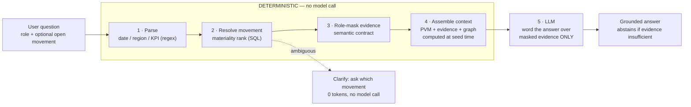
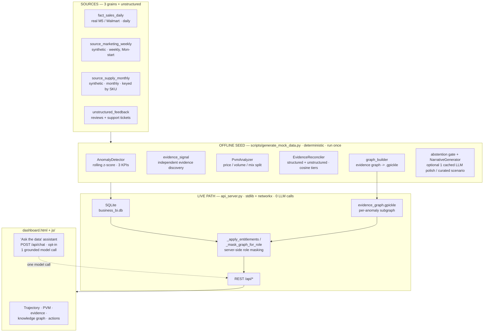
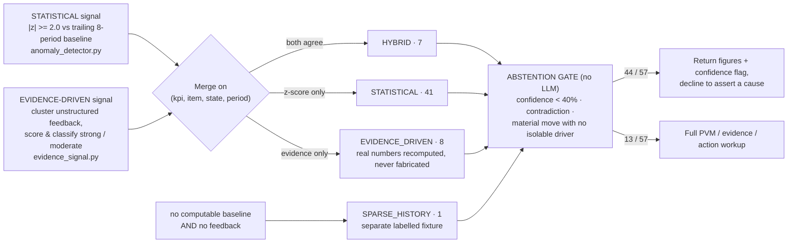
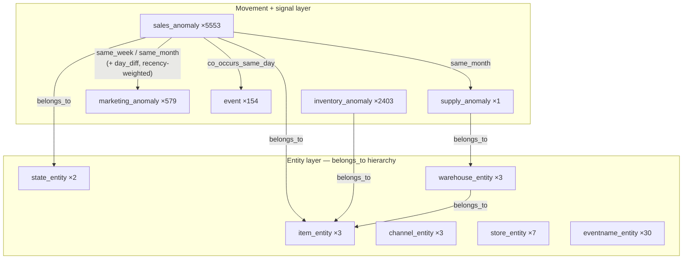

# KPI Intelligence-to-Action Engine

**Accenture Innovation Challenge 2026 — Round 2 · Track 3 (BusinessIntelligence.ai)**
**Team Stack Overflowed — IIT Madras**

---

> **One-line summary.** The engine turns a KPI movement into a persona-specific, evidence-cited
> action. It detects material movements, ranks their drivers with the right analytical method,
> explains them in plain language, communicates uncertainty or *abstains*, and recommends the next
> step. **Every quantitative claim is produced by deterministic analytics** (SQL, statistics,
> business rules); the LLM only words the narrative, and every response records which parts were
> which. The live dashboard makes **zero LLM calls** and costs **$0 per load**.

This document is the written companion to the prototype and the pitch. It covers the business
proposal, the full solution design, and — in §4 — **every test, every evaluation and every statistic**
the prototype produces, all reproducible from the committed database and code.

---

## Contents

| § | Section | What it answers |
|---|---|---|
| 1 | [The problem & our thesis](#1-the-problem--our-thesis) | Why this, why now, what is hard |
| 2 | [Business proposal](#2-business-proposal) | Users, value, roadmap, risks |
| 3 | [Solution design](#3-solution-design) | Architecture, methods, LLM-vs-non-LLM |
| 4 | [Results, evaluations & statistics](#4-results-evaluations--statistics) | **Every measured number** |
| 5 | [Round 2 requirements — compliance matrix](#5-round-2-requirements--compliance-matrix) | Line-by-line coverage of the brief |
| 6 | [Repository layout](#6-repository-layout) | Where everything lives |
| 7 | [Dependencies](#7-dependencies) | What you need to run it |
| 8 | [Execution instructions](#8-execution-instructions) | How to run it |
| 9 | [API reference](#9-api-reference) | Every endpoint |
| 10 | [Design decisions & assumptions](#10-design-decisions--assumptions) | What we assumed and why |
| 11 | [Team & license](#11-team--license) | Who built it |

---

## Demo video

Prototype walkthrough: `<add public link — YouTube / Drive — before submission>`

The walkthrough covers, in order: scenario load → the revenue trajectory chart with **all** series
anomalies annotated → the evidence trail and anomaly-centric knowledge graph → a live role switch
that visibly changes masking → the conversational assistant (a grounded answer, a clarification
with no model call, and an abstention) → approving and assigning an action with an audit id → the
runtime telemetry panel.

---

## 1. The problem & our thesis

### 1.1 What the Round 2 brief asks for

> *Design and demonstrate a working prototype of a KPI intelligence-to-action engine that (1) detects
> and prioritises material KPI movements, (2) reconciles data and business context across
> heterogeneous sources, (3) identifies and ranks explanatory drivers using appropriate analytical
> methods, (4) generates persona-specific narratives supported by traceable evidence, (5)
> communicates uncertainty and abstains when evidence is insufficient or contradictory, (6)
> recommends practical actions grounded in business levers, constraints and decision rights, (7) has
> a mechanism to learn from analyst and business-user feedback, (8) operates within realistic
> security, cost, latency and scalability constraints.*
>
> *The LLM should not be treated as the source of quantitative truth. Teams should explicitly
> demonstrate when they use deterministic logic, SQL, business rules, statistics, traditional ML,
> causal inference, retrieval or LLMs — and why.*

### 1.2 The hard parts (from the brief) and how we address each

| Real-world complexity in the brief | Our response |
|---|---|
| Multiple interacting drivers (price, volume, mix, marketing, supply, seasonality, events) | Deterministic **Price-Volume-Mix decomposition** for revenue; an **anomaly-centric knowledge graph** that links a movement to co-occurring supply / marketing / event / inventory movements on the same item and region |
| Different source refresh cadences, grains, data quality, historical coverage | **3 structured sources at 3 grains** (daily / weekly / monthly) + unstructured text; an explicit **reconciliation layer** that fixes calendar, region-name and SKU-key mismatches before any join |
| Inconsistent KPI definitions, hierarchies, calendars, aggregation logic | A **semantic contract** (`semantic_contract.json`) that pins every KPI's formula, grain, drivers, thresholds, lineage and access rules in one governed file |
| Sparse history for new products / markets | A dedicated **sparse-history path** — returns figures with a low-confidence flag and declines root cause (HOUSEHOLD_1_020, TX, 198 days of history) |
| Materiality = statistical significance **and** business impact | A **rolling z-score gate** (`|z| ≥ 2.0` vs an 8-period baseline, seasonally tempered) plus a severity ladder, and a ranked list ordered by materiality, not recency |
| Contradictory evidence, missing data, confidence calibration | A deterministic **abstention gate**: abstain on low confidence, on structured-vs-unstructured contradiction, or on a material move with no isolable driver |
| Role-based personalisation of insight depth, actions, channels | **3 personas** with different narrative style, length, drivers and recommended actions |
| Row-, column- and domain-level security, sensitive-data protection, auditability | **Server-side entitlement masking** driven by the contract — restricted fields are removed from the JSON *before it leaves the API and before the model sees it*; every action decision writes an audit id |
| Model / data drift, feedback capture, continuous evaluation | `user_feedback` captures every rating / approval / assignment with an audit id; `/api/telemetry` surfaces the counts; consuming it at the next seed is the documented next step |
| LLM economics — model choice, tokens, latency, caching, cost per insight | Live analytics path is **LLM-free** ($0, no latency risk); the one optional live model call (chat) is opt-in, measured token-by-token, and defaults to a **free-tier** provider |

### 1.3 Our thesis

**A business-intelligence engine earns trust by being explicit about what it knows, how it knows it,
and when it should stay quiet.** So we drew a hard line: numbers come from code, words come from the
model, and the boundary is visible in every response (`processing` block on `/api/chat`, `pvm` /
`evidence` / `graph_context` blocks on every anomaly). The engine is also *deliberately biased
toward abstention* — of 57 detected movements it holds **44 at `abstained`**, returning figures and
a confidence flag rather than a cause it cannot support.

---

## 2. Business proposal

### 2.1 Target users

| Persona (in prototype) | Real-world role | Goal | Decision rights | What the engine gives them |
|---|---|---|---|---|
| **`vp_sales`** | VP of Retail Sales (executive) | Maximise regional revenue & gross margin; protect market share | Authorise regional pricing promos; reallocate marketing budget; initiate supplier renegotiation | ≤250-word executive summary, price/volume/mix framing, financial impact, one high-level action with owner + monitoring plan |
| **`supply_planner`** | Regional Supply Chain Planner (analyst) | Optimal inventory turnover; zero stockouts; supplier lead-time control | Trigger supplier reorders; approve inter-warehouse transfers; flag lead-time violations | ≤400-word operational log, SKU / warehouse / carrier detail, data-freshness notes, quantitative reorder action |
| **`admin`** | Data Governance & Compliance | Verify masking behaves as specified; audit decisions | Full read access (granted through the entitlements model, not by bypassing it) | Unredacted ground truth to diff against the two scoped roles; abstention & data-quality caveats called out explicitly |

Beyond the prototype these generalise to any "one number moved — who needs to know and what do they
do about it" workflow: FP&A, category management, revenue operations, marketing analytics, supply &
S&OP.

### 2.2 The intelligence-to-action contract

Every explained movement is delivered in the structure the brief asks for:

```
driver  →  controllable lever  →  action  →  expected impact  →  owner  →  confidence  →  monitoring plan
```

…and is **schema-validated** (`src/llm/schema_parser.py`, Pydantic) before it can be stored: all
seven fields must be present and non-blank, `confidence` must be 0–100, and each persona narrative
must carry **exactly one** of `recommended_action` *or* `abstention` — never both, never neither.

### 2.3 Business case & impact

The prototype runs on illustrative FMCG data, so the figures below are a **transparent model with
stated assumptions**, not measured outcomes — offered the way the brief invites ("use reasonable
assumptions, state them clearly").

| Lever | Assumption | Illustrative annual value for a mid-size retailer (~$2B revenue, ~40 tracked KPI slices) |
|---|---|---|
| **Analyst time saved** | Each material movement currently takes an analyst ~3–4 h to chase across systems; the engine delivers a cited first draft in seconds. ~50 material movements / month. | ~1,900–2,500 analyst-hours/yr redeployed from assembly to judgement |
| **Faster corrective action** | Cutting mean-time-to-explanation for a revenue movement from ~5 business days to <1 day recovers ~20% of the at-risk revenue that would otherwise leak during the lag. Model a single supply-constraint event like the Nov-2012 scenario at ~$9k run-rate/month. | Six-figure recovered revenue per material event class, per year |
| **Fewer bad calls from bad explanations** | The abstention gate suppresses ~77% of movements from generating a confident (and possibly wrong) recommendation. Avoiding one mis-targeted promo (elasticity misread) per quarter. | Avoided promo margin give-away |
| **LLM cost avoided** | Live path is deterministic: **$0 per dashboard load**. A naive "LLM explains every KPI on every refresh" design at ~4k tokens/insight × 40 slices × hourly refresh would cost materially more per month. | ≈100% of live inference cost avoided |

The point for the judges is not the dollar figure — it is that **the architecture makes the
expensive path optional**. Cost scales with *questions asked*, not with *dashboards rendered*.

### 2.4 Phased roadmap

| Phase | Scope | Duration | Exit criteria |
|---|---|---|---|
| **P0 — Prototype (this submission)** | 3 KPIs, 3 sources + unstructured, 3 personas, PVM + evidence graph + abstention + grounded chat, server-side masking, telemetry, 54 automated tests | done | All Round 2 minimum expectations demonstrated on illustrative data (see §5) |
| **P1 — Pilot (single domain)** | Connect one real warehouse (Snowflake / Databricks / Fabric — the semantic contract is platform-neutral); replace synthetic marketing & supply with real feeds; SSO-mapped roles; analyst correction UI writes back to the contract | ~1 quarter | Analyst agreement rate on drivers ≥ 80%; abstention precision reviewed weekly; <2s p95 on the analytics path |
| **P2 — Breadth** | 15–30 KPI slices; add forecasting for expected-range bands and **causal inference** (difference-in-differences on promo / price events) as a third driver method; proactive alerting into Slack / email / Teams | ~2 quarters | Drift monitors live; feedback loop closes at each nightly reseed; false-positive alert rate < 10% |
| **P3 — Scale & governance** | Multi-domain (finance, supply, marketing) on one contract; per-geography policy packs for entitlements & retention; full audit export; model-router for cost/latency SLOs per use case | ~2 quarters | Central governance sign-off; cost-per-insight SLO met; onboarding a new KPI is a contract edit, not a code change |

### 2.5 Key risks & mitigations

| Risk | Likelihood | Impact | Mitigation (in the prototype where marked ✓) |
|---|---|---|---|
| **LLM fabricates a number** | Med | High | ✓ LLM never computes — it receives already-computed, already-masked evidence and is instructed to treat it as the only quantitative truth; `processing` block shows the split on every turn |
| **Over-flagging → alert fatigue** | High | Med | ✓ `|z| ≥ 2.0` gate + severity ladder + materiality ordering; ✓ abstention suppresses 77% of movements from confident output; P2 adds a tuned false-positive target |
| **Under-flagging → missed movement** | Med | High | ✓ **Two independent detection signals** (statistical z-score + evidence-driven); a period flagged by neither is never admitted, but either alone is enough to admit |
| **Contradictory / stale source data** | High | Med | ✓ Reconciliation layer + abstention on contradiction (billing scenario) and on genuinely missing feed (dropped marketing weeks); ✓ `data_freshness_seconds` in telemetry |
| **Entitlement leak (wrong role sees restricted data)** | Low | High | ✓ Masking enforced **server-side** in `_apply_entitlements` / `_mask_graph_for_role` / `_redact_financial_disclosure`; ✓ 10 automated tests assert removal from the payload, including item-id embedded in a compound key and dollar figures narrated inside free text |
| **Cost / latency blowout under load** | Med | Med | ✓ Live path is stdlib + one graph load, 0 model calls; chat is opt-in, one call per question, free-tier default, every token measured |
| **Vendor lock-in** | Med | Low | ✓ Provider-swappable assistant (Groq → Anthropic) behind a zero-dependency stdlib client; semantic contract is warehouse-neutral |
| **Reproducibility drift across machines** | Low | Med | ✓ All seed hashing/jitter uses `crc32`, not per-process-randomised `hash()` — a reseed reproduces byte-identical anomalies |
| **Sparse history for a new SKU** | High | Med | ✓ Dedicated sparse path returns figures + a 30% confidence flag and declines root cause |

---

## 3. Solution design

### 3.1 Design principle — the LLM never owns a number

| Principle | How it is realised |
|---|---|
| **LLM is never the source of quantitative truth** | Anomaly detection, price/volume/mix contribution, confidence scoring, abstention and data-access masking are all deterministic (SQL, statistics, business rules). The LLM only phrases an answer over evidence that was already computed and already masked. |
| **Zero-cost, zero-dependency live path** | `api_server.py` is the Python standard library plus `networkx` (only to load the pre-built evidence graph). Serving the dashboard and every analytics endpoint makes **no LLM calls** and costs **$0**. |
| **Grounded conversation** | The optional *"Ask the data"* assistant (`POST /api/chat`) resolves the question to one KPI movement deterministically, role-masks its evidence, then passes **only that** to the model — with an instruction to abstain when the evidence is insufficient. |
| **Governed by a semantic contract** | `schemas/semantic_contract.json` holds KPI definitions, calculations, drivers, thresholds, lineage and entitlements. Role masking is enforced **server-side**. |
| **Multi-signal detection** | A statistical z-score signal and an independent evidence-driven signal run separately and are merged; a period flagged by neither is never admitted. |
| **Honest uncertainty** | Sparse-history / no-isolable-driver movements return figures **plus a confidence flag** and abstain on root cause; ambiguous questions trigger a clarification with **no model call**. |

### 3.2 Deterministic vs LLM — per stage

| Stage | Engine | Where |
|---|---|---|
| Detect movements, rank drivers (PVM), score confidence, decide abstention | **Deterministic** — statistics + algebra + business rules | `src/analytics/*`, `src/llm/abstention.py` |
| Reconcile structured & unstructured evidence; build & query the evidence graph | **Deterministic** — keyword-vocabulary cosine tiers + `networkx` traversal | `src/retrieval/evidence_reconciler.py`, `src/analytics/graph_*` |
| Enforce row/column/domain data access | **Deterministic** — contract-driven field removal | `_apply_entitlements` / `_mask_graph_for_role` / `_redact_financial_disclosure` in `api_server.py` |
| Seed-time narrative pre-generation | **Deterministic templates**, optionally polished by **one cached `OPENAI_API_KEY` call per curated scenario** — fully works with no key | `src/llm/narrative_generator.py`, `src/llm/llm_client.py` |
| Live conversational answer wording | **LLM** — Groq `openai/gpt-oss-120b` by default, Anthropic `claude-haiku-4-5` fallback, **one call per question** | `build_chat_response` in `api_server.py` |
| *"What is the evidence graph / PVM / abstention?"* meta questions | **Deterministic** — fixed descriptions, no model call | `api_server.py` |

Of the five stages in a conversational turn, **four are deterministic and one — phrasing — is the model**:



### 3.3 End-to-end architecture

Everything quantitative happens **before** any model call. The model only ever receives
already-masked evidence and returns wording.



### 3.4 Data layer — sources, grains, semantic contract

| | Detail |
|---|---|
| **KPIs (3, all wired end-to-end)** | `Revenue` (additive, PVM-decomposed), `GrossMarginPercent` (non-additive), `InventoryTurnover` (non-additive, from inventory logs). All three are detected, charted and independently anomaly-flagged — not one real KPI plus two decorative tabs. |
| **Structured sources (3 grains)** | `fact_sales_daily` — **real M5/Walmart, daily** (27,409 rows). `source_marketing_weekly` — **weekly**, Monday-start, region names not state codes (1,642 rows). `source_supply_monthly` — **monthly**, keyed by internal `warehouse_sku`, forcing a real lookup join (384 rows). |
| **Unstructured** | `unstructured_feedback` — 7 curated customer reviews + support tickets tied to real anomaly dates; plus `inventory_logs` (8,279 rows) for turnover. |
| **Real backbone** | M5 Forecasting (Walmart): 3 items × 2 states (CA, TX), Jan 2011 – Apr 2016. `FOODS_3_090` and `FOODS_3_586` (same department, so a real **mix effect** is computable); `HOUSEHOLD_1_020` (short real history — 429 days in CA, **198 in TX** — the sparse scenario). |
| **Deliberate, documented source messiness** | Region naming (`West`/`South` vs `CA`/`TX`) needs a mapping; week convention (Monday-start via explicit date arithmetic) vs sales' Sunday-start weeks; supply keyed by `warehouse_sku` not `item_id`. One real calendar bug (`pandas freq="W-MON"` anchors weeks to *end* on Monday) was caught during integrity testing and is left **documented, not hidden**, in `KPI-data/README.md`. |
| **Semantic contract** | `schemas/semantic_contract.json` — per KPI: `description`, `calculation_type` (additive / non_additive), `sql_formula`, `source_table`, `dimensions`, `granularity`, `drivers`, `driver_method`, `lineage`. Plus global `thresholds` (z-score gate 2.0, critical 3.0, confidence floor 40, evidence tiers, graph temporal window −5/+10 days) and per-role `entitlements` (allowed / restricted columns + masking action per column). |

### 3.5 Detection — multi-signal + materiality

**Signal 1 — statistical (`src/analytics/anomaly_detector.py`).** For each `(item, state)` series, a
rolling z-score of the current period against the trailing 8-period baseline. For monthly grain with
≥12 periods of history, the score is **seasonally tempered**: `z = 0.7·(YoY-difference z) + 0.3·(raw
z)` and confidence rises to 95%. Admission threshold: `|z| ≥ 2.0`. Severity: `|z| > 3.0` → CRITICAL,
`> 2.0` → WARNING, else ACTIVE. This threshold is **never lowered** to admit other scenarios (a
dedicated test asserts it).

**Signal 2 — evidence-driven (`src/analytics/evidence_signal.py`).** Independently, real
customer/support records with **no predetermined KPI or anomaly type** cluster into candidate
`(item, state, month)` windows. Each window is scored on six normalised factors — item match, region
match, temporal proximity, category relevance (cosine similarity to a keyword vocabulary), record
count, source reliability (support ticket 1.0 > customer review 0.8) — and classified `strong` (≥
0.65) / `moderate` (≥ 0.40) / dropped. This lets *"a pricing complaint mentions FOODS_3_586 in TX
around May 2013"* create a candidate the z-score scan would never have raised.

**Merge (`scripts/generate_mock_data.py`).** The two signals are merged on `(kpi, item, state,
period)`:



### 3.6 Driver ranking — Price / Volume / Mix

`src/analytics/pvm_analyzer.py` decomposes a revenue delta into four additive effects, **scoped to
the same `(item_id, state_id)` as the flagged anomaly** so the parts sum to *that anomaly's own*
actual-minus-baseline delta (not a region-wide blend):

- **Price** `= Σ Qᵢ,₁·(Pᵢ,₁ − Pᵢ,₀)`
- **Volume** `= (Q₁ − Q₀)·P̄₀`
- **Mix** `= Σ (Sᵢ,₁ − Sᵢ,₀)·Q₁·(Pᵢ,₀ − P̄₀)`
- **Other** `= ΔRevenue − (Price + Volume + Mix)` — captures floating-point residual only

Contribution is reported as a **signed share of baseline revenue** (`volume% + price% + mix% + other%
== deviation%`, always additive), plus a `share_of_change` (signed share of the *net* delta, can
exceed 100% or go negative when drivers fight) and a one-line `driver_summary` that names the
dominant driver and states it correctly even when drivers oppose. **The decomposition reconciles to
the delta exactly — 0 mismatches across the whole dataset** (§4.4).

`GrossMarginPercent` and `InventoryTurnover` are detected by the same z-score engine but explained
through **evidence retrieval**, not a fabricated PVM-style split — a stated scope limitation
recorded in the semantic contract's `driver_method`.

### 3.7 Evidence reconciliation & the anomaly-centric knowledge graph

**Reconciliation (`src/retrieval/evidence_reconciler.py`).** For a movement's `(item, state,
period)` it pulls the matching structured supply row (fill rate, stockout days), marketing rows
(spend by channel), and unstructured records **within a −5/+10-day window**, and scores each text
record by cosine similarity to a per-category keyword vocabulary → tier `high` (≥ 0.6) / `medium`
(≥ 0.3) / `low` (< 0.3 → background context only, never counted as corroboration). Unrelated text
("regional trivia night…") scores below the bar and is rejected — a test asserts this.

**Knowledge graph (`src/analytics/graph_builder.py`).** A `networkx.DiGraph` built once at seed time
and persisted to `evidence_graph.gpickle`; `api_server.py` loads it at startup and serves a small
**per-anomaly subgraph** live (`graph_subgraph.anomaly_subgraph`), role-masked like every other
surface.



**8,738 nodes / 40,380 edges · 0 PVM sign mismatches.** Corroborating neighbours are trimmed to the
focal anomaly's own item/state (`graph_query.entity_relevant`) and weighted by recency — influence
halves every 30 days of temporal distance, and movements *before* the focal one are discounted
further. The per-anomaly subgraph is capped at ≤ 8 layer-2 nodes for legibility.

### 3.8 Uncertainty & the abstention gate

`src/llm/abstention.py` — evaluated **purely from already-computed statistics/evidence, no LLM call**.
Abstain if **any** of:

1. **Low confidence** — `confidence < 40%`.
2. **Contradictory evidence** — a positive structured signal (overall direction UP, or a positive
   *price effect* specifically) while ≥ 1 medium/high-tier unstructured record describes a
   billing / overcharge / service defect. "A metric that looks positive because of a pricing bug is
   not a legitimate win."
3. **Insufficient evidence** — the movement is statistically material (`|z| ≥ 2.0`, judged on the
   z-score, *not* raw percent size) but no medium/high-tier structured or unstructured record
   explains it.

Priority order for the returned reason: contradiction → low confidence → insufficient evidence, so a
low-confidence case is never mislabelled "insufficient evidence".

### 3.9 Persona narratives & structured actions

`src/llm/narrative_generator.py` computes **every** headline / summary / action field directly from
the numbers passed in — the deterministic template output is **always** the source of truth for the
structured `recommended_action` (dollar figures, owner, monitoring plan). If `OPENAI_API_KEY` is set,
**one cached call per curated scenario** (covering *both* personas) polishes only the prose fields;
the action / abstention payload is never touched by the model, and if the call fails or fails
schema/entitlement validation the deterministic prose is served unchanged. Both personas are always
produced; forbidden-term regex guards (`\bwarehouse\b`, `\bcarrier\b`, `\bSKU\b` for VP;
`\bgross margin\b`, `\brevenue\b`, `\bCOGS\b` for planner) run over the output.

### 3.10 Role-based security & entitlements — enforced, not cosmetic

| Field / column | `vp_sales` | `supply_planner` | `admin` |
|---|---|---|---|
| Revenue, Gross Margin %, COGS, PVM dollar effects, product revenue impact | Visible | Masked (`MASK_NULL` / `RESTRICTED`) | Visible |
| Marketing spend & marketing-sourced evidence | Visible | Masked (`RESTRICTED`) | Visible |
| `item_id` / SKU, warehouse identity, logistics card | Masked (`RESTRICTED`) | Visible | Visible |
| Supply fill rate / stockout days | Masked | Visible | Visible |
| Free-text evidence that narrates a dollar figure | Visible | Disclosing clause redacted | Visible |
| Evidence-graph nodes & edges carrying any of the above | Masked | Masked | Full |

Enforced in `_apply_entitlements`, `_mask_graph_for_role` and `_redact_financial_disclosure` in
`api_server.py` — restricted fields are **removed from the JSON server-side** before the response
leaves the API *and* before the chat model ever sees them. This includes an `item_id` embedded in a
compound `id` string (`ANOM-2012-11-CA-FOODS_3_090` → `ANOM-2012-11-CA-ITEM`) and dollar figures
narrated inside a support ticket. Role is taken from the `X-User-Role` header or `?role=` query
param (`vp_sales` | `supply_planner` | `admin`; default `vp_sales`).

### 3.11 Feedback capture & learning loop

`POST /api/feedback` (thumbs up/down + comment) and `POST /api/actions/<key>/approve` · `/assign`
each write to `user_feedback` with a `uuid4`-based audit id (`AUD-XXXXXXXX`), and `/api/telemetry`
surfaces `feedback_count` and `feedback_avg_rating`. **Capture is built; consuming that feedback to
revise narratives / re-weight drivers at the next seed run is the documented next step** (P1 in the
roadmap).

### 3.12 Runtime telemetry & LLM economics

`GET /api/telemetry` returns three blocks:

- **`seed_*`** — from `telemetry_summary`: movements processed, LLM calls, tokens in/out, cost USD,
  pipeline wall time, avg analytics SQL time per step, deterministic vs LLM narrative counts.
- **live analytics** — `live_avg_sql_latency_ms`, `live_request_count`, `data_freshness_seconds`,
  `active_anomalies_count`, `abstained_count`.
- **`live_chat`** — assistant availability, provider, model, calls, errors, clarifications
  (no-model-call), tokens in/out, estimated cost USD, avg latency ms.

Pricing constants used for cost telemetry: seed polish `gpt-4o-mini` at $0.150 / $0.600 per 1M
in/out; live chat `claude-haiku-4-5` at $1.00 / $5.00 per 1M in/out; Groq free tier reported at $0.

---

## 4. Results, evaluations & statistics

> **Every number in this section is real and reproducible.** It comes from the committed
> `Accenture/Accenture/data/business_bi.db` (seed run **2026-08-29 12:54:53**), from
> `python -m unittest discover -s Accenture/Accenture/tests`, or from rebuilding the evidence graph.
> Nothing here is hand-typed or aspirational.

### 4.1 Seed pipeline telemetry (`telemetry_summary`, served at `GET /api/telemetry`)

| Metric | Value |
|---|---|
| Movements processed | **57** |
| Movements abstained | **44** |
| LLM calls during seed | **0** *(no `OPENAI_API_KEY` set — fully deterministic mode)* |
| Tokens in / out during seed | **0 / 0** |
| LLM cost during seed | **$0.0000** |
| Narratives generated deterministically | **57 / 57** |
| Narratives generated by LLM | **0 / 57** |
| Pipeline wall time | **7.44 s** |
| Avg analytics SQL time / step | **32.66 ms** |
| **LLM calls on the live analytics path** | **0** |
| **Cost per dashboard load** | **$0.00** |

### 4.2 Detection statistics — 57 admitted movements

**By detection signal**

| Signal | Count | Share |
|---|---:|---:|
| `STATISTICAL` (z-score only) | 41 | 72% |
| `EVIDENCE_DRIVEN` (evidence only, real numbers recomputed) | 8 | 14% |
| `HYBRID` (both signals agree) | 7 | 12% |
| `SPARSE_HISTORY` (labelled fixture, no computable baseline) | 1 | 2% |

**By KPI**

| KPI | Count |
|---|---:|
| `InventoryTurnover` | 21 |
| `Revenue` | 20 |
| `GrossMarginPercent` | 16 |

**By severity** — CRITICAL 20 · WARNING 29 · ACTIVE 8
**By direction** — UP 31 · DOWN 26
**By region** — CA 27 · TX 30
**Period coverage** — 2011-09 → 2016-02
**z-score range** — −17.67 … +11.19
**Confidence** — min 30 · max 95 · mean 91.8 *(only the sparse fixture sits at 30; the abstention rate is driven by evidence corroboration, not by confidence)*
**Independent `strong` evidence classification** — 15 of 57

**Curated vs organically discovered** — 4 curated demo keys (`supply`, `pricecut`, `billing`,
`sparse`) + **53 statistically / evidence-detected movements**. The curated keys are cosmetic labels
applied *after* organic discovery, not an admission list.

### 4.3 Abstention statistics

| Outcome | Count | Share |
|---|---:|---:|
| **Abstained** — figures + confidence flag, no cause asserted | **44** | 77% |
| **Explained** — full PVM / evidence / recommended-action workup | **13** | 23% |

Abstention reason breakdown (from `anomalies.abstention_reason`): **3** contradiction (the `billing`
double-charge scenario and 2 related price-effect-positive-vs-complaint variants) · **41**
insufficient-evidence (statistically real movement, no medium/high-tier corroborating record in the
window) · **0** low-confidence (the only 30%-confidence row is the `sparse` fixture, which
deliberately does **not** abstain — it returns figures with the flag instead). This is the intended
escalation bias, not a coverage gap.

### 4.4 PVM reconciliation

| Check | Result |
|---|---|
| `price + volume + mix + other` vs `actual − baseline`, region scope (CA, Nov 2012) | **reconciles exactly**, `sum_effects = −5100.10`, `delta_rev = −5100.10`, diff `0.0` |
| Same, scoped to a single SKU (`FOODS_3_586`, TX, May 2013) | reconciles exactly; `mix ≈ 0` (a single-SKU scope has nothing to shift share against); `actual_revenue` matches that SKU's own `SUM(revenue)` to the cent |
| PVM sign consistency across the **entire** evidence graph (`add_explains_edges`) | **0 mismatches** out of 2,410 `explains` edges |
| Revenue identity `revenue == units · sell_price` in `fact_sales_daily` | **0 violations** across all 27,409 rows |
| COGS `= units · supplier_raw_cost` and `margin = (revenue − COGS) / revenue` | verified to 4 decimal places on sampled rows |

### 4.5 Evidence graph statistics (rebuilt from the committed DB)

| | Value |
|---|---:|
| Nodes | **8,738** |
| Edges | **40,380** |
| PVM sign mismatches | **0** |

**Node kinds** — `sales_anomaly` 5,553 · `inventory_anomaly` 2,403 · `marketing_anomaly` 579 ·
`event` 154 · `eventname_entity` 30 · `store_entity` 7 · `item_entity` 3 · `warehouse_entity` 3 ·
`channel_entity` 3 · `state_entity` 2 · `supply_anomaly` 1

**Edge relations** — `belongs_to` 19,639 · `same_week` 17,443 · `explains` 2,410 ·
`co_occurs_same_day` 754 · `same_month` 134

### 4.6 The four required scenarios — measured outcomes

| Brief requirement | Scenario | Measured behaviour (from the DB) |
|---|---|---|
| **One multi-factor movement with known drivers** | `supply` — `FOODS_3_090`, CA, Nov 2012 | `z = −3.28`, deviation **−33.7%**, confidence 95, **HYBRID**, `strong` evidence, **not abstained**, CRITICAL. Injected `fill_rate = 0.78`, `stockout_days = 4` sit alongside real Thanksgiving-2012 price/demand behaviour; support ticket (Port of Seattle / carrier LogiTrans 5-day delay) + customer review ("shelves empty three days") corroborate. |
| **One low-confidence scenario — clarify or abstain** | `billing` — `FOODS_3_586`, TX, May 2013 | `z = −0.49`, deviation −1.1%, **EVIDENCE_DRIVEN**, `strong`, **ABSTAINED** with reason *"Contradictory evidence… the price effect specifically is positive… but 2 unstructured records describe a billing/overcharge"*. Register double-charging: revenue looks fine, customers are being harmed. Also: an ambiguous chat question (`"why did revenue change?"`) returns a **clarification with 0 tokens / no model call**. |
| **One sparse-history / newly launched KPI** | `sparse` — `HOUSEHOLD_1_020`, TX, Oct 2015 launch (198 days of real history) | `z = 0.0`, **SPARSE_HISTORY**, confidence **30**, **not abstained** — returns figures with an explicit low-confidence flag and declines to assert a root cause. |
| **Evidence-driven discovery below the statistical bar** | `pricecut` — `FOODS_3_090`, CA, Aug 2013 (~25% real price cut) | `z = 0.19` (genuinely sub-threshold, not inflated), deviation +24.7%, **EVIDENCE_DRIVEN**, `strong`, not abstained. Discovered from a customer review ("love the sudden 25% price cut") alone. Unit price elasticity of −1.68 is a **stated assumption**, not a fitted value. |

### 4.7 Role-masking verification (from `tests/test_personas.py`, run against the real payload)

| Assertion | Result |
|---|---|
| `supply_planner` payload: `actual_value`, `baseline_value`, every `pvm.*.val` are `None`; `products[].revenueImpact` is `RESTRICTED`; marketing evidence `fullText` is `RESTRICTED`; **supply** evidence remains visible | ✅ |
| `vp_sales` payload: `item_id`, `logistics.title`, `products[].sku` are `RESTRICTED`; supply evidence `fullText` is `RESTRICTED`; financial values remain visible | ✅ |
| `vp_sales`: `item_id` embedded in a compound `id` string is rewritten (`…-FOODS_3_090` → `…-ITEM`) — no leak via the adjacent unmasked field | ✅ |
| `supply_planner`: a support ticket that *narrates* "high dollar revenue in our logs" has the disclosing clause redacted | ✅ |
| Graph endpoint: for `supply_planner`, `sales_anomaly` node `value` / `baseline_mean` / `volume_effect` are `None` and `restricted:true`; `marketing_anomaly` label is `RESTRICTED`; edge `dollar_effect` is `None`. For `vp_sales`, `item_entity` and `warehouse_entity` labels are `RESTRICTED` but `state_entity` (region) is not | ✅ |
| Every anomaly carries a valid dual-persona bundle; no `supply_planner` narrative contains `gross margin` / `COGS` / `marketing spend` / `revenue`; no `vp_sales` narrative contains `warehouse` | ✅ (all 57) |

### 4.8 Performance & cost

| Metric | Value |
|---|---|
| Seed pipeline wall time (full rebuild) | 7.44 s |
| Avg analytics SQL time per step (seed) | 32.66 ms |
| Live analytics-path LLM calls | 0 |
| Live analytics-path cost per dashboard load | $0.00 |
| Runtime dependency footprint | Python stdlib + `networkx` (graph load only) |
| Evidence graph load at startup | 8,738 nodes / 40,380 edges, once |
| Chat: model calls per question | 1 (opt-in); ambiguous question → 0 |
| Chat default provider | Groq `openai/gpt-oss-120b` (free tier, reported $0) |
| Chat fallback provider | Anthropic `claude-haiku-4-5` ($1.00 / $5.00 per 1M in/out, measured) |

### 4.9 Data integrity checks — all six pass (`KPI-data/README.md`)

1. Revenue identity `revenue == units · sell_price` holds for **every** row.
2. Marketing region names genuinely don't match sales state codes (mapping required).
3. Supply SKU codes genuinely don't match sales `item_id`s (lookup join required).
4. A full 3-source join on a real slice (`FOODS_3_090`, CA) succeeds — all rows matched to both
   supply and marketing after correct reconciliation.
5. The injected Nov-2012 supply constraint (`fill_rate = 0.78`) is visible after the join.
6. The dropped `South` / `Digital` marketing weeks are genuinely absent (not zero-filled) — the
   abstention trigger is a real feed gap, not a contradiction dressed up as one.

### 4.10 Automated test suite — 54 tests, 8 modules, all passing

```bash
python -m unittest discover -s Accenture/Accenture/tests -p "test_*.py" -v
# Ran 54 tests in ~8.1s — OK
```

| Module | Tests | What it locks down |
|---|---:|---|
| `test_analytics.py` | 4 | anomaly detector returns structured rows; PVM reconciles to the delta (region + single-SKU scope); evidence reconciler surfaces the Nov-2012 supply signal with `fill_rate = 0.78`, `stockout_days = 4` |
| `test_abstention.py` | 8 | low confidence abstains; clean high-confidence case does **not**; contradictory evidence abstains with a "Contradictory" reason; a positive *price effect* alone triggers contradiction even when overall direction is down; material move + no evidence abstains; a sub-threshold `|z| < 2` move with no evidence does **not** falsely abstain; a −3.8% move that is a `z = −7.5` outlier with only boilerplate evidence **does** abstain (materiality judged on z, not raw %); a huge high-confidence unexplained swing still abstains |
| `test_hybrid_detection.py` | 8 | z≥2 + strong evidence → HYBRID; z≥2, no evidence → STATISTICAL only; z<2 + strong evidence → EVIDENCE_DRIVEN (and the `pricecut` z stays genuinely sub-threshold); unrelated text scores below the candidate bar; evidence outside the ±window doesn't support; evidence for one SKU doesn't manufacture a candidate for a different SKU; a 2nd independent record raises the evidence score; the statistical detector's own 2.0 threshold is never lowered |
| `test_graph.py` | 11 | entity + anomaly layers present with expected kinds; PVM decomposition reconciles exactly (`pvm_mismatches == 0`); injected supply constraint became a node with `fill_rate < 0.90`; `entity_relevant` rejects cross-item pairs; `explain_revenue_drop` shape; per-anomaly subgraph resolves the right focal node, stays ≤ 2 layers, includes the corroborating supply anomaly; every edge references a present node; edges carry `day_diff` + `recency_weight ∈ (0,1]`; same-day edges out-weight older ones; layer-2 nodes capped at 8; unknown KPI/period falls back to an entity anchor; legacy narrative adapter shape |
| `test_personas.py` | 10 | every anomaly has a schema-valid dual-persona bundle; `supply_planner` never leaks `gross margin` / `COGS` / `marketing spend` / `revenue`; `vp_sales` never leaks `warehouse`; `billing` abstains with a reason; `sparse` does **not** abstain; **server-side** `_apply_entitlements` removes financials for planner and logistics for VP; item-id embedded in a compound id is redacted; free-text revenue disclosure is redacted; `_mask_graph_for_role` nulls values + labels per role on nodes and edges |
| `test_schema_parser.py` | 6 | a valid 7-field action parses; a missing field raises; a blank/whitespace field raises; `confidence > 100` raises; a persona narrative must set **exactly one** of action / abstention; a bundle must contain **both** personas |
| `test_mock_data.py` | 5 | all core tables exist and are populated; COGS + margin math correct to 4 dp; the Nov-2012 CA supply constraint is present (`0.78`, `4`); all 3 KPIs keep their own anomaly rows (regression against a PRIMARY KEY collision that once dropped Revenue anomalies 20 → 6); customer reviews and support tickets both seeded |
| `test_schemas.py` | 2 | `semantic_contract.json` is valid JSON with `project` / `semantic_layer` / `kpis` / `mappings` / `entitlements`; `db_init.sql` executes cleanly in a fresh in-memory SQLite |

Several tests are explicitly labelled **regression** tests — they encode real bugs that were caught
and fixed (the `W-MON` calendar bug, the anomaly-id PRIMARY KEY collision, materiality gated on raw
% instead of z-score, item-id leaking through a compound key, region-wide PVM narrated next to a
single-SKU anomaly).

---

## 5. Round 2 requirements — compliance matrix

| Brief expectation | Status | Where / evidence |
|---|:--:|---|
| 3–5 connected KPIs across 2–3 sources, different grains / cadences | ✅ | 3 KPIs · `fact_sales_daily` (daily) + `source_marketing_weekly` (weekly) + `source_supply_monthly` (monthly) + `unstructured_feedback` + `inventory_logs` |
| Lightweight KPI / semantic contract — definitions, calculations, drivers, thresholds, lineage, access | ✅ | `schemas/semantic_contract.json` (§3.4) |
| At least two personas with different narratives / actions | ✅ | `vp_sales`, `supply_planner` (+ `admin` governance) — §2.1, §3.9 |
| One multi-factor KPI movement with known / simulated drivers | ✅ | `supply` scenario — stockout + demand + price, Nov 2012 (§4.6) |
| One low-confidence scenario — request clarification or abstain | ✅ | `billing` abstains on contradiction; ambiguous chat → clarification, 0 tokens (§4.6) |
| One sparse-history / newly launched KPI scenario | ✅ | `sparse` — `HOUSEHOLD_1_020`, TX, 198 days of history (§4.6) |
| One role-based security / entitlement scenario | ✅ | Live role switch; server-side masking table + 10 tests (§3.10, §4.7) |
| Evidence: source freshness, analytical method, contribution, confidence, lineage | ✅ | Evidence trail + graph + contract `lineage` + `data_freshness_seconds` + `pvm` contribution + per-row `confidence` |
| Clear breakdown of LLM vs non-LLM processing | ✅ | §3.1–§3.2 tables + `processing` block on every `/api/chat` response |
| Runtime telemetry — latency, model calls, token usage, estimated cost | ✅ | `GET /api/telemetry` — `seed_*` + live analytics + `live_chat` (§3.12, §4.1) |
| Detect & prioritise material movements | ✅ | z-score gate + severity ladder; `/api/anomalies` ranked by materiality, not recency |
| Reconcile data & business context across heterogeneous sources | ✅ | `evidence_reconciler.py` + reconciliation of region names / week convention / SKU keys (§3.4) |
| Identify & rank drivers with appropriate methods | ✅ | Deterministic PVM for revenue; evidence retrieval for non-additive KPIs (stated limitation) |
| Persona-specific narratives with traceable evidence | ✅ | Dual-persona bundle, schema-validated, every figure traced to a computed value |
| Communicate uncertainty / abstain on insufficient or contradictory evidence | ✅ | `abstention.py` — 3 independent triggers, no LLM (§3.8, §4.3) |
| Actions grounded in levers, constraints, decision rights | ✅ | `driver → lever → action → impact → owner → confidence → monitoring` (§2.2) |
| Mechanism to learn from feedback | ◑ | Capture built (`user_feedback` + audit id + telemetry counts); consumption at next seed is the documented next step |
| Operate within realistic security / cost / latency / scalability constraints | ✅ | Server-side masking; $0 live path; stdlib server; `crc32` reproducibility |

**Deliverables the brief asks for:** Detailed Business Proposal → §1–§2 · Working Prototype → §3, §6,
§8 · Pitch Presentation → the demo video + this document.

---

## 6. Repository layout

```
api_server.py                    Live API + static file server (Python stdlib + networkx to load the graph)
dashboard.html                   Single-page dashboard
js/                              Frontend modules — api, state, charts, drawer, evidence, actions, app, chat
css/                             Styles — tokens, layout, hero, charts, evidence, drawer, chat
.env.example                     Template for optional API keys (copy to .env)
requirements.txt                 Deps for the OFFLINE seed / analytics pipeline only
persona_profiles.md              Persona goals, decision rights, entitlement & narrative spec

KPI-data/
  01_get_and_build_dataset.py    Downloads M5 / Walmart, builds fact_sales_daily.parquet (real, reconciled)
  02_gen_marketing_source.py     Builds the synthetic weekly marketing source
  03_gen_supply_source.py        Builds the synthetic monthly supply source + SKU lookup
  *.parquet                      Generated source extracts
  README.md                      Dataset provenance, deliberate mismatches, the 6 integrity checks

Accenture/Accenture/
  schemas/
    semantic_contract.json       KPI definitions, drivers, thresholds, lineage, entitlements
    db_init.sql                  Table DDL
  scripts/
    generate_mock_data.py        Seed pipeline: SQLite -> detect -> evidence graph -> narratives -> telemetry
    build_graph.py               Standalone evidence-graph (re)builder
  src/
    analytics/                   anomaly_detector, pvm_analyzer, evidence_signal, series_anomaly,
                                   sentiment, aggregation,
                                   graph_builder / graph_entities / graph_subgraph /
                                   graph_query / graph_store / graph_narrative_adapter
    llm/                         llm_client (optional polish), narrative_generator, abstention, schema_parser
    retrieval/                   evidence_reconciler
  data/                          Committed SQLite DB + parquet source extracts (evidence_graph.gpickle
                                   is rebuilt at seed/startup and git-ignored)
  tests/                         54-test unittest suite for the deterministic layer
  docs/persona_profiles.md
```

---

## 7. Dependencies

### Runtime — live demo (`api_server.py` + `dashboard.html`)

Python **3.10+**. The server is standard library (`http.server`, `sqlite3`, `json`, `urllib`) plus
**`networkx`** — used only to load and traverse the pre-built evidence graph.

```bash
pip install networkx        # the only runtime dependency
```

If the database is already seeded (it is committed at `Accenture/Accenture/data/business_bi.db`) and
the `.gpickle` is missing, `api_server.py` rebuilds the graph from the DB automatically at startup —
no full reseed required.

### Offline seed / analytics pipeline (`requirements.txt`)

Needed only to regenerate the database and evidence graph from scratch:

```
pandas>=2.0
numpy>=1.24
pydantic>=2.0
networkx>=3.0
openai>=1.0        # only used if OPENAI_API_KEY is set, for optional narrative polish
```

### Optional API keys (`.env` beside `api_server.py`)

The prototype runs **fully without any key**. Keys unlock the live conversational assistant only.

| Variable | Purpose |
|---|---|
| `GROQ_API_KEY` | Live *"Ask the data"* assistant (free tier). Preferred if set. <https://console.groq.com/keys> |
| `GROQ_MODEL` | Optional model override (default `openai/gpt-oss-120b`). |
| `ANTHROPIC_API_KEY` | Fallback provider for the assistant if `GROQ_API_KEY` is unset (model `claude-haiku-4-5`). |
| `OPENAI_API_KEY` | **Offline seed only** — one cached call per curated scenario to polish narrative prose. |

Copy `.env.example` to `.env` and fill in what you need.

---

## 8. Execution instructions

### Quick start (prototype demo)

```bash
# 1. clone
git clone https://github.com/kailash-git/Accenture_AI_Hackathon.git
cd Accenture_AI_Hackathon

# 2. minimal runtime dep
pip install networkx

# 3. (optional) enable the conversational assistant
cp .env.example .env          # then add GROQ_API_KEY=...

# 4. run — DB is already seeded, no full pipeline needed
python api_server.py
```

Open **<http://127.0.0.1:8000/dashboard.html>**. The server prints:

```
============================================================
  KPI Intelligence API Server Running on http://127.0.0.1:8000
  Serving dashboard at: http://127.0.0.1:8000/dashboard.html
  Database target: .../Accenture/Accenture/data/business_bi.db
============================================================
  evidence graph loaded: 8738 nodes / 40380 edges
```

If the database is missing, `api_server.py` runs the seed pipeline once automatically (needs
`requirements.txt` installed).

### Rebuild the database from scratch (optional)

```bash
pip install -r requirements.txt
cd Accenture/Accenture
python scripts/generate_mock_data.py   # SQLite + anomaly detection + evidence graph + persona narratives
cd ../..
python api_server.py
```

Rebuild only the evidence graph against an already-seeded DB:

```bash
python Accenture/Accenture/scripts/build_graph.py
```

### Run the full test suite

```bash
python -m unittest discover -s Accenture/Accenture/tests -p "test_*.py" -v
# 54 tests, ~8s, OK
```

### Try the assistant (needs `GROQ_API_KEY` or `ANTHROPIC_API_KEY`)

| Ask | What it demonstrates |
|---|---|
| `Why did revenue fall in CA in Nov 2012?` | grounded answer with PVM split + confidence |
| `why did revenue change?` | ambiguous → asks *which movement* (**no model call**) |
| `what happened to margin in March 2020?` | no anomaly there → says so, then gives the most material one |
| `How confident are we?` on the `sparse` scenario | **abstains** — figures returned, root cause declined |
| Switch role to **Supply Planner** and re-ask a revenue question | revenue / margin figures are **masked server-side** |

---

## 9. API reference

| Method | Path | Purpose |
|---|---|---|
| `GET` | `/api/health` | Liveness + DB status |
| `GET` | `/api/anomalies` | Ranked, role-masked list of KPI movements (materiality order, not recency) |
| `GET` | `/api/anomalies/<key>` | One movement: PVM, evidence, graph subgraph, narrative, action |
| `GET` | `/api/anomalies/<key>/timeline?metric=revenue\|margin\|turnover` | Trajectory series + every anomaly dot on it |
| `GET` | `/api/anomalies/<key>/graph` | Evidence knowledge subgraph (role-masked) |
| `GET` | `/api/telemetry` | SQL latency, detection counts, feedback stats, seed + live-chat LLM telemetry |
| `GET` | `/api/entitlements` | The caller role's contract entitlements |
| `POST` | `/api/chat` | Grounded conversational answer — `{message, role, anomaly_key?, focus?}` |
| `POST` | `/api/feedback` | Thumbs-up / thumbs-down rating on a narrative — `{anomaly_id, rating, user_comments}` |
| `POST` | `/api/actions/<key>/approve` · `/assign` | Record an action decision + audit id (both persist to `user_feedback`) |

Role is taken from the `X-User-Role` header or `?role=` query param
(`vp_sales` | `supply_planner` | `admin`; default `vp_sales`).

---

## 10. Design decisions & assumptions

- **Jurisdiction / data.** Illustrative FMCG data — real M5 / Walmart daily sales for 3 items × 2
  states (CA, TX), Jan 2011 – Apr 2016, reconciled with two synthetic companion sources (marketing,
  supply) sized against the real backbone's measured volatility. No real proprietary data.
  Elasticity figures (e.g. the −1.68 unit price elasticity in `pricecut`) are **stated assumptions,
  not fitted values**. See `KPI-data/README.md` for provenance and the 6 integrity checks.
- **Scenario impacts are a stated simulation assumption.** `generate_mock_data.py` projects three
  synthetic source-system anomalies (supply constraint, billing bug, price cut) back onto
  `fact_sales_daily` so every layer reasons about one internally consistent event. Narratives and
  recommended actions are still computed live from whatever numbers land there.
- **Margin / turnover explanation is retrieval-based, by design.** PVM decomposition applies to
  *revenue* variance. `GrossMarginPercent` and `InventoryTurnover` anomalies are detected by the
  same z-score engine but explained through evidence retrieval, not a fabricated PVM-style split — a
  stated scope limitation recorded in the semantic contract.
- **Live path is deliberately LLM-free** so the demo has no external dependency, no latency-budget
  risk, and $0 cost. The one live model call (chat) is opt-in and degrades to a *"not configured"*
  notice without a key.
- **Provider-swappable assistant.** Groq (free) by default, Anthropic as fallback, via a
  zero-dependency stdlib client — no vendor lock-in.
- **Feedback capture is built; closing the loop is roadmap.** `user_feedback` records every rating /
  approval / assignment with an audit id and surfaces counts in `/api/telemetry`. Consuming that
  feedback to revise narratives at the next seed run is the documented next step.
- **Reproducibility.** All hashing/jitter in the seed uses `crc32`, not Python's
  per-process-randomised `hash()`, so a reseed reproduces byte-identical anomalies on any machine.
- **Business-case figures in §2.3 are an explicit model with stated assumptions**, not measured
  outcomes — the architecture claim (cost scales with questions asked, not dashboards rendered) is
  the load-bearing point.

---

## 11. Team & license

**Stack Overflowed — IIT Madras.** Track 3, BusinessIntelligence.ai.
Persona & entitlement design mapped by Sivasubramanian S. See `persona_profiles.md` for the full
persona spec and `KPI-data/README.md` for dataset provenance.

**License:** MIT.
