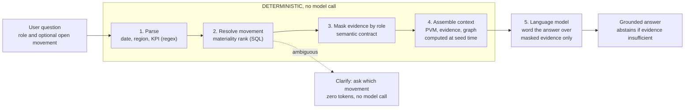
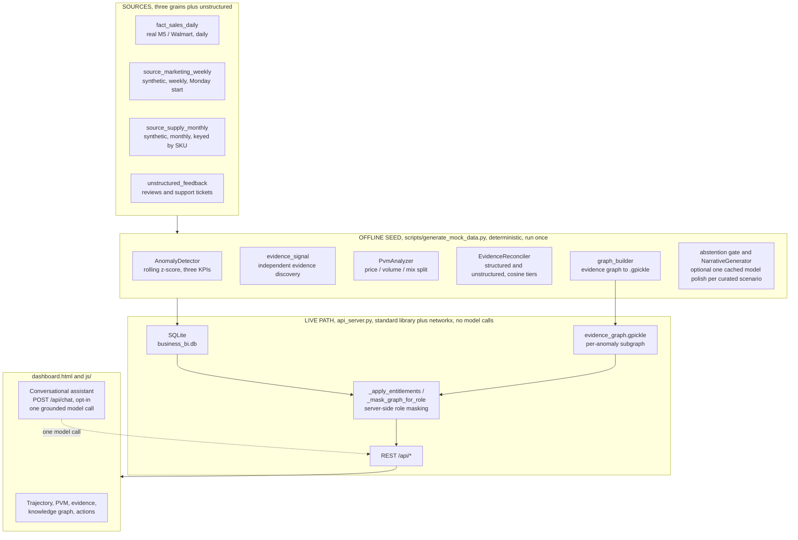
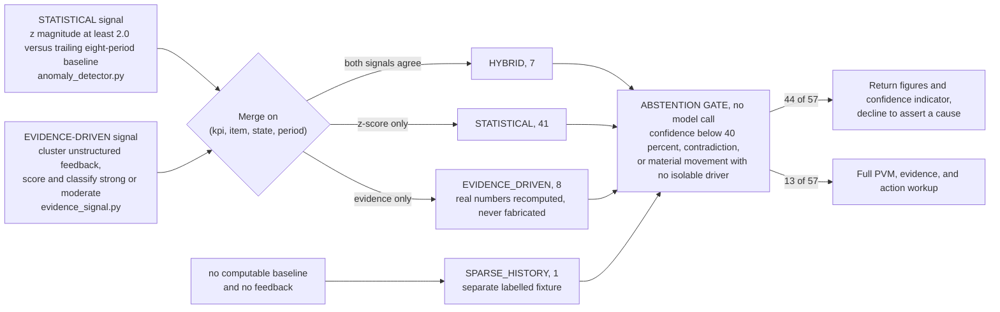
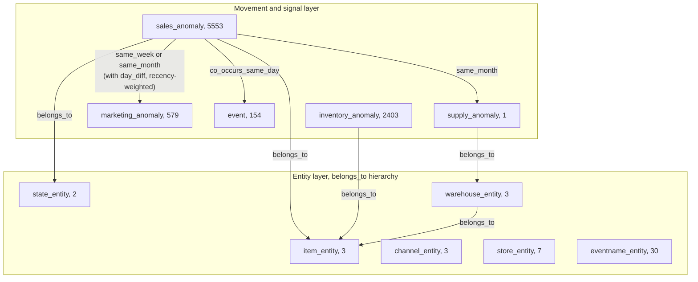

# KPI Intelligence-to-Action Engine

Accenture Innovation Challenge 2026, Round 2, Track 3 (BusinessIntelligence.ai)
Team Stack Overflowed, IIT Madras

---

## Abstract

The engine converts a movement in a business KPI into a persona-specific, evidence-cited action. It
detects material movements, ranks their explanatory drivers with an appropriate analytical method,
explains them in plain language, communicates uncertainty or abstains when the evidence does not
support a conclusion, and recommends the next step. Every quantitative claim is produced by
deterministic analytics (SQL, statistics, and business rules). The language model is used only to
word the narrative, and every response records which parts were computed and which parts were
phrased by the model. The live dashboard and all analytics endpoints make no language-model calls
and incur no per-request cost.

This document is the written companion to the prototype and the pitch. It contains the business
proposal, the full solution design, and, in Section 4, every test, evaluation, and statistic the
prototype produces. All figures are reproducible from the committed database and source code.

---

## Contents

| Section | Title | Purpose |
|---|---|---|
| 1 | [Problem statement and design thesis](#1-problem-statement-and-design-thesis) | Context, difficulty, and guiding principle |
| 2 | [Business proposal](#2-business-proposal) | Target users, value case, roadmap, risk register |
| 3 | [Solution design](#3-solution-design) | Architecture, analytical methods, model-versus-non-model split |
| 4 | [Results, evaluations, and statistics](#4-results-evaluations-and-statistics) | Every measured figure |
| 5 | [Round 2 requirements compliance matrix](#5-round-2-requirements-compliance-matrix) | Line-by-line coverage of the brief |
| 6 | [Repository layout](#6-repository-layout) | Location of every component |
| 7 | [System requirements and dependencies](#7-system-requirements-and-dependencies) | What is needed to run the system |
| 8 | [Setup and execution guide](#8-setup-and-execution-guide) | Complete, step-by-step instructions |
| 9 | [API reference](#9-api-reference) | Every endpoint |
| 10 | [Design decisions and assumptions](#10-design-decisions-and-assumptions) | Stated assumptions and their rationale |
| 11 | [Team and licence](#11-team-and-licence) | Authorship |

---

## Demo video

Prototype walkthrough: `add public link (YouTube or Google Drive) before submission`

The walkthrough covers, in order: scenario load; the revenue trajectory chart with every series
anomaly annotated; the evidence trail and the anomaly-centric knowledge graph; a live role switch
that visibly changes field masking; the conversational assistant (a grounded answer, a clarification
that makes no model call, and an abstention); approving and assigning an action with an audit
identifier; and the runtime telemetry panel.

---

## 1. Problem statement and design thesis

### 1.1 What the Round 2 brief requires

The brief for Track 3 asks teams to design and demonstrate a working prototype of a KPI
intelligence-to-action engine that:

1. Detects and prioritises material KPI movements.
2. Reconciles data and business context across heterogeneous sources.
3. Identifies and ranks explanatory drivers using appropriate analytical methods.
4. Generates persona-specific narratives supported by traceable evidence.
5. Communicates uncertainty and abstains when evidence is insufficient or contradictory.
6. Recommends practical actions grounded in business levers, constraints, and decision rights.
7. Provides a mechanism to learn from analyst and business-user feedback.
8. Operates within realistic security, cost, latency, and scalability constraints.

The brief also states that the language model must not be treated as the source of quantitative
truth, and that teams should explicitly demonstrate when they use deterministic logic, SQL, business
rules, statistics, traditional machine learning, causal inference, retrieval, or language models,
and why.

### 1.2 The stated real-world complexities, and how this engine addresses each

| Complexity identified in the brief | Response in this engine |
|---|---|
| Multiple interacting drivers (price, volume, mix, marketing, supply, seasonality, events) | Deterministic Price-Volume-Mix decomposition for revenue, and an anomaly-centric knowledge graph that links a movement to co-occurring supply, marketing, event, and inventory movements for the same item and region |
| Different source refresh cadences, grains, data-quality levels, and historical coverage | Three structured sources at three grains (daily, weekly, monthly) plus unstructured text, with an explicit reconciliation layer that resolves calendar, region-name, and SKU-key mismatches before any join |
| Inconsistent KPI definitions, hierarchies, calendars, and aggregation logic | A semantic contract (`semantic_contract.json`) that fixes every KPI formula, grain, driver set, threshold, lineage, and access rule in one governed file |
| Sparse history for new products, categories, or markets | A dedicated sparse-history path that returns figures with a low-confidence indicator and declines to assert a root cause |
| Materiality defined by both statistical significance and business impact | A rolling z-score gate against an eight-period baseline, seasonally tempered, combined with a severity ladder, and a result list ordered by materiality rather than recency |
| Contradictory evidence, missing data, and confidence calibration | A deterministic abstention gate that withholds a recommendation on low confidence, on a structured-versus-unstructured contradiction, or on a material movement with no isolable driver |
| Role-based personalisation of insight depth, actions, and delivery | Three personas, each receiving a different narrative style, length, driver framing, and recommended action |
| Row-level, column-level, and domain-level security, sensitive-data protection, and auditability | Server-side entitlement masking driven by the contract; restricted fields are removed from the response payload before it leaves the API and before the model receives it, and every action decision writes an audit identifier |
| Model and data drift, feedback capture, and continuous evaluation | The `user_feedback` table captures every rating, approval, and assignment with an audit identifier; the telemetry endpoint surfaces the counts; consuming that feedback at the next seed run is the documented next step |
| Language-model economics (model choice, token consumption, latency, caching, cost per insight) | The live analytics path makes no model calls and incurs no per-request cost; the single optional live model call (the conversational assistant) is opt-in, measured token by token, and defaults to a free-tier provider |

### 1.3 Design thesis

A business-intelligence engine earns trust by being explicit about what it knows, how it knows it,
and when it should withhold a conclusion. The system therefore enforces a strict separation:
quantitative values are produced by code, narrative wording is produced by the model, and the
boundary between the two is visible in every response through the `processing` block on the chat
endpoint and the `pvm`, `evidence`, and `graph_context` blocks on every anomaly.

The engine is also deliberately biased toward abstention. Of the 57 movements it admits, it holds 44
at the `abstained` state, returning the figures and a confidence indicator rather than asserting a
cause it cannot support. This is the intended behaviour under the brief's instruction to bias toward
caution when evidence is thin.

---

## 2. Business proposal

### 2.1 Target users

| Persona identifier | Role | Primary objective | Decision rights | What the engine delivers to this persona |
|---|---|---|---|---|
| `vp_sales` | Vice-President of Retail Sales (executive) | Maximise regional revenue and gross margin; protect category market share | Authorise regional pricing promotions; reallocate marketing budget; initiate supplier renegotiation | An executive summary of 250 words or fewer, price/volume/mix framing, financial impact, and a single high-level action with a named owner and a monitoring plan |
| `supply_planner` | Regional Supply Chain Planner (analyst) | Maintain optimal inventory turnover; eliminate stockouts; control supplier lead times | Trigger supplier reorders; approve inter-warehouse transfers; flag lead-time violations | An operational report of 400 words or fewer, SKU, warehouse, and carrier detail, data-freshness notes, and a quantitative reorder action |
| `admin` | Data Governance and Compliance | Verify that masking behaves as specified; audit decisions | Full read access, granted through the entitlements model rather than by bypassing it | The unredacted ground truth against which the two scoped roles can be compared, with abstention and data-quality caveats stated explicitly |

Beyond the prototype, these personas generalise to any workflow of the form "a number moved: who
needs to know, and what should they do about it", including financial planning and analysis, category
management, revenue operations, marketing analytics, and sales and operations planning.

### 2.2 The intelligence-to-action contract

Every explained movement is delivered in the structure the brief specifies:

```
driver  ->  controllable lever  ->  action  ->  expected impact  ->  owner  ->  confidence  ->  monitoring plan
```

This structure is schema-validated by `src/llm/schema_parser.py` (using Pydantic) before it can be
stored. All seven fields must be present and non-blank, `confidence` must lie between 0 and 100, and
each persona narrative must carry exactly one of `recommended_action` or `abstention`, never both and
never neither.

### 2.3 Business case and impact

The prototype runs on illustrative fast-moving consumer goods data. The figures below are therefore
a transparent model with stated assumptions, not measured outcomes, presented in the manner the
brief invites.

| Value lever | Assumption | Illustrative annual value for a mid-size retailer (approximately 2 billion USD revenue, approximately 40 tracked KPI slices) |
|---|---|---|
| Analyst time recovered | A material movement currently takes an analyst approximately three to four hours to investigate across systems; the engine delivers a cited first draft in seconds. Approximately 50 material movements per month. | Approximately 1,900 to 2,500 analyst-hours per year redeployed from assembly to judgement |
| Faster corrective action | Reducing mean time to explanation for a revenue movement from approximately five business days to less than one day recovers approximately 20 percent of the at-risk revenue that would otherwise leak during the delay. A single supply-constraint event comparable to the November 2012 scenario is modelled at approximately 9,000 USD run-rate per month. | A six-figure recovered-revenue figure per material event class, per year |
| Fewer poor decisions caused by weak explanations | The abstention gate prevents approximately 77 percent of movements from generating a confident and possibly incorrect recommendation. Avoiding one mis-targeted promotion (a misread of price elasticity) per quarter. | Avoided promotional margin give-away |
| Inference cost avoided | The live path is deterministic and incurs no per-request cost. A naive design in which the model explains every KPI on every refresh, at approximately 4,000 tokens per insight across 40 slices on an hourly refresh, would cost materially more per month. | Approximately 100 percent of live inference cost avoided |

The salient architectural property is that the costly path is optional. Cost scales with the number
of questions asked, not with the number of dashboards rendered.

### 2.4 Phased roadmap

| Phase | Scope | Indicative duration | Exit criteria |
|---|---|---|---|
| P0, Prototype (this submission) | Three KPIs; three structured sources plus unstructured text; three personas; Price-Volume-Mix decomposition, evidence graph, abstention gate, and grounded conversational assistant; server-side masking; runtime telemetry; 54 automated tests | Complete | Every Round 2 minimum expectation demonstrated on illustrative data (see Section 5) |
| P1, Pilot (single domain) | Connect one production data warehouse (Snowflake, Databricks, or Microsoft Fabric; the semantic contract is platform-neutral); replace the synthetic marketing and supply sources with production feeds; map roles to single sign-on; add an analyst correction interface that writes back to the contract | Approximately one quarter | Analyst agreement rate on ranked drivers at or above 80 percent; abstention precision reviewed weekly; 95th-percentile latency on the analytics path below two seconds |
| P2, Breadth | 15 to 30 KPI slices; add forecasting for expected-range bands and causal inference (difference-in-differences on promotion and price events) as a third driver method; add proactive alerting to messaging and email channels | Approximately two quarters | Drift monitors in production; the feedback loop closes at each nightly reseed; false-positive alert rate below 10 percent |
| P3, Scale and governance | Multiple domains (finance, supply, marketing) on one contract; per-geography policy packs for entitlements and data retention; full audit export; a model router that meets cost and latency service-level objectives per use case | Approximately two quarters | Central governance sign-off; cost-per-insight service-level objective met; onboarding a new KPI is a contract edit rather than a code change |

### 2.5 Risk register

| Risk | Likelihood | Impact | Mitigation (present in the prototype where indicated) |
|---|---|---|---|
| The language model fabricates a numerical value | Medium | High | Present. The model performs no computation; it receives only pre-computed, pre-masked evidence and is instructed to treat that evidence as the sole quantitative source. The `processing` block reports the split on every turn. |
| Over-flagging leads to alert fatigue | High | Medium | Present. A z-score admission gate at a magnitude of 2.0, a severity ladder, and materiality ordering. The abstention gate prevents approximately 77 percent of movements from producing confident output. Phase P2 adds a tuned false-positive target. |
| Under-flagging leads to a missed movement | Medium | High | Present. Two independent detection signals (a statistical z-score signal and an evidence-driven signal). A period flagged by neither signal is never admitted, but either signal alone is sufficient to admit it. |
| Contradictory or stale source data | High | Medium | Present. The reconciliation layer, plus abstention on contradiction (the billing scenario) and on a genuinely missing feed (the dropped marketing weeks). The telemetry endpoint reports `data_freshness_seconds`. |
| Entitlement leak (a role sees restricted data) | Low | High | Present. Masking is enforced server-side in `_apply_entitlements`, `_mask_graph_for_role`, and `_redact_financial_disclosure`. Ten automated tests assert removal from the payload, including an item identifier embedded inside a compound key and dollar figures narrated inside free text. |
| Cost or latency growth under load | Medium | Medium | Present. The live path is standard library plus one graph load, with no model calls. The assistant is opt-in, makes one call per question, defaults to a free-tier provider, and measures every token. |
| Vendor lock-in | Medium | Low | Present. A provider-swappable assistant (Groq, with Anthropic as fallback) behind a dependency-free standard-library client. The semantic contract is warehouse-neutral. |
| Reproducibility drift across machines | Low | Medium | Present. All seed-time hashing and jitter use CRC-32 rather than Python's per-process randomised hash, so a reseed reproduces byte-identical anomalies on any machine. |
| Sparse history for a newly launched SKU | High | Medium | Present. A dedicated sparse-history path returns figures with a 30 percent confidence indicator and declines to assert a root cause. |

---

## 3. Solution design

### 3.1 Design principle: the language model is never the source of a quantitative value

| Principle | Realisation |
|---|---|
| The language model is never the source of quantitative truth | Anomaly detection, Price-Volume-Mix contribution, confidence scoring, abstention, and data-access masking are all deterministic (SQL, statistics, business rules). The model only phrases an answer over evidence that has already been computed and already been masked. |
| A zero-cost, low-dependency live path | `api_server.py` uses the Python standard library plus `networkx`, and `networkx` is used only to load the pre-built evidence graph. Serving the dashboard and every analytics endpoint makes no model calls and incurs no per-request cost. |
| Grounded conversation | The optional conversational assistant (`POST /api/chat`) resolves the question to a single KPI movement deterministically, masks that movement's evidence by role, and passes only that evidence to the model, with an instruction to abstain when the evidence is insufficient. |
| Governed by a semantic contract | `schemas/semantic_contract.json` holds KPI definitions, calculations, drivers, thresholds, lineage, and entitlements. Role masking is enforced server-side. |
| Multi-signal detection | A statistical z-score signal and an independent evidence-driven signal run separately and are then merged. A period flagged by neither signal is never admitted. |
| Calibrated uncertainty | Movements with sparse history or with no isolable driver return the figures together with a confidence indicator and abstain on root cause. An ambiguous question triggers a clarification with no model call. |

### 3.2 Deterministic processing versus language-model processing, by stage

| Stage | Processing type | Location |
|---|---|---|
| Detect movements, rank drivers (Price-Volume-Mix), score confidence, decide abstention | Deterministic: statistics, algebra, business rules | `src/analytics/*`, `src/llm/abstention.py` |
| Reconcile structured and unstructured evidence; build and query the evidence graph | Deterministic: keyword-vocabulary cosine tiers, graph traversal | `src/retrieval/evidence_reconciler.py`, `src/analytics/graph_*` |
| Enforce row-level, column-level, and domain-level data access | Deterministic: contract-driven field removal | `_apply_entitlements`, `_mask_graph_for_role`, `_redact_financial_disclosure` in `api_server.py` |
| Seed-time narrative pre-generation | Deterministic templates, optionally polished by one cached model call per curated scenario when `OPENAI_API_KEY` is set; fully functional with no key | `src/llm/narrative_generator.py`, `src/llm/llm_client.py` |
| Live conversational answer wording | Language model: Groq `openai/gpt-oss-120b` by default, Anthropic `claude-haiku-4-5` as fallback; one call per question | `build_chat_response` in `api_server.py` |
| Definitional questions such as "what is the evidence graph" | Deterministic: fixed descriptions, no model call | `api_server.py` |

Of the five stages in a conversational turn, four are deterministic and only the phrasing stage uses
the model:



### 3.3 End-to-end architecture

All quantitative processing occurs before any model call. The model receives only pre-masked
evidence and returns wording.



### 3.4 Data layer: sources, grains, and the semantic contract

| Item | Detail |
|---|---|
| KPIs (three, all wired end to end) | `Revenue` (additive, decomposed by Price-Volume-Mix), `GrossMarginPercent` (non-additive), and `InventoryTurnover` (non-additive, derived from inventory logs). All three are detected, charted, and independently anomaly-flagged; all three are fully instrumented rather than a single implemented KPI with two placeholder tabs. |
| Structured sources (three grains) | `fact_sales_daily`, real M5 and Walmart data at a daily grain (27,409 rows). `source_marketing_weekly`, a weekly grain, Monday-start, using region names rather than state codes (1,642 rows). `source_supply_monthly`, a monthly grain, keyed by an internal `warehouse_sku` code that forces a genuine lookup join (384 rows). |
| Unstructured source | `unstructured_feedback`, seven curated customer reviews and support tickets tied to real anomaly dates, plus `inventory_logs` (8,279 rows) for the turnover KPI. |
| Real data backbone | M5 Forecasting (Walmart): three items across two states (California and Texas), January 2011 to April 2016. `FOODS_3_090` and `FOODS_3_586` are in the same department, so a genuine mix effect is computable. `HOUSEHOLD_1_020` has a short real history (429 days in California, 198 days in Texas) and is used for the sparse-history scenario. |
| Deliberate and documented source inconsistency | Region naming (`West` and `South` versus `CA` and `TX`) requires an explicit mapping; the weekly calendar (Monday start, computed by explicit date arithmetic) differs from the sales calendar (Sunday start); supply is keyed by `warehouse_sku` rather than `item_id`. One genuine calendar defect (the pandas frequency code `W-MON` anchors weeks to end on Monday, not to start on Monday) was caught during integrity testing and is left documented, not concealed, in `KPI-data/README.md`. |
| Semantic contract | `schemas/semantic_contract.json`. Per KPI: `description`, `calculation_type` (additive or non_additive), `sql_formula`, `source_table`, `dimensions`, `granularity`, `drivers`, `driver_method`, and `lineage`. Global `thresholds`: z-score admission gate 2.0, critical severity 3.0, confidence floor 40, evidence relevance tiers, and a graph temporal window of minus five to plus ten days. Per-role `entitlements`: allowed and restricted columns, and a masking action per restricted column. |

### 3.5 Detection: two signals and a materiality gate

Signal one, statistical (`src/analytics/anomaly_detector.py`). For each item-and-state series, a
rolling z-score compares the current period against the trailing eight-period baseline. For a monthly
grain with at least twelve periods of history, the score is seasonally tempered by the formula
`z = 0.7 x (year-on-year difference z) + 0.3 x (raw z)`, and confidence rises to 95 percent. The
admission threshold is a z-score magnitude of at least 2.0. Severity is CRITICAL above a magnitude of
3.0, WARNING above 2.0, and ACTIVE otherwise. This threshold is never lowered to admit other
scenarios, and a dedicated test asserts this.

Signal two, evidence-driven (`src/analytics/evidence_signal.py`). Independently, real customer and
support records with no predetermined KPI or anomaly type are clustered into candidate windows
defined by item, state, and month. Each window is scored on six normalised factors: item match,
region match, temporal proximity, category relevance (cosine similarity to a keyword vocabulary),
record count, and source reliability (a support ticket at 1.0 outweighs a customer review at 0.8).
Each window is then classified as strong (score at or above 0.65), moderate (at or above 0.40), or
dropped. This allows a statement such as "a pricing complaint names FOODS_3_586 in Texas around May
2013" to create a candidate that the z-score scan would never have raised.

Merge (`scripts/generate_mock_data.py`). The two signals are merged on the key of KPI, item, state,
and period:



### 3.6 Driver ranking: Price, Volume, and Mix

`src/analytics/pvm_analyzer.py` decomposes a revenue delta into four additive effects, scoped to the
same item and state as the flagged anomaly, so the parts sum to that anomaly's own actual-minus-
baseline delta rather than a region-wide blend:

- Price effect: the sum over items of current-period quantity multiplied by the change in unit price.
- Volume effect: the change in total quantity multiplied by the average baseline price.
- Mix effect: the sum over items of the change in unit-share, multiplied by current-period total
  quantity, multiplied by the difference between the item's baseline price and the average baseline
  price.
- Other effect: the revenue delta minus the sum of the price, volume, and mix effects; this captures
  the floating-point residual only.

Contribution is reported as a signed share of baseline revenue (so that volume percent plus price
percent plus mix percent plus other percent equals the deviation percent, always additive), together
with a `share_of_change` value (the signed share of the net delta, which can exceed 100 percent or
turn negative when drivers oppose one another) and a one-line `driver_summary` that names the
dominant driver and states the relationship correctly even when drivers oppose one another. The
decomposition reconciles to the delta exactly, with zero sign mismatches across the entire dataset
(see Section 4.4).

`GrossMarginPercent` and `InventoryTurnover` are detected by the same z-score engine but explained
through evidence retrieval rather than a Price-Volume-Mix-style split. This is a stated scope
limitation, recorded in the `driver_method` field of the semantic contract.

### 3.7 Evidence reconciliation and the anomaly-centric knowledge graph

Reconciliation (`src/retrieval/evidence_reconciler.py`). For a movement's item, state, and period,
the reconciler retrieves the matching structured supply row (fill rate, stockout days), the matching
marketing rows (spend by channel), and the unstructured records within a window of minus five to
plus ten days. It scores each text record by cosine similarity to a per-category keyword vocabulary
and assigns a tier: high at 0.6 or above, medium at 0.3 or above, and low below 0.3. Low-tier
records are treated as background context only and are never counted as corroboration. Unrelated
text (for example, a note about a regional trivia night) scores below the bar and is rejected; a
test asserts this.

Knowledge graph (`src/analytics/graph_builder.py`). A directed graph is built once at seed time and
persisted to `evidence_graph.gpickle`. `api_server.py` loads it at start-up and serves a small
per-anomaly subgraph at run time (`graph_subgraph.anomaly_subgraph`), masked by role in the same way
as every other surface.



The graph contains 8,738 nodes and 40,380 edges, with zero Price-Volume-Mix sign mismatches.
Corroborating neighbours are trimmed to the focal anomaly's own item and state
(`graph_query.entity_relevant`) and weighted by recency: influence halves every 30 days of temporal
distance, and movements that precede the focal one are discounted further. The per-anomaly subgraph
is capped at eight second-layer nodes for legibility.

### 3.8 Uncertainty and the abstention gate

`src/llm/abstention.py` is evaluated purely from already-computed statistics and evidence, with no
model call. The engine abstains if any of the following holds:

1. Low confidence: `confidence` is below 40 percent.
2. Contradictory evidence: a positive structured signal (an overall direction of "up", or a positive
   price effect specifically) coincides with at least one medium-tier or high-tier unstructured
   record that describes a billing error, an overcharge, or a service defect. A metric that appears
   positive because of a pricing defect is not a legitimate gain.
3. Insufficient evidence: the movement is statistically material (a z-score magnitude of at least
   2.0, judged on the z-score rather than on raw percentage size) but no medium-tier or high-tier
   structured or unstructured record explains it.

The priority order for the returned reason is contradiction, then low confidence, then insufficient
evidence, so that a low-confidence case is never mislabelled as insufficient evidence.

### 3.9 Persona narratives and structured actions

`src/llm/narrative_generator.py` computes every headline, summary, and action field directly from the
numbers passed in. The deterministic template output is always the source of truth for the
structured `recommended_action` (dollar figures, owner, monitoring plan). When `OPENAI_API_KEY` is
set, one cached model call per curated scenario (covering both personas in a single call) polishes
only the prose fields; the action and abstention payload is never altered by the model. If the call
fails, or its output fails schema or entitlement validation, the deterministic prose is served
unchanged. Both personas are always produced, and forbidden-term regular-expression guards run over
the output (for example, "warehouse", "carrier", and "SKU" for the executive persona, and "gross
margin", "revenue", and "COGS" for the planner persona).

### 3.10 Role-based security and entitlements

| Field or column | `vp_sales` | `supply_planner` | `admin` |
|---|---|---|---|
| Revenue, Gross Margin percent, Cost of Goods Sold, Price-Volume-Mix dollar effects, product revenue impact | Visible | Masked (`MASK_NULL` or `RESTRICTED`) | Visible |
| Marketing spend and marketing-sourced evidence | Visible | Masked (`RESTRICTED`) | Visible |
| `item_id` and SKU, warehouse identity, logistics card | Masked (`RESTRICTED`) | Visible | Visible |
| Supply fill rate and stockout days | Masked | Visible | Visible |
| Free-text evidence that narrates a dollar figure | Visible | Disclosing clause redacted | Visible |
| Evidence-graph nodes and edges carrying any of the above | Masked | Masked | Full |

Masking is enforced in `_apply_entitlements`, `_mask_graph_for_role`, and
`_redact_financial_disclosure` in `api_server.py`. Restricted fields are removed from the response
payload on the server before the response leaves the API, and before the conversational model
receives them. This includes an `item_id` embedded inside a compound `id` string (for example,
`ANOM-2012-11-CA-FOODS_3_090` becomes `ANOM-2012-11-CA-ITEM`) and dollar figures narrated inside a
support ticket. The role is taken from the `X-User-Role` request header or the `role` query
parameter, with permitted values `vp_sales`, `supply_planner`, and `admin`, and a default of
`vp_sales`.

### 3.11 Feedback capture and the learning loop

`POST /api/feedback` (a rating with an optional comment) and `POST /api/actions/<key>/approve` and
`/assign` each write to `user_feedback` with an audit identifier of the form `AUD-XXXXXXXX`, derived
from a version-4 UUID. The telemetry endpoint surfaces `feedback_count` and `feedback_avg_rating`.
Capture is implemented in the prototype. Consuming that feedback to revise narratives and re-weight
drivers at the next seed run is the documented next step, scheduled for Phase P1 of the roadmap.

### 3.12 Runtime telemetry and language-model economics

`GET /api/telemetry` returns three blocks:

- Seed-time metrics, from `telemetry_summary`: movements processed, model calls, tokens in and out,
  cost in US dollars, pipeline wall-clock time, average analytics SQL time per step, and the counts
  of deterministic versus model-generated narratives.
- Live analytics metrics: `live_avg_sql_latency_ms`, `live_request_count`, `data_freshness_seconds`,
  `active_anomalies_count`, and `abstained_count`.
- Live conversational-assistant metrics (`live_chat`): assistant availability, provider, model,
  calls, errors, clarifications (which make no model call), tokens in and out, estimated cost in US
  dollars, and average latency in milliseconds.

The pricing constants used for cost telemetry are: seed-time polish with `gpt-4o-mini` at 0.150 and
0.600 US dollars per million input and output tokens respectively; live chat with `claude-haiku-4-5`
at 1.00 and 5.00 US dollars per million input and output tokens respectively; and the Groq free tier
reported at zero.

---

## 4. Results, evaluations, and statistics

Every figure in this section is reproducible. Each is drawn from the committed database at
`Accenture/Accenture/data/business_bi.db` (seed run of 29 August 2026, 12:54:53), from the command
`python -m unittest discover -s Accenture/Accenture/tests`, or from a rebuild of the evidence graph.
No value in this section is manually entered or projected.

### 4.1 Seed pipeline telemetry (`telemetry_summary`, served at `GET /api/telemetry`)

| Metric | Value |
|---|---|
| Movements processed | 57 |
| Movements abstained | 44 |
| Language-model calls during seed | 0 (no `OPENAI_API_KEY` set, fully deterministic mode) |
| Tokens in and out during seed | 0 and 0 |
| Language-model cost during seed | 0.0000 US dollars |
| Narratives generated deterministically | 57 of 57 |
| Narratives generated by the language model | 0 of 57 |
| Pipeline wall-clock time | 7.44 seconds |
| Average analytics SQL time per step | 32.66 milliseconds |
| Language-model calls on the live analytics path | 0 |
| Cost per dashboard load | 0.00 US dollars |

### 4.2 Detection statistics: 57 admitted movements

By detection signal:

| Signal | Count | Share |
|---|---:|---:|
| `STATISTICAL` (z-score only) | 41 | 72 percent |
| `EVIDENCE_DRIVEN` (evidence only, real numbers recomputed) | 8 | 14 percent |
| `HYBRID` (both signals agree) | 7 | 12 percent |
| `SPARSE_HISTORY` (labelled fixture, no computable baseline) | 1 | 2 percent |

By KPI:

| KPI | Count |
|---|---:|
| `InventoryTurnover` | 21 |
| `Revenue` | 20 |
| `GrossMarginPercent` | 16 |

Additional distributions:

| Dimension | Distribution |
|---|---|
| Severity | CRITICAL 20, WARNING 29, ACTIVE 8 |
| Direction | UP 31, DOWN 26 |
| Region | California 27, Texas 30 |
| Period coverage | September 2011 to February 2016 |
| Z-score range | minus 17.67 to plus 11.19 |
| Confidence | minimum 30, maximum 95, mean 91.8 (only the sparse fixture sits at 30; the abstention rate is driven by evidence corroboration, not by confidence) |
| Independent `strong` evidence classification | 15 of 57 |

Curated versus organically discovered: four curated demonstration keys (`supply`, `pricecut`,
`billing`, `sparse`) plus 53 statistically or evidence-detected movements. The curated keys are
cosmetic labels applied after organic discovery, not an admission list.

### 4.3 Abstention statistics

| Outcome | Count | Share |
|---|---:|---:|
| Abstained: figures and confidence indicator returned, no cause asserted | 44 | 77 percent |
| Explained: full Price-Volume-Mix, evidence, and recommended-action workup | 13 | 23 percent |

Abstention reason breakdown, from `anomalies.abstention_reason`: 3 contradiction (the billing
double-charge scenario and two related variants in which the price effect is positive while
complaints describe an overcharge); 41 insufficient evidence (a statistically real movement with no
medium-tier or high-tier corroborating record in the window); and 0 low confidence (the only
30-percent-confidence row is the sparse fixture, which deliberately does not abstain and instead
returns the figures with the indicator). This distribution reflects the intended bias toward
caution, not a coverage gap.

### 4.4 Price-Volume-Mix reconciliation

| Check | Result |
|---|---|
| Sum of price, volume, mix, and other effects versus actual minus baseline, region scope (California, November 2012) | Reconciles exactly. Sum of effects: minus 5,100.10. Delta revenue: minus 5,100.10. Difference: 0.0. |
| Same check, scoped to a single SKU (`FOODS_3_586`, Texas, May 2013) | Reconciles exactly. Mix effect approximately 0 (a single-SKU scope has no share to shift against). Actual revenue matches that SKU's own summed revenue to the cent. |
| Price-Volume-Mix sign consistency across the entire evidence graph (`add_explains_edges`) | Zero mismatches across 2,410 `explains` edges. |
| Revenue identity: revenue equals units multiplied by sell price, in `fact_sales_daily` | Zero violations across all 27,409 rows. |
| Cost of Goods Sold equals units multiplied by supplier raw cost; margin equals (revenue minus COGS) divided by revenue | Verified to four decimal places on sampled rows. |

### 4.5 Evidence graph statistics (rebuilt from the committed database)

| Metric | Value |
|---|---:|
| Nodes | 8,738 |
| Edges | 40,380 |
| Price-Volume-Mix sign mismatches | 0 |

Node kinds: `sales_anomaly` 5,553; `inventory_anomaly` 2,403; `marketing_anomaly` 579; `event` 154;
`eventname_entity` 30; `store_entity` 7; `item_entity` 3; `warehouse_entity` 3; `channel_entity` 3;
`state_entity` 2; `supply_anomaly` 1.

Edge relations: `belongs_to` 19,639; `same_week` 17,443; `explains` 2,410; `co_occurs_same_day` 754;
`same_month` 134.

### 4.6 The four required scenarios: measured outcomes

| Brief requirement | Scenario | Measured behaviour (from the database) |
|---|---|---|
| One multi-factor movement with known drivers | `supply`: `FOODS_3_090`, California, November 2012 | Z-score minus 3.28, deviation minus 33.7 percent, confidence 95, HYBRID, strong evidence, not abstained, CRITICAL. The injected fill rate of 0.78 and stockout-days value of 4 sit alongside genuine Thanksgiving 2012 price and demand behaviour. A support ticket (a five-day carrier delay through the Port of Seattle) and a customer review (empty shelves for three days) corroborate. |
| One low-confidence scenario, clarify or abstain | `billing`: `FOODS_3_586`, Texas, May 2013 | Z-score minus 0.49, deviation minus 1.1 percent, EVIDENCE_DRIVEN, strong, ABSTAINED, with the reason recorded as contradictory evidence: the price effect specifically is positive, but two unstructured records describe a billing overcharge. A register is double-charging: revenue appears intact while customers are being harmed. Separately, an ambiguous chat question (for example, "why did revenue change?") returns a clarification with zero tokens and no model call. |
| One sparse-history or newly launched KPI | `sparse`: `HOUSEHOLD_1_020`, Texas, launched October 2015 (198 days of real history) | Z-score 0.0, SPARSE_HISTORY, confidence 30, not abstained. The engine returns the figures with an explicit low-confidence indicator and declines to assert a root cause. |
| Evidence-driven discovery below the statistical threshold | `pricecut`: `FOODS_3_090`, California, August 2013 (an approximately 25 percent real price cut) | Z-score 0.19 (genuinely below the threshold, not inflated), deviation plus 24.7 percent, EVIDENCE_DRIVEN, strong, not abstained. Discovered from a customer review alone. The unit price elasticity of minus 1.68 is a stated assumption, not a fitted value. |

### 4.7 Role-masking verification (from `tests/test_personas.py`, run against the real payload)

| Assertion | Result |
|---|---|
| For `supply_planner`: `actual_value`, `baseline_value`, and every `pvm.*.val` are null; `products[].revenueImpact` is `RESTRICTED`; marketing evidence `fullText` is `RESTRICTED`; supply evidence remains visible | Pass |
| For `vp_sales`: `item_id`, `logistics.title`, and `products[].sku` are `RESTRICTED`; supply evidence `fullText` is `RESTRICTED`; financial values remain visible | Pass |
| For `vp_sales`: an `item_id` embedded inside a compound `id` string is rewritten (the trailing `FOODS_3_090` becomes `ITEM`), with no leak through the adjacent unmasked field | Pass |
| For `supply_planner`: a support ticket that narrates "high dollar revenue in our logs" has the disclosing clause redacted | Pass |
| Graph endpoint: for `supply_planner`, `sales_anomaly` node `value`, `baseline_mean`, and `volume_effect` are null and `restricted` is true; `marketing_anomaly` label is `RESTRICTED`; edge `dollar_effect` is null. For `vp_sales`, `item_entity` and `warehouse_entity` labels are `RESTRICTED`, while `state_entity` (region) is not | Pass |
| Every anomaly carries a valid dual-persona bundle; no `supply_planner` narrative contains "gross margin", "COGS", "marketing spend", or "revenue"; no `vp_sales` narrative contains "warehouse" | Pass (all 57) |

### 4.8 Performance and cost

| Metric | Value |
|---|---|
| Seed pipeline wall-clock time (full rebuild) | 7.44 seconds |
| Average analytics SQL time per step (seed) | 32.66 milliseconds |
| Language-model calls on the live analytics path | 0 |
| Cost per dashboard load on the live analytics path | 0.00 US dollars |
| Runtime dependency footprint | Python standard library plus `networkx` (graph load only) |
| Evidence graph load at start-up | 8,738 nodes and 40,380 edges, loaded once |
| Chat model calls per question | 1 (opt-in); an ambiguous question makes 0 |
| Chat default provider | Groq `openai/gpt-oss-120b` (free tier, reported at zero) |
| Chat fallback provider | Anthropic `claude-haiku-4-5` (1.00 and 5.00 US dollars per million input and output tokens, measured) |

### 4.9 Data integrity checks: all six pass (`KPI-data/README.md`)

1. The revenue identity (revenue equals units multiplied by sell price) holds for every row.
2. Marketing region names genuinely do not match sales state codes, so a mapping is required.
3. Supply SKU codes genuinely do not match sales item identifiers, so a lookup join is required.
4. A full three-source join on a real slice (`FOODS_3_090`, California) succeeds, with every row
   matched to both the supply source and the marketing source after correct reconciliation.
5. The injected November 2012 supply constraint (fill rate 0.78) is visible after the join.
6. The dropped South-region, Digital-channel marketing weeks are genuinely absent rather than
   zero-filled, so the abstention trigger is a real feed gap rather than a contradiction presented as
   one.

### 4.10 Automated test suite: 54 tests across 8 modules, all passing

```
python -m unittest discover -s Accenture/Accenture/tests -p "test_*.py" -v
# Ran 54 tests in approximately 8.1 seconds. Status: OK.
```

| Module | Tests | What it verifies |
|---|---:|---|
| `test_analytics.py` | 4 | The anomaly detector returns structured rows; the Price-Volume-Mix decomposition reconciles to the delta at both region scope and single-SKU scope; the evidence reconciler surfaces the November 2012 supply signal with a fill rate of 0.78 and a stockout-days value of 4. |
| `test_abstention.py` | 8 | Low confidence abstains; a clean high-confidence case does not; contradictory evidence abstains with a reason that names the contradiction; a positive price effect alone triggers a contradiction even when the overall direction is down; a material movement with no evidence abstains; a movement with a z-score magnitude below 2 and no evidence does not falsely abstain; a movement of minus 3.8 percent that is a z-score outlier of minus 7.5, with only boilerplate evidence, does abstain (materiality is judged on the z-score, not on the raw percentage); a large, high-confidence, unexplained swing still abstains. |
| `test_hybrid_detection.py` | 8 | A z-score of at least 2 with strong evidence yields HYBRID; a z-score of at least 2 with no evidence yields STATISTICAL only; a z-score below 2 with strong evidence yields EVIDENCE_DRIVEN, and the `pricecut` z-score remains genuinely below the threshold; unrelated text scores below the candidate bar; evidence outside the temporal window does not support a candidate; evidence for one SKU does not manufacture a candidate for a different SKU; a second independent record raises the evidence score; the statistical detector's own threshold of 2.0 is never lowered. |
| `test_graph.py` | 11 | The entity and anomaly layers are present with the expected node kinds; the Price-Volume-Mix decomposition reconciles exactly (`pvm_mismatches` equals 0); the injected supply constraint became a node with a fill rate below 0.90; `entity_relevant` rejects cross-item pairs; `explain_revenue_drop` returns the expected shape; the per-anomaly subgraph resolves the correct focal node, stays within two layers, and includes the corroborating supply anomaly; every edge references a node that is present; edges carry `day_diff` and a `recency_weight` between 0 and 1; same-day edges outweigh older edges; second-layer nodes are capped at eight; an unknown KPI or period falls back to an entity anchor; the legacy narrative adapter returns the expected shape. |
| `test_personas.py` | 10 | Every anomaly has a schema-valid dual-persona bundle; the `supply_planner` narrative never contains "gross margin", "COGS", "marketing spend", or "revenue"; the `vp_sales` narrative never contains "warehouse"; the billing scenario abstains with a reason; the sparse scenario does not abstain; the server-side `_apply_entitlements` removes financial fields for the planner and logistics fields for the executive; an item identifier embedded inside a compound identifier is redacted; a free-text revenue disclosure is redacted; `_mask_graph_for_role` nulls values and labels per role on both nodes and edges. |
| `test_schema_parser.py` | 6 | A valid seven-field action parses; a missing field raises; a blank or whitespace field raises; a confidence value above 100 raises; a persona narrative must set exactly one of an action or an abstention; a bundle must contain both personas. |
| `test_mock_data.py` | 5 | All core tables exist and are populated; the Cost of Goods Sold and margin arithmetic is correct to four decimal places; the November 2012 California supply constraint is present with values 0.78 and 4; all three KPIs retain their own anomaly rows (a regression test against a primary-key collision that once reduced the Revenue anomaly count from 20 to 6); customer reviews and support tickets are both seeded. |
| `test_schemas.py` | 2 | `semantic_contract.json` is valid JSON and contains the keys `project`, `semantic_layer`, `kpis`, `mappings`, and `entitlements`; `db_init.sql` executes cleanly in a fresh in-memory SQLite database. |

Several of these are explicitly labelled regression tests. They encode real defects that were caught
and fixed: the `W-MON` calendar defect; the anomaly-identifier primary-key collision; materiality
being gated on raw percentage rather than on the z-score; an item identifier leaking through a
compound key; and a region-wide Price-Volume-Mix result being narrated next to a single-SKU anomaly.

---

## 5. Round 2 requirements compliance matrix

Status values: "Met" means demonstrated in the prototype on illustrative data; "Partially met" means
the capability is implemented but one component is documented as a next step.

| Brief expectation | Status | Location and evidence |
|---|---|---|
| Three to five connected KPIs across two or three data sources with different grains or cadences | Met | Three KPIs; `fact_sales_daily` (daily), `source_marketing_weekly` (weekly), `source_supply_monthly` (monthly), plus `unstructured_feedback` and `inventory_logs` |
| A lightweight KPI or semantic contract covering definitions, calculations, drivers, thresholds, lineage, and access restrictions | Met | `schemas/semantic_contract.json` (Section 3.4) |
| At least two personas receiving different narratives or actions | Met | `vp_sales` and `supply_planner`, plus `admin` for governance (Sections 2.1 and 3.9) |
| One multi-factor KPI movement with known or simulated drivers | Met | The `supply` scenario: stockout, demand, and price, November 2012 (Section 4.6) |
| One low-confidence scenario in which the engine requests clarification or abstains | Met | The `billing` scenario abstains on contradiction; an ambiguous chat question returns a clarification with zero tokens (Section 4.6) |
| One sparse-history or newly launched KPI scenario | Met | The `sparse` scenario: `HOUSEHOLD_1_020`, Texas, 198 days of history (Section 4.6) |
| One role-based security or entitlement scenario | Met | A live role switch; the server-side masking table plus ten tests (Sections 3.10 and 4.7) |
| Evidence showing source freshness, analytical method, contribution, confidence, and lineage | Met | The evidence trail and graph; the contract `lineage` field; `data_freshness_seconds`; the `pvm` contribution block; the per-row `confidence` value |
| A clear breakdown of language-model versus non-language-model processing | Met | The tables in Sections 3.1 and 3.2, and the `processing` block on every `/api/chat` response |
| Runtime telemetry covering latency, model calls, token usage, and estimated cost | Met | `GET /api/telemetry`: the seed metrics, the live analytics metrics, and the `live_chat` metrics (Sections 3.12 and 4.1) |
| Detect and prioritise material movements | Met | The z-score gate and severity ladder; `/api/anomalies` is ordered by materiality, not recency |
| Reconcile data and business context across heterogeneous sources | Met | `evidence_reconciler.py`, plus reconciliation of region names, the weekly calendar, and SKU keys (Section 3.4) |
| Identify and rank drivers using appropriate analytical methods | Met | Deterministic Price-Volume-Mix for revenue; evidence retrieval for the non-additive KPIs (a stated limitation) |
| Generate persona-specific narratives with traceable evidence | Met | A schema-validated dual-persona bundle, with every figure traced to a computed value |
| Communicate uncertainty and abstain on insufficient or contradictory evidence | Met | `abstention.py`: three independent triggers, no model call (Sections 3.8 and 4.3) |
| Recommend actions grounded in levers, constraints, and decision rights | Met | The structure of driver, lever, action, expected impact, owner, confidence, and monitoring plan (Section 2.2) |
| Provide a mechanism to learn from feedback | Partially met | Capture is implemented (`user_feedback`, an audit identifier, and telemetry counts); consumption at the next seed run is the documented next step |
| Operate within realistic security, cost, latency, and scalability constraints | Met | Server-side masking; a live path with no per-request cost; a standard-library server; CRC-32 reproducibility |

The three deliverables the brief requests map to this repository as follows: the detailed business
proposal is Sections 1 and 2; the working prototype is Sections 3, 6, and 8; the pitch presentation
is the demo video together with this document.

---

## 6. Repository layout

```
api_server.py                    Live API and static-file server (Python standard library plus networkx to load the graph)
dashboard.html                   Single-page dashboard
js/                              Front-end modules: api, state, charts, drawer, evidence, actions, app, chat
css/                             Stylesheets: tokens, layout, hero, charts, evidence, drawer, chat
.env.example                     Template for the optional API keys (copy to .env)
requirements.txt                 Dependencies for the offline seed and analytics pipeline only
persona_profiles.md              Persona goals, decision rights, and the entitlement and narrative specification

KPI-data/
  01_get_and_build_dataset.py    Downloads M5 and Walmart data; builds fact_sales_daily.parquet (real, reconciled)
  02_gen_marketing_source.py     Builds the synthetic weekly marketing source
  03_gen_supply_source.py        Builds the synthetic monthly supply source and the SKU lookup
  *.parquet                      Generated source extracts
  README.md                      Dataset provenance, the deliberate mismatches, and the six integrity checks

Accenture/Accenture/
  schemas/
    semantic_contract.json       KPI definitions, drivers, thresholds, lineage, and entitlements
    db_init.sql                  Table data-definition language
  scripts/
    generate_mock_data.py        Seed pipeline: SQLite, then detection, then evidence graph, then narratives, then telemetry
    build_graph.py               Standalone evidence-graph rebuilder
  src/
    analytics/                   anomaly_detector, pvm_analyzer, evidence_signal, series_anomaly,
                                   sentiment, aggregation,
                                   graph_builder, graph_entities, graph_subgraph,
                                   graph_query, graph_store, graph_narrative_adapter
    llm/                         llm_client (optional polish), narrative_generator, abstention, schema_parser
    retrieval/                   evidence_reconciler
  data/                          Committed SQLite database, parquet source extracts, and the pre-built
                                   evidence_graph.gpickle (committed so a networkx-only clone is turn-key;
                                   regenerated by scripts/build_graph.py or automatically at start-up)
  tests/                         The 54-test unittest suite for the deterministic layer
  docs/persona_profiles.md
```

---

## 7. System requirements and dependencies

### 7.1 Prerequisites

| Requirement | Minimum | Notes |
|---|---|---|
| Operating system | Windows 10 or 11, macOS 12 or later, or a current Linux distribution | The server is pure Python and platform-independent |
| Python | 3.10 or later | Confirm with `python --version` (on some systems, `python3 --version`) |
| pip | Any recent version | Bundled with modern Python; confirm with `pip --version` |
| git | Any recent version | Required only to clone the repository |
| Network access | Required only for the optional conversational assistant, and for a full data rebuild that downloads the M5 dataset | The committed database allows the prototype to run fully offline |
| Disk space | Approximately 200 MB | The repository, including the committed database and parquet extracts |
| Free TCP port | 8000 on the loopback interface | Configurable in `api_server.py` if 8000 is in use |

### 7.2 Runtime dependency for the live demonstration

The server (`api_server.py` serving `dashboard.html`) uses only the Python standard library
(`http.server`, `sqlite3`, `json`, `urllib`) plus one third-party package, `networkx`, which is used
solely to load and traverse the pre-built evidence graph.

```
pip install networkx
```

Both the seeded database (`Accenture/Accenture/data/business_bi.db`) and the pre-built evidence graph
(`Accenture/Accenture/data/evidence_graph.gpickle`) are committed, so a clone with only `networkx`
installed runs fully, dashboard and knowledge graph included, with no build step.

If the graph file is ever absent (for example, after a manual delete) and the database is present,
`api_server.py` rebuilds the graph from the database automatically at start-up. That one rebuild
path also imports `pandas` and `numpy`; install the packages in Section 7.3 (or run
`python Accenture/Accenture/scripts/build_graph.py` once) if you hit it. A full reseed is not
required.

### 7.3 Dependencies for the offline seed and analytics pipeline

These are needed only to regenerate the database and the evidence graph from scratch. They are
listed in `requirements.txt`:

```
pandas>=2.0
numpy>=1.24
pydantic>=2.0
networkx>=3.0
openai>=1.0        # used only if OPENAI_API_KEY is set, for optional narrative polish
```

### 7.4 Optional API keys

The prototype runs fully without any API key. Keys enable the live conversational assistant only.
Place them in a file named `.env` beside `api_server.py`.

| Variable | Purpose |
|---|---|
| `GROQ_API_KEY` | Enables the live conversational assistant using the Groq free tier. Preferred when set. Keys are available at `https://console.groq.com/keys`. |
| `GROQ_MODEL` | Optional override of the chat model. The default is `openai/gpt-oss-120b`. |
| `ANTHROPIC_API_KEY` | Fallback provider for the assistant when `GROQ_API_KEY` is not set. The model is `claude-haiku-4-5`. |
| `OPENAI_API_KEY` | Used by the offline seed only, for one cached call per curated scenario to polish the narrative prose. Not used on the live path. |

---

## 8. Setup and execution guide

This guide is written to be followed from a clean machine. Commands are given for Windows PowerShell
and, where they differ, for macOS or Linux (bash or zsh).

### 8.1 Step 1: Clone the repository

Windows PowerShell:

```
git clone https://github.com/kailash-git/Accenture_AI_Hackathon.git
Set-Location Accenture_AI_Hackathon
```

macOS or Linux:

```
git clone https://github.com/kailash-git/Accenture_AI_Hackathon.git
cd Accenture_AI_Hackathon
```

### 8.2 Step 2: Confirm the Python version

```
python --version
```

The output must be `Python 3.10.x` or higher. If `python` is not recognised, try `python3
--version`, and substitute `python3` for `python` in the remaining commands. If no suitable version
is present, install Python 3.10 or later from `https://www.python.org/downloads/` and, on Windows,
select the option "Add python.exe to PATH" during installation.

### 8.3 Step 3: Create and activate a virtual environment (recommended)

A virtual environment keeps the project's dependencies isolated from the system Python.

Windows PowerShell:

```
python -m venv .venv
.\.venv\Scripts\Activate.ps1
```

If PowerShell reports that running scripts is disabled, run the following once for the current user,
then activate again:

```
Set-ExecutionPolicy -Scope CurrentUser -ExecutionPolicy RemoteSigned
```

macOS or Linux:

```
python -m venv .venv
source .venv/bin/activate
```

When the environment is active, the prompt is prefixed with `(.venv)`. To leave it later, run
`deactivate`.

### 8.4 Step 4: Install the runtime dependency

For the live demonstration, only one package is required:

```
pip install networkx
```

To be able to rebuild the database from scratch later, install the full pipeline dependencies
instead:

```
pip install -r requirements.txt
```

### 8.5 Step 5 (optional): Enable the conversational assistant

Skip this step to run the prototype without the assistant. Every KPI narrative on the dashboard was
generated offline and requires no key.

To enable the assistant, copy the template and add a key.

Windows PowerShell:

```
Copy-Item .env.example .env
notepad .env
```

macOS or Linux:

```
cp .env.example .env
nano .env
```

Add one of the following lines to `.env` and save the file:

```
GROQ_API_KEY=your_key_here
```

or

```
ANTHROPIC_API_KEY=your_key_here
```

### 8.6 Step 6: Start the server

```
python api_server.py
```

The database is already seeded, so no pipeline run is required. On success, the server prints:

```
============================================================
  KPI Intelligence API Server Running on http://127.0.0.1:8000
  Serving dashboard at: http://127.0.0.1:8000/dashboard.html
  Database target: .../Accenture/Accenture/data/business_bi.db
============================================================
  evidence graph loaded: 8738 nodes / 40380 edges
```

If the database file is missing, `api_server.py` runs the seed pipeline once automatically. That
path requires the full pipeline dependencies from `requirements.txt`.

### 8.7 Step 7: Open the dashboard

Open a web browser and navigate to:

```
http://127.0.0.1:8000/dashboard.html
```

To stop the server, return to the terminal and press Ctrl and C together.

### 8.8 Step 8: Verify the installation

With the server running, the following checks confirm a healthy setup. Each command can be run from a
second terminal.

| Check | Command | Expected result |
|---|---|---|
| Server liveness | `curl http://127.0.0.1:8000/api/health` | A JSON object with a status field and database status |
| Anomaly list | `curl http://127.0.0.1:8000/api/anomalies` | A JSON array of ranked movements |
| Telemetry | `curl http://127.0.0.1:8000/api/telemetry` | A JSON object with `seed_anomalies_processed` equal to 57 and `seed_llm_calls` equal to 0 |
| Role masking | `curl -H "X-User-Role: supply_planner" http://127.0.0.1:8000/api/anomalies` | Revenue and margin fields returned as null or `RESTRICTED` |

On Windows PowerShell, `curl` is an alias for `Invoke-WebRequest`; append `| Select-Object -Expand
Content` to see the raw body, or use `curl.exe` if it is installed.

### 8.9 Step 9: Run the automated test suite

The tests run against the committed database and require no server.

```
python -m unittest discover -s Accenture/Accenture/tests -p "test_*.py" -v
```

The expected final line is `OK`, preceded by `Ran 54 tests`. The suite completes in approximately
eight seconds.

If `pytest` is preferred and installed, the equivalent command is:

```
pytest Accenture/Accenture/tests -q
```

### 8.10 Step 10 (optional): Rebuild the database from scratch

This step regenerates the SQLite database, runs anomaly detection, rebuilds the evidence graph, and
regenerates the persona narratives. It requires the full pipeline dependencies.

```
pip install -r requirements.txt
cd Accenture/Accenture
python scripts/generate_mock_data.py
cd ../..
python api_server.py
```

To rebuild only the evidence graph against an already-seeded database:

```
python Accenture/Accenture/scripts/build_graph.py
```

### 8.11 Step 11 (optional): Exercise the conversational assistant

With a key configured (Step 5), open the "Ask the data" panel on the dashboard and try the following:

| Question | Behaviour demonstrated |
|---|---|
| Why did revenue fall in California in November 2012? | A grounded answer with the Price-Volume-Mix split and a confidence value |
| Why did revenue change? | An ambiguous question: the engine asks which movement is meant, and makes no model call |
| What happened to margin in March 2020? | No anomaly exists then: the engine states this, then reports the most material movement instead |
| How confident are we, on the sparse scenario | The engine abstains: figures are returned, the root cause is declined |
| Switch the role to Supply Planner and re-ask a revenue question | Revenue and margin figures are masked server-side |

### 8.12 Troubleshooting

| Symptom | Cause | Resolution |
|---|---|---|
| `ModuleNotFoundError: No module named 'networkx'` | The runtime dependency is not installed, or the virtual environment is not active | Activate the virtual environment and run `pip install networkx` |
| `Address already in use` or `OSError: [Errno 48]` on start-up | Another process is using port 8000 | Stop the other process, or change the port in `api_server.py` and use the new port in the browser |
| The browser shows "connection refused" | The server is not running, or is bound to a different address | Confirm the terminal shows the running banner; use the exact URL `http://127.0.0.1:8000/dashboard.html` |
| The start-up banner omits the "evidence graph loaded" line | The committed `evidence_graph.gpickle` was deleted, or it could not be loaded and the automatic rebuild failed for want of `pandas` and `numpy` | Restore the file from version control, or install `requirements.txt` and run `python Accenture/Accenture/scripts/build_graph.py` once |
| `api_server.py` starts a long seeding run | The database file is missing | Restore `Accenture/Accenture/data/business_bi.db` from version control, or install `requirements.txt` and allow the seed to complete |
| The assistant panel reports "not configured" | No `GROQ_API_KEY` or `ANTHROPIC_API_KEY` is set | Complete Step 5; the rest of the prototype is unaffected |
| `Activate.ps1 cannot be loaded because running scripts is disabled` | PowerShell execution policy | Run `Set-ExecutionPolicy -Scope CurrentUser -ExecutionPolicy RemoteSigned`, then activate again |
| Tests fail with "Seeded database missing" | The committed database is absent | Restore it from version control, or rebuild it with Step 10 |

---

## 9. API reference

| Method | Path | Purpose |
|---|---|---|
| `GET` | `/api/health` | Liveness and database status |
| `GET` | `/api/anomalies` | The ranked, role-masked list of KPI movements, in materiality order rather than recency order |
| `GET` | `/api/anomalies/<key>` | A single movement: Price-Volume-Mix, evidence, graph subgraph, narrative, and action |
| `GET` | `/api/anomalies/<key>/timeline?metric=revenue\|margin\|turnover` | The trajectory series with every anomaly point marked on it |
| `GET` | `/api/anomalies/<key>/graph` | The evidence knowledge subgraph, masked by role |
| `GET` | `/api/telemetry` | SQL latency, detection counts, feedback statistics, and seed-time and live-chat language-model telemetry |
| `GET` | `/api/entitlements` | The calling role's contract entitlements |
| `POST` | `/api/chat` | A grounded conversational answer. Body: `{message, role, anomaly_key?, focus?}` |
| `POST` | `/api/feedback` | A rating on a narrative. Body: `{anomaly_id, rating, user_comments}` |
| `POST` | `/api/actions/<key>/approve` and `/assign` | Records an action decision with an audit identifier; both persist to `user_feedback` |

The role is taken from the `X-User-Role` request header or the `role` query parameter. Permitted
values are `vp_sales`, `supply_planner`, and `admin`. The default is `vp_sales`.

---

## 10. Design decisions and assumptions

- Jurisdiction and data. The data is illustrative fast-moving consumer goods data: real M5 and
  Walmart daily sales for three items across two states (California and Texas), January 2011 to April
  2016, reconciled with two synthetic companion sources (marketing and supply) that are sized against
  the measured volatility of the real backbone. No real proprietary data is used. Elasticity figures,
  such as the unit price elasticity of minus 1.68 in the `pricecut` scenario, are stated assumptions
  rather than fitted values. See `KPI-data/README.md` for provenance and the six integrity checks.
- Scenario impacts are a stated simulation assumption. `generate_mock_data.py` projects three
  synthetic source-system anomalies (a supply constraint, a billing defect, and a price cut) back
  onto `fact_sales_daily` so that every layer reasons about one internally consistent event.
  Narratives and recommended actions are still computed at run time from whatever numbers result.
- Margin and turnover explanation is retrieval-based by design. Price-Volume-Mix decomposition
  applies to revenue variance. `GrossMarginPercent` and `InventoryTurnover` anomalies are detected by
  the same z-score engine but explained through evidence retrieval rather than a fabricated
  decomposition. This is a stated scope limitation, recorded in the semantic contract.
- The live path is deliberately free of language-model calls, so the demonstration has no external
  dependency, no latency-budget risk, and no per-request cost. The single live model call (the
  conversational assistant) is opt-in and degrades to a "not configured" notice when no key is
  present.
- The assistant is provider-swappable: Groq (free tier) by default, with Anthropic as a fallback,
  behind a dependency-free standard-library client. There is no vendor lock-in.
- Feedback capture is implemented; closing the loop is on the roadmap. `user_feedback` records every
  rating, approval, and assignment with an audit identifier, and surfaces the counts through
  `/api/telemetry`. Consuming that feedback to revise narratives at the next seed run is the
  documented next step.
- Reproducibility. All seed-time hashing and jitter use CRC-32 rather than Python's per-process
  randomised hash, so a reseed reproduces byte-identical anomalies on any machine.
- The business-case figures in Section 2.3 are an explicit model with stated assumptions, not
  measured outcomes. The load-bearing claim is architectural: cost scales with the number of
  questions asked, not with the number of dashboards rendered.

---

## 11. Team and licence

Team Stack Overflowed, IIT Madras. Track 3, BusinessIntelligence.ai. Persona and entitlement design
by Sivasubramanian S. See `persona_profiles.md` for the full persona specification and
`KPI-data/README.md` for dataset provenance.

Licence: MIT.
